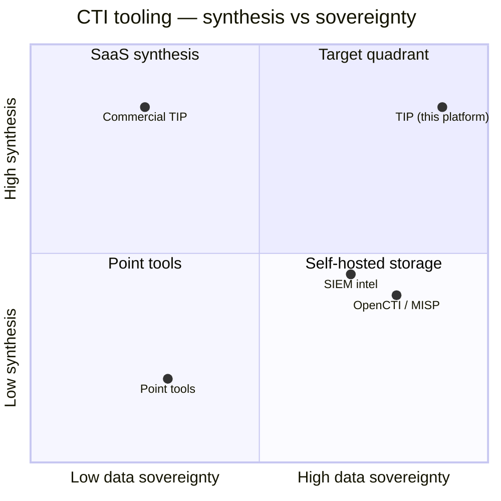

# Limitations of Existing Solutions

This document details *why each category of existing solution falls short*
for the specific customer, justifying the in-house build. It is the
mirror image of `alternative_solutions.md`: there we said what we chose;
here we explain the gaps that forced the choice.

## Commercial TIP limitations

| Limitation | Impact on this customer |
|---|---|
| Cloud-hosted by default | Conflicts with regional financial data-residency rules; customer-adjacent data leaving the perimeter is hard to defend to regulators |
| Per-seat / per-query pricing | A 3-user SOC cannot justify enterprise licensing economics |
| Opaque relevance model | The team cannot tune "relevant to us" toward their actual stack (core banking, SWIFT) and region (MENA) |
| Closed AI egress | No way to prove which payloads reach which model — the bank cannot demonstrate the boundary |
| Generic actor coverage | Long-tail regional finance-sector targeting under-weighted |

## Open-source TIP limitations (OpenCTI / MISP / Yeti)

| Limitation | Impact |
|---|---|
| Storage/aggregation, not synthesis | They answer "what do we know about X" but not "who attacks us today, what should the manager do" |
| Heavy operational footprint (OpenCTI: ES + RabbitMQ + MinIO + workers) | Disproportionate for 3 users; a second platform to operate |
| No executive-level daily brief | Karim's workflow (one dashboard, 3 minutes) is unserved |
| No company-profile-aware ranking | Relevance is global, not "our stack" |
| Limited or no AI hunting-hypothesis generation | Amira must hand-write Wazuh rules |

MISP specifically is **not** dismissed — it is integrated. Its limitation
is scope (sharing + IOC/event model), not quality.

## SIEM-native limitations (Wazuh / Splunk / Elastic)

| Limitation | Impact |
|---|---|
| Scoped to ingested SIEM data | Weak at external multi-source aggregation |
| Rule-based correlation | No AI ranking of actor likelihood vs the company profile |
| No executive synthesis | No daily brief / geopolitical outlook |
| Intel is a bolt-on, not the core | The cross-source pivot (IOC → actor) is manual |

Wazuh is integrated (alerts pulled in for correlation); the platform adds
the layer Wazuh lacks.

## Point-tool / manual-workflow limitations

This is the status quo being replaced:

| Limitation | Impact (the original pain) |
|---|---|
| Ten disconnected tools | ~40 minutes per alert cross-referencing |
| No corroboration | "Is this in three feeds?" is a manual count |
| No single relevance answer | The manager assembles a picture from tabs |
| No persistence of analyst judgement | Notes live in spreadsheets, lost over time |
| No audit trail | Compliance cannot reconstruct who-knew-what-when |

## The gap the platform fills

Plotting the categories against the two axes that matter most to this
customer — **synthesis depth** and **data sovereignty** — reveals an
empty quadrant:

The top-right quadrant — **high synthesis AND high sovereignty** — is
where no existing solution sat for this customer, and is exactly where the
platform is positioned.
