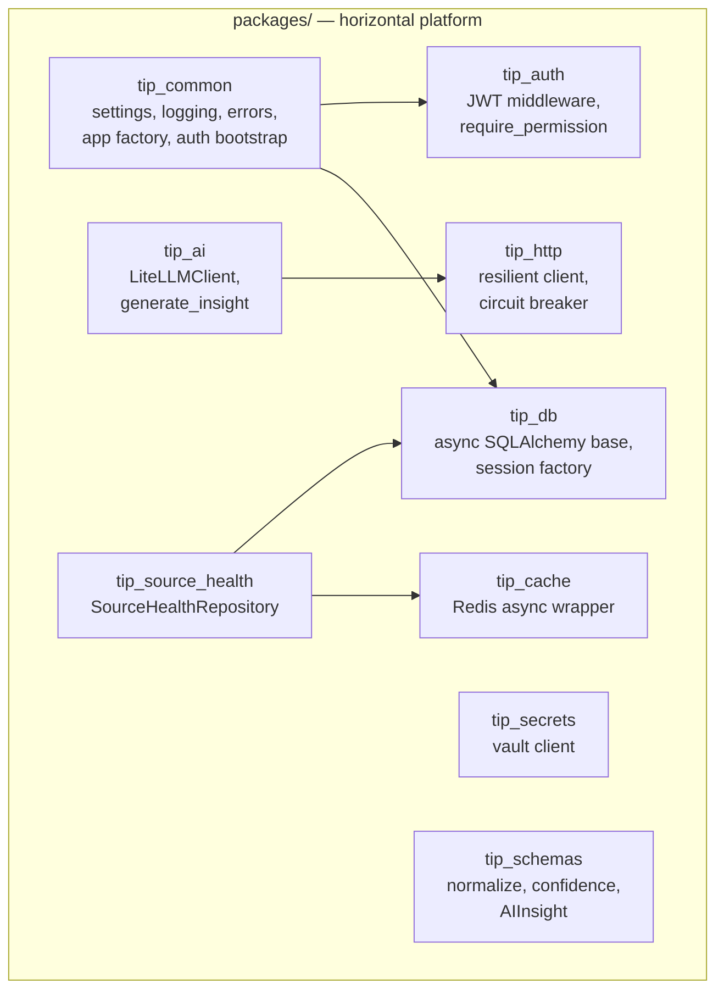
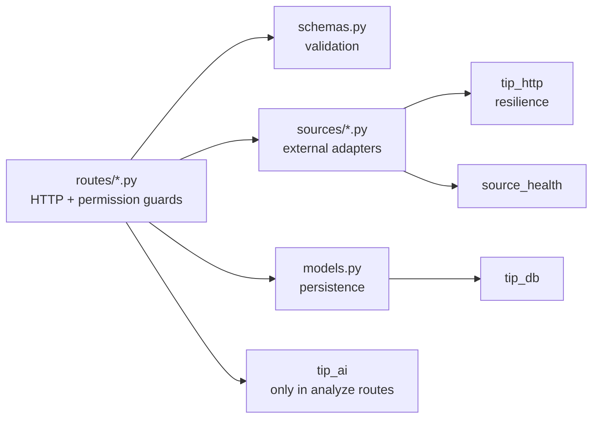

# Modularization Strategy

## Two axes of modularity

The codebase is modular along two orthogonal axes:

1. **Horizontal (shared libraries)** — cross-cutting concerns extracted
   into `packages/tip_*` and reused by every service.
2. **Vertical (services)** — each business capability is a self-contained
   deployable service owning its schema, routes, and external
   integrations.

The intersection gives a grid: any service is "its vertical slice
(routes + models + sources) sitting on the horizontal platform
(tip_common + tip_db + tip_auth + …)".

## The horizontal layer — shared packages



### Why each package exists

| Package | Single responsibility | Used by |
|---|---|---|
| `tip_common` | Settings base, structured logging, error handlers, correlation IDs, `create_service_app`, `wire_auth`, notes-router factory | all |
| `tip_db` | Async SQLAlchemy declarative base + asyncpg session factory through PgBouncer | all data services |
| `tip_cache` | Redis async wrapper with JSON helpers + incr-with-ttl | ioc-collector, source-health, rate-limit users |
| `tip_http` | httpx wrapper + `fetch_with_resilience` (timeout, retry, circuit breaker) | every ingester |
| `tip_auth` | RS256 JWT middleware + `require_permission` dependency | all (no-op when `DISABLE_AUTH=true`) |
| `tip_secrets` | Client to the secrets service; in-memory cache; bootstrap-aware | all |
| `tip_schemas` | Indicator normalisation, confidence config, shared Pydantic models | ingesters, orchestrator, indicator-intel |
| `tip_source_health` | `SourceHealthRepository` + per-service `source_health` table builder | every ingester |
| `tip_ai` | `LiteLLMClient`, `ContextProvider` protocol, `generate_insight`/`generate_structured` | AI-consuming services |

### The dependency rule that protects modularity

`tip_ai` **must not** import `tip_db` or any service's models. It receives
data through the `ContextProvider` protocol only. This structural rule is
what keeps AI off the ingest hot path (G3) — an ingester cannot
accidentally pull the LLM into a write path because the dependency simply
isn't there.

## The vertical layer — services

Every service follows the same internal package layout:

```
services/<name>/
├── pyproject.toml          deps (path-installed tip_* + service-specific)
├── Dockerfile              slim Python base, COPY app + packages, uv install
├── alembic/
│   ├── env.py              imports app.models METADATA
│   └── versions/*.py       schema migrations (this service only)
└── app/
    ├── main.py             create_service_app + _startup wiring + routers
    ├── settings.py         Settings(BaseServiceSettings) subclass
    ├── db.py               engine/session factory init
    ├── models.py           SQLAlchemy models (SCHEMA = "<name>")
    ├── schemas.py          Pydantic request/response models
    ├── routes/             one module per resource
    ├── sources/            external-source adapters (ingesters only)
    └── <feature>/          feature packages (e.g. notify/, dorking/)
```

This uniformity is a deliberate modularisation strategy: **the cost of
learning a new service is bounded** because its shape is known in advance.

## Separation of concerns within a service



- **Routes** own HTTP concerns and permission checks, nothing else.
- **Schemas** own validation (Pydantic) — the boundary between untyped
  HTTP and typed Python.
- **Sources** own external-world adapters and resilience.
- **Models** own persistence.
- **AI** is imported *only* in `analyze`-style routes, never in sources.

## Feature sub-packages

When a capability is larger than a single route module, it becomes a
sub-package with its own internal structure. Two examples added during the
project:

- `services/orchestrator/app/notify/` — `smtp.py` (channel),
  `dispatcher.py` (rule eval + audit), `__init__.py` (public surface).
- `services/indicator-intel/app/dorking/` — `catalog.py` (templates),
  `google.py` + `duckduckgo.py` (backends), `runner.py` (orchestration).

This keeps a feature's cohesion high (everything in one directory) and
its coupling to the rest of the service low (one import surface via
`__init__.py`).

## Why this strategy pays off

- **Onboarding** — `14_project_structure/repository_breakdown.md` can
  describe one service shape and the reader knows all fifteen.
- **Change isolation** — a feature lives in one directory; a service lives
  in one folder; a cross-cutting concern lives in one package.
- **Independent deployment** — changing one service rebuilds one image
  (unless a shared package changed).
- **Testability** — the `ContextProvider` protocol and dependency
  injection make the AI layer mockable without a live provider.
