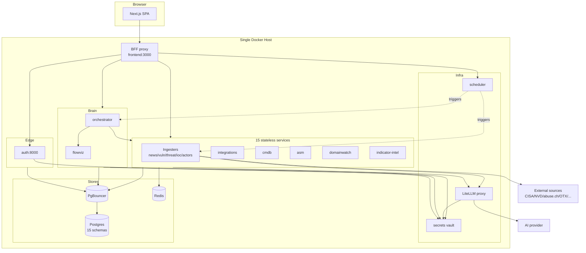

# Solution Overview

## One-paragraph description

The platform is a **monorepo of 15 stateless FastAPI microservices**, a
**Next.js 16 frontend with an integrated backend-for-frontend proxy**, and
a **single-host Docker Compose deployment**. Services share nine path-
installed Python libraries (`tip_*`) and one Postgres database partitioned
into one schema per service behind PgBouncer. External-source ingestion is
cyclical and resilient; an AI synthesis layer (isolated behind a LiteLLM
proxy) reads only processed data to produce ranked, actionable
intelligence. Redis serves the latency-critical IOC lookup and circuit-
breaker state. A Fernet-encrypted secrets vault holds every credential.

## The shape of the system

(See `05_architecture/diagrams/global_architecture.mmd` for the
full-fidelity version.)

## Five pillars of the design

### Pillar 1 — Resilient, cyclical ingestion
Every external call goes through `tip_http.fetch_with_resilience`
(timeout + retry + circuit breaker). Cycles use
`asyncio.gather(return_exceptions=True)` so one source's failure never
aborts the cycle. Per-service `source_health` tables and Redis circuit
state make degradation observable and recoverable.

### Pillar 2 — Canonical data + per-type confidence
`tip_schemas.indicators.normalize` gives every indicator a single
canonical form, making cross-source corroboration meaningful.
`tip_schemas.confidence` scores each artefact with a per-`DataType`
weight vector, persisting both the score and its input vector for future
re-scoring.

### Pillar 3 — AI as an isolated synthesis layer
AI never touches the ingest hot path. It lives behind `tip_ai` and a
standalone LiteLLM proxy. The orchestrator's 4-step cycle and the
per-resource `analyze` endpoints read processed data and emit typed,
versioned, cache-first insight payloads.

### Pillar 4 — Schema-per-service isolation
One Postgres database, one schema per service, no cross-schema FKs.
Cross-service relations use stable external IDs. Cross-service data
access is HTTP-only. This keeps services independently deployable and
independently migratable.

### Pillar 5 — Single-host operational simplicity
One `make up` brings up the entire stack. One `make smoke-test` verifies
it. One `make check-llm` diagnoses the AI chain. Secrets live in one
vault; only `FERNET_KEY` stays in `.env`. Auth is enforced at the edge;
the docker network is the trust boundary for inter-service calls.

## Request-to-value paths

| User action | Path through the system |
|---|---|
| IOC lookup | Browser → BFF → ioc-collector → Redis (hit) / Postgres (miss) |
| Generate threat insight | Browser → BFF → threat-intel → LiteLLM → provider; flowviz inline; IOCs auto-promoted to ioc-collector |
| Daily brief | scheduler → orchestrator → (vuln, actors, integrations, cmdb) → LiteLLM → orchestrator.reports |
| Deep investigation | Browser → BFF → indicator-intel → (ip-api, Shodan, crt.sh, IOC DB, actors, articles) in parallel → LiteLLM verdict |
| Dorking | Browser → BFF → indicator-intel/dorks → Google CSE / DuckDuckGo |
| Notification | event source → orchestrator/internal/notify → SMTP |

## What makes the solution coherent

Every service follows the same skeleton (`create_service_app` factory from
`tip_common`, a `_startup` hook that wires DB + cache + secrets + AI, a
`JWTAuthMiddleware`, and routers). A reader who understands one service
understands the shape of all fifteen. The per-service documentation in
`06_services/` exploits this — the auth service is documented in full
depth as the exemplar, and the others are documented as deltas from that
shared shape.
