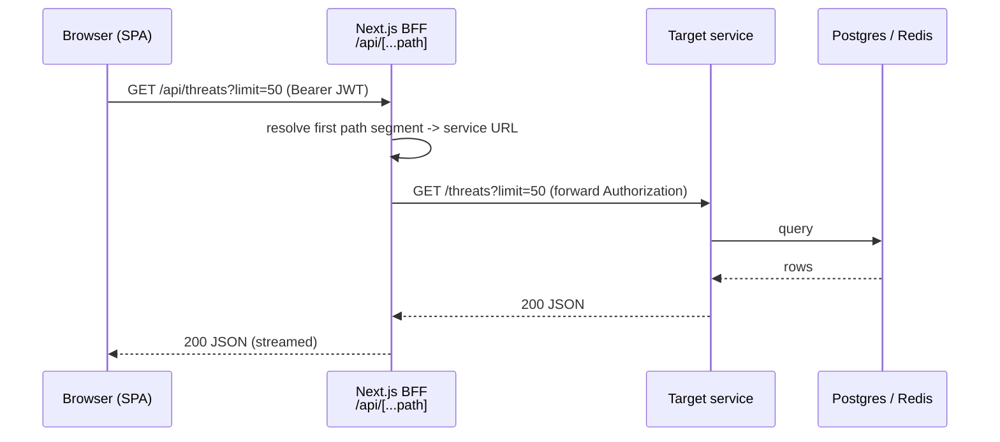
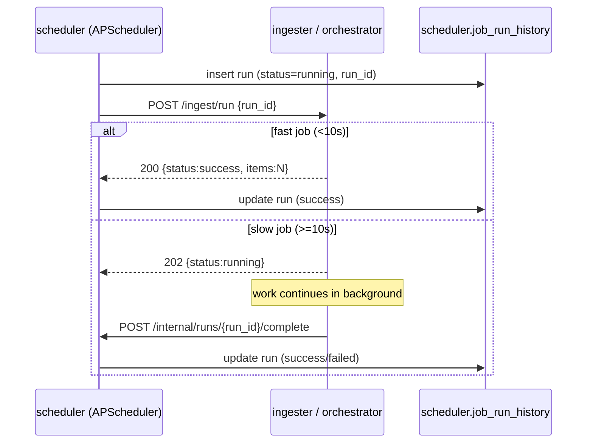
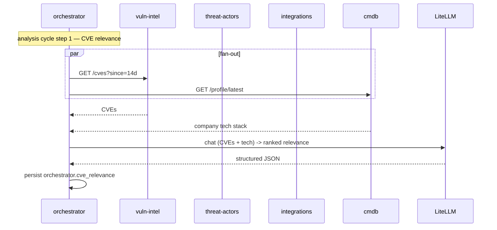

# Communication Patterns

The platform uses four distinct communication patterns. Each is used for a
specific class of interaction; mixing them is avoided.

## Pattern 1 — Browser → BFF → service (synchronous request/response)

The dominant pattern for user-facing reads and writes.



- **Routing:** the BFF maps the first path segment to an internal service
  URL (`SERVICE_MAP` in `frontend/src/app/api/[...path]/route.ts`).
- **Auth:** the bearer token is forwarded. The auth service validates it
  for its own endpoints; data services run `DISABLE_AUTH=true`.
- **No CORS:** the browser only ever sees the frontend origin.

## Pattern 2 — Scheduler → service (cron-triggered HTTP)

The scheduler is the single owner of "when things happen".



- **run_id** is generated by the scheduler before firing, so the callback
  can correlate.
- **Watchdog:** a 60-second sweep marks any `running` row older than the
  job's `max_runtime` as `timeout`.
- **Auth:** post-simplification, the scheduler's calls are unauthenticated
  on the trusted network (data services trust the docker net).

## Pattern 3 — Orchestrator fan-out (parallel HTTP aggregation)

The orchestrator is the **only** service that reads from multiple other
services. It implements the `tip_ai.ContextProvider` protocol by HTTP
fan-out.



- **Fan-out is parallel** where the legs are independent (`asyncio.gather`).
- **AI calls are serialised** where provider concurrency caps apply
  (per-resource analyze, EC11).

## Pattern 4 — Event emit → notification dispatch (fire-and-forget)

Event sources notify the orchestrator without blocking their own work.

```mermaid
sequenceDiagram
    participant SRC as event source<br/>(domainwatch / vuln-intel / threat-intel)
    participant O as orchestrator /internal/notify
    participant R as notification_rules
    participant SMTP as SMTP server
    participant D as notification_dispatches

    SRC->>O: POST /internal/notify {event_type, payload}
    Note over SRC: fire-and-forget; failure doesn't roll back source work
    O->>R: SELECT active rules WHERE event_type
    loop each matching rule
        O->>O: eval_filter(rule.filter, payload)
        O->>SMTP: send email
        O->>D: insert dispatch (sent/failed/skipped)
    end
```

- **Decoupled:** the source's POST is best-effort; a notification failure
  never rolls back the snapshot/ingest that triggered it.
- **Auditable:** every attempt lands a `notification_dispatches` row.

## Inline service-to-service calls (within a request)

Some user requests trigger a synchronous call to a sibling service:

- `threat-intel /threats/{id}/analyze` calls `flowviz /flows` inline to
  embed an attack flow, then POSTs extracted IOCs to `ioc-collector`.
- `threat-actors /actors/{id}/analyze` does the same.

These are synchronous HTTP within the request, on the trusted network, no
JWT required.

## Communication matrix

| From | To | Pattern | Sync? | Auth |
|---|---|---|---|---|
| Browser | frontend BFF | request/response | sync | JWT |
| BFF | any service | proxy | sync | JWT forwarded |
| scheduler | ingesters / orchestrator | cron trigger | sync + async callback | none (trusted net) |
| orchestrator | data services | fan-out | sync parallel | none |
| threat-intel/actors | flowviz, ioc-collector | inline | sync | none |
| event sources | orchestrator notify | emit | fire-and-forget | none |
| any service | secrets | bootstrap fetch | sync | bootstrap token |
| AI services | litellm | chat | sync | master key |

## What the platform deliberately does NOT use

- **No message queue / event bus** (Kafka, RabbitMQ). Ingest is cyclical;
  notifications are direct HTTP. A queue would add an operational
  dependency disproportionate to the scale (see
  `15_limitations/tradeoffs.md`).
- **No gRPC.** All internal calls are JSON/HTTP for uniformity and
  debuggability (`curl` works everywhere).
- **No WebSockets / SSE** for live updates in v1. The dashboard refreshes
  via SWR `refetchInterval`. SSE for live alerts is future work.
