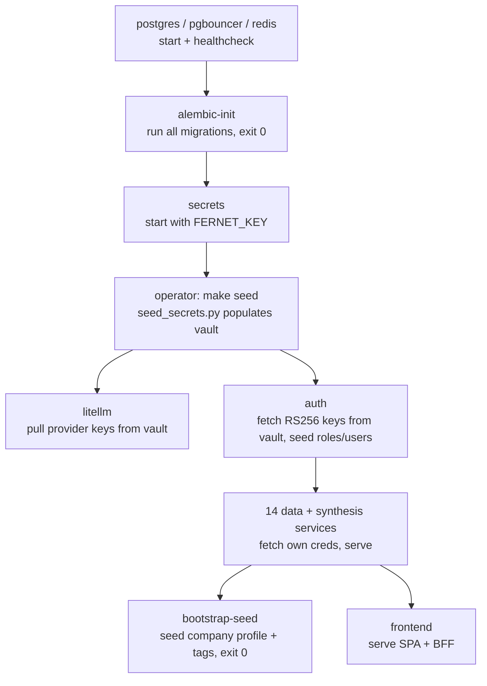
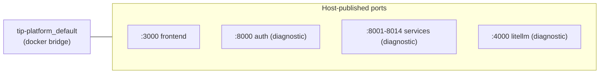

# Deployment Architecture

## Deployment model: single-host Docker Compose

The platform deploys as a single `docker-compose.yml` stack on one Linux
host. There is no Kubernetes, no managed cloud service, no multi-node
orchestration. This is a deliberate fit for a single-organisation,
three-user SOC (rationale in `04_solution_design/design_goals.md` G7).

## Container inventory

From `infra/docker-compose.yml`:

| Container | Image source | Role | Exposed port |
|---|---|---|---|
| postgres | official postgres | single DB, 15 schemas | (internal) |
| pgbouncer | pgbouncer | connection pooler | (internal 6432) |
| redis | official redis | cache + circuit state | (internal) |
| alembic-init | `infra/alembic-init/Dockerfile` | one-shot migrations, then exits | — |
| secrets | `services/secrets` | Fernet vault | 8012 |
| litellm | `infra/litellm/Dockerfile` | AI gateway | 4000 |
| auth | `services/auth` | JWT issuer | 8000 |
| news-collector … orchestrator | each `services/<name>` | 14 capability/synthesis services | 8001–8014 |
| bootstrap-seed | `infra/seed/Dockerfile` | one-shot data seeder, then exits | — |
| frontend | `frontend/Dockerfile` | SPA + BFF | 3000 |

Named volumes: `postgres-data`, `domainwatch-screenshots`.

## Two compose files

| File | Purpose |
|---|---|
| `infra/docker-compose.yml` | Production-shape stack |
| `infra/docker-compose.dev.yml` | Dev overlay: bind-mounts `packages/` for live editing, `DISABLE_AUTH=true`, debug logging |

Production: `docker compose -f infra/docker-compose.yml --env-file .env up -d`
Dev: add `-f infra/docker-compose.dev.yml`.

The `Makefile` wraps the production invocation (`make up`).

## Bring-up sequence



`depends_on` conditions enforce this:
- data services depend on `alembic-init: service_completed_successfully`,
  `postgres/pgbouncer/redis: service_healthy`, and `auth: service_healthy`.
- `litellm` and `auth` start after `secrets`.

## Environment configuration

Only the root `.env` is operator-managed (`.env.example` is the template):

```
FERNET_KEY=<generated>             # vault encryption key — the one secret to protect
POSTGRES_PASSWORD=<chosen>
TIP_ENV=development|production
DISABLE_AUTH=true                  # data services trust the docker net
BOOTSTRAP_ADMIN_USERNAME=admin
BOOTSTRAP_ADMIN_PASSWORD=changeme  # rotate after first login
SECRETS_BOOTSTRAP_TOKEN=<generated>
LITELLM_PROXY_URL=http://litellm:4000
```

Everything else (provider keys, NVD/abuse.ch/OTX/HIBP/Shodan keys, Wazuh
& MISP creds, SMTP creds, optional Google CSE keys) lives in the secrets
vault, seeded by `infra/bootstrap/seed_secrets.py` from
`prompt/credentials.env`.

## Networking



- Services resolve each other by **service name** (`http://auth:8000`,
  `http://litellm:4000`) on the bridge network.
- In production the only port that *must* be published is `3000`
  (frontend). Service ports are published for diagnostics and should be
  firewalled or removed in a hardened deployment.
- A production deployment puts a TLS-terminating reverse proxy in front of
  `:3000` (documented in `09_devops/deployment_strategies.md`).

## Image build strategy

Each service has its own Dockerfile:

1. Slim Python base.
2. `COPY packages/` (the shared `tip_*` libs) + `COPY services/<name>/`.
3. `uv pip install` the service (which path-installs the shared libs).
4. `CMD uvicorn app.main:app`.

The `alembic-init` image additionally installs every service's package so
its `env.py` can `import app.models` — a fatter image paid once.

## Reproducibility guarantees

- **Pinned dependencies** per `pyproject.toml`.
- **Deterministic migrations** via `alembic-init`.
- **Deterministic seed** via `seed_secrets.py` + `bootstrap-seed`.
- **Verified** by running `screenshots/walkthrough.py` against a fresh
  `make clean && make seed && make migrate && make up` — all 40 surfaces
  render.

## Supported deployment targets

| Target | Status | Notes |
|---|---|---|
| Local dev (Docker Desktop) | ✓ | dev overlay, bind mounts |
| Single VPS / bare-metal Linux | ✓ (primary) | the deployed model (`lightserv1.local`) |
| Kubernetes | ✗ (future) | services are stateless; path documented in `16_future_work` |
| Managed cloud (ECS/Cloud Run) | ✗ (future) | would need per-service task defs + managed Postgres/Redis |

The detailed "why containers at all" rationale is in
`09_devops/dockerization.md`.
