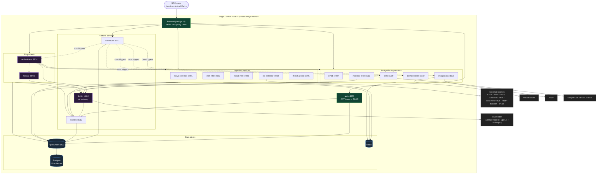
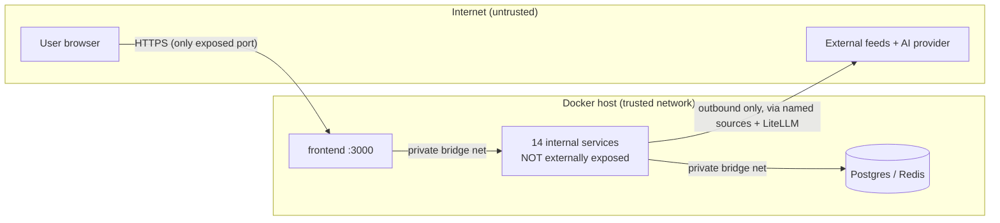

# Global Architecture

## High-level system topology

This is the enterprise-level view: services, stores, boundaries — no
internal implementation. The companion `.mmd` file is
`diagrams/global_architecture.mmd`.

## Architectural layers

The system is best understood as five concentric layers:

| Layer | Members | Responsibility |
|---|---|---|
| **Edge** | frontend (SPA + BFF), auth | The only externally-reachable surface; authentication |
| **Capability** | 5 ingesters + 5 analyst-facing services | Business logic, owns data |
| **Synthesis** | orchestrator, flowviz | AI ranking + generation |
| **Platform** | scheduler, secrets, litellm | Cross-cutting platform services |
| **Storage** | PgBouncer, Postgres, Redis | Persistence + cache |

## Trust boundaries

Two boundaries matter:

1. **Browser ↔ frontend** — authenticated (JWT). The auth service
   validates tokens; the BFF forwards them.
2. **Host ↔ internet (outbound)** — constrained to named ingester
   sources and the single LiteLLM AI egress. No inbound path exists to
   any service except the frontend.

## Why this topology

- **One exposed port** minimises the external attack surface (P11).
- **Capability services own data** (P1/P2) so the topology can evolve
  service-by-service.
- **Synthesis isolated** behind LiteLLM (P3) so AI outages do not cascade.
- **Platform services centralise** cross-cutting concerns (one scheduler,
  one vault, one AI gateway) so "when/secrets/AI" each have one owner.
- **Storage shared but partitioned** (one Postgres, 15 schemas, one
  PgBouncer, one Redis) — single-host simplicity with logical isolation.

## Reading guide

- For *how requests flow*, see `request_lifecycle.md`.
- For *how services talk*, see `communication_patterns.md`.
- For *how it deploys*, see `deployment_architecture.md` and
  `infrastructure_topology.md`.
- For *one service in depth*, see `06_services/<service>/`.
