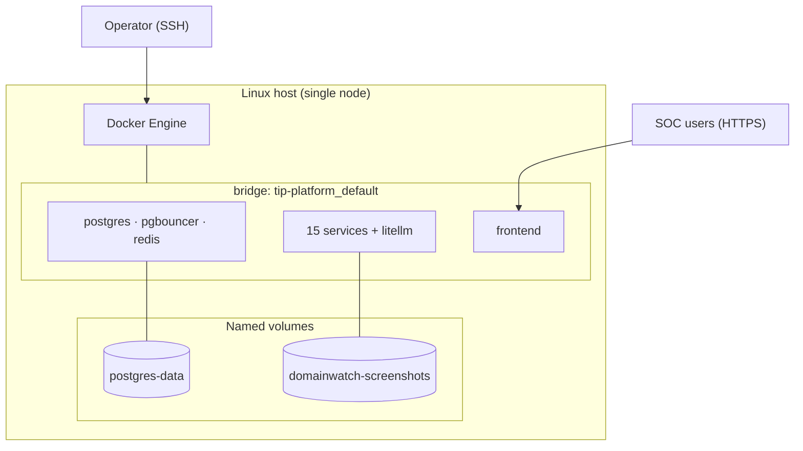
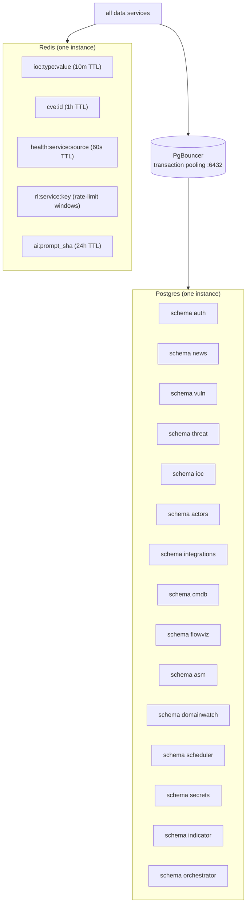

# Infrastructure Topology

## Physical / host view

## Logical store topology

## Why one Postgres, one PgBouncer, one Redis

| Decision | Reason |
|---|---|
| One Postgres, 15 schemas | Single-host simplicity; logical isolation via schemas; no FK across schemas so splitting later is cheap |
| One PgBouncer | Multiplexes 15 services' connection pools onto few Postgres connections; transaction pooling required because of the connection math (TP4) |
| One Redis | Loss-tolerant cache only — every key has a TTL and can be reconstructed from Postgres; no business state in Redis |

## Redis usage policy

Redis holds **only loss-tolerant data**. The policy (from `CLAUDE.md`):

- **Allowed:** IOC lookup cache, CVE summary cache, circuit-breaker state,
  rate-limit counters, AI response cache. All TTL'd.
- **Not allowed:** sessions (→ `auth.sessions`), job queues (→ APScheduler
  Postgres job store), any business state.

Redis can be wiped at any moment with no data loss — only a cold-cache
latency penalty.

## Volume topology

| Volume | Mounted by | Contents | Backup criticality |
|---|---|---|---|
| `postgres-data` | postgres | the entire database | **critical** — the system of record |
| `domainwatch-screenshots` | domainwatch | PNG screenshots of monitored domains | medium — reproducible by re-checking |

The operator's backup responsibility is `postgres-data` first and
foremost.

## Network ports

| Port | Service | Production exposure |
|---|---|---|
| 3000 | frontend | **published** (behind reverse proxy in prod) |
| 8000–8014 | services | published for diagnostics; firewall in prod |
| 4000 | litellm | published for diagnostics; firewall in prod |
| 6432 | pgbouncer | internal only |
| 5432 | postgres | internal only |
| 6379 | redis | internal only |

## Resource footprint (design point)

| Resource | Estimate at the design point |
|---|---|
| Containers | ~20 (15 services + 3 stores + litellm + frontend + 2 transient sidecars) |
| RAM | ~4–6 GB steady (Python services are light; Postgres + Redis dominate); domainwatch's Playwright browser is the heaviest single consumer |
| Disk | tens of GB (Postgres data + screenshots); grows with ingest history |
| CPU | mostly idle; spikes during ingest cycles and AI calls |

> Estimated, not measured under load. The platform is I/O-bound and bursty;
> steady-state CPU is low. The single heaviest component is the
> `domainwatch` Playwright browser image.

## Single points of failure (acknowledged)

| SPOF | Impact if down | Mitigation |
|---|---|---|
| Postgres | platform read/write stops | operator backup/restore; future: replica |
| Redis | hot path falls back to Postgres (slower, still works) | TTL'd cache; reconstructs automatically |
| LiteLLM proxy | all AI down; platform keeps serving stored data | G3 isolation; restart |
| scheduler | scheduled ingest stops; manual triggers still work | restart; jobs resume from job store |
| the host itself | everything down | this is the fundamental single-host tradeoff |

The single-host model means the host is the ultimate SPOF. This is the
accepted cost of operational simplicity for a single-organisation
deployment; the HA evolution path is in
`16_future_work/infrastructure_improvements.md`.
