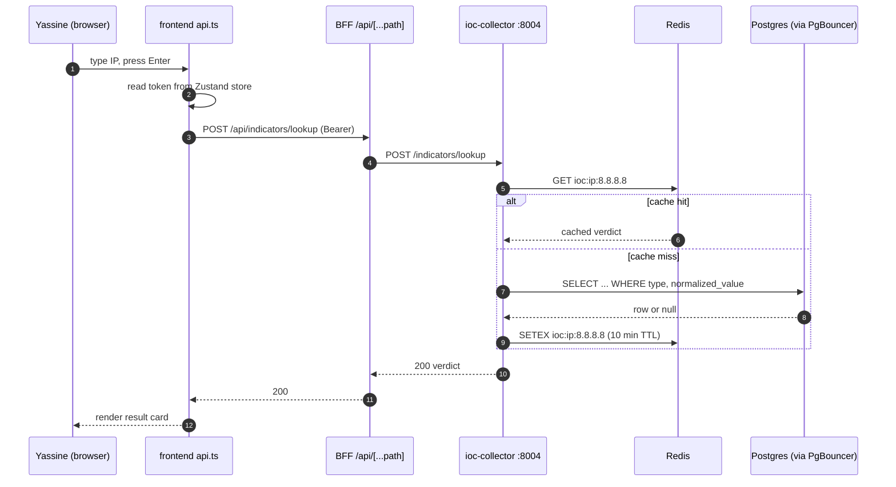
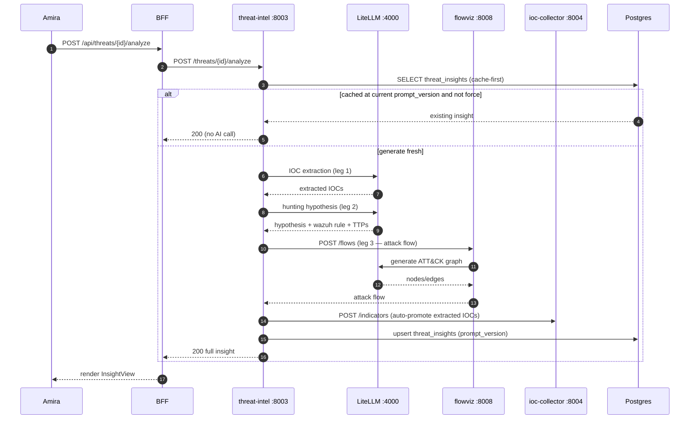
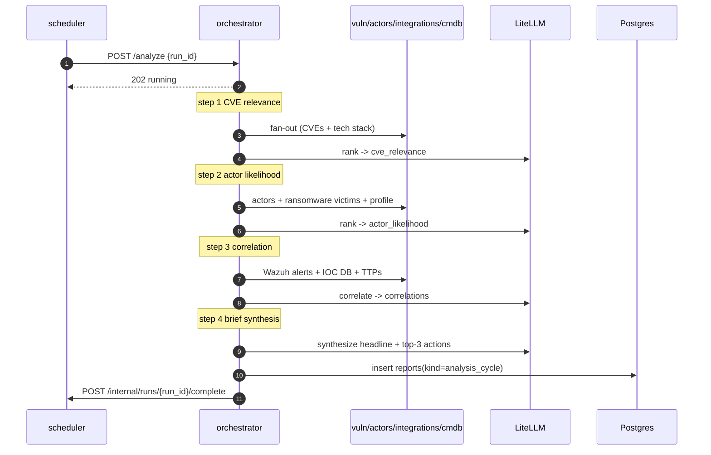
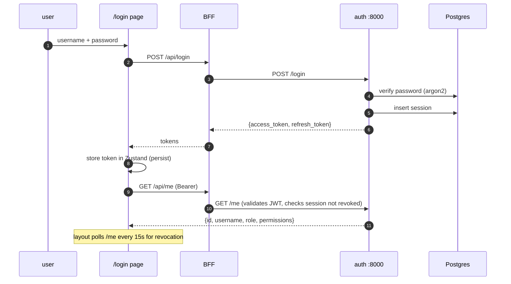
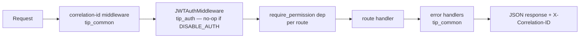

# Request Lifecycle

This document traces representative requests end to end, from the
browser keystroke to the rendered result, naming the real code at each
hop.

## Lifecycle A — IOC lookup (the hot path)

The latency-critical path. Target: < 200 ms.

Key code:
- `frontend/src/lib/api.ts` — token attach, single-flight 401 redirect.
- `frontend/src/app/api/[...path]/route.ts` — `indicators` → ioc-collector.
- `services/ioc-collector/app/routes/indicators.py` — lookup with Redis
  first.

## Lifecycle B — Generate a threat insight (AI multi-leg)

The richest path: three AI legs + an inline sibling call + IOC
auto-promotion + cache-first.

Key code:
- `services/threat-intel/app/routes/threats.py` — cache-first guard,
  serialised legs (EC11), lossless merge, auto-promotion.
- `services/flowviz/app/routes/flows.py` — cached by
  `sha256(input + prompt_version)`.

## Lifecycle C — Daily executive brief (scheduled, multi-service)

No user in the loop — the scheduler drives it.

Key code:
- `services/scheduler/app/jobs.py` — `orchestrator_analysis` job.
- `services/orchestrator/app/analysis.py` — `run_analysis_cycle`.
- Per-step failure is logged and skipped; the cycle continues (G2).

## Lifecycle D — Login + session

Key code:
- `frontend/src/app/login/page.tsx`, `frontend/src/lib/store.ts`.
- `services/auth/app/routes/auth.py` — `/login`, `/me` (DB-truth session
  check), `frontend/src/app/(app)/layout.tsx` — 15s `/me` poll.

## Cross-cutting middleware (every request)

Every request to every service passes through, in order:

- **Correlation ID** — generated or propagated via `X-Correlation-ID`,
  logged on every line.
- **JWTAuthMiddleware** — validates the bearer token (or short-circuits
  to a dev-admin context when `DISABLE_AUTH=true`).
- **require_permission** — per-route RBAC dependency.
- **Error handlers** — convert exceptions (`NotFoundError`, validation,
  AI errors) into typed JSON responses.

## Latency budget by lifecycle

| Lifecycle | Dominant cost | Target / typical |
|---|---|---|
| A — IOC lookup | Redis round-trip | < 200 ms (cache hit ≈ single-digit ms) |
| B — threat insight (fresh) | 2–3 AI legs + flowviz | 30–95 s (provider-bound) |
| B — threat insight (cached) | one Postgres read | < 1 s (measured ~0.1–0.2 s) |
| C — daily brief | 4 AI calls + fan-out | minutes (background, no user waiting) |
| D — login | argon2 verify + session insert | sub-second |

The only lifecycle a user waits on synchronously and which can be slow is
**B-fresh**, and it is explicitly cached so the second view is **B-cached**.
