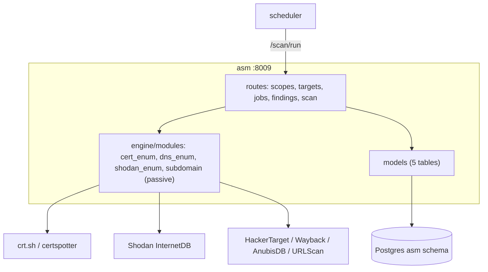

# asm — Overview

## Purpose

Passive attack-surface discovery. Given scopes and targets, it discovers
subdomains, certificates, and exposed services using **passive** sources
only — certificate transparency, passive DNS, Shodan InternetDB. All
active scanning (Nmap, DNS brute-force) was deliberately removed during
the refactor.

| Property | Value |
|---|---|
| Port | 8009 |
| Schema | `asm` |
| Source | `services/asm/` |
| Scheduler trigger | `POST /scan/run` daily 02:00 |
| Secrets | `SHODAN_API_KEY` (optional) |

## Tables

| Table | Purpose |
|---|---|
| `scopes` | named discovery scopes (config) |
| `targets` | per-scope targets (domain/subdomain/ip/cidr/asn/tls_cert), active flag |
| `jobs` | scan job runs (status, findings_count) |
| `findings` | discovered artefacts (type, value, source, details) |
| `source_health` | per-passive-source circuit state |

## Endpoints

| Method | Path | Purpose |
|---|---|---|
| GET/POST/PATCH/DELETE | `/scopes` | scope CRUD |
| GET/POST/DELETE | `/targets` | target CRUD |
| GET | `/jobs`, `/jobs/{id}` | scan history |
| GET | `/findings` | filter by scope/type/since |
| POST | `/scan/run` | scheduler trigger — passive discovery on active scopes |

## Passive-only sources

Kept from the refactor: crt.sh + certspotter (cert transparency),
HackerTarget, Wayback Machine, AnubisDB, URLScan (passive subdomain
enumeration), Shodan InternetDB, passive DNS.

**Removed** in the refactor: `nmap_enum.py` (active port scanning), the
wordlist DNS brute-force path inside `subdomain_enum.py`, the embedded
Celery worker, and any embedded frontend. The service was converted from
sync SQLAlchemy to async during the port.

## Why passive-only

A bank's ASM tool must not itself behave like an attacker. Active scanning
(port scans, DNS brute-force) generates traffic that could trip the bank's
own IDS, violate acceptable-use of third-party infrastructure, or be
mistaken for hostile reconnaissance. Passive sources observe what is
*already* public (cert transparency logs, passive DNS records, Shodan's
existing scans) without sending a single probe to the target. This is a
deliberate scope decision (`01_introduction/objectives.md` non-goals).

## Architecture

## CMDB → ASM binding (design intent)

The platform design includes a binding where editing the company profile's
`public_ip_ranges` / `asn_numbers` propagates ASM targets automatically
(profile-diff → ASM targets), so the operator maintains the inventory in
one place. This keeps the attack-surface scope synchronised with the
declared external footprint.
