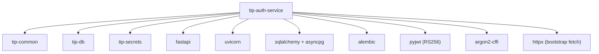
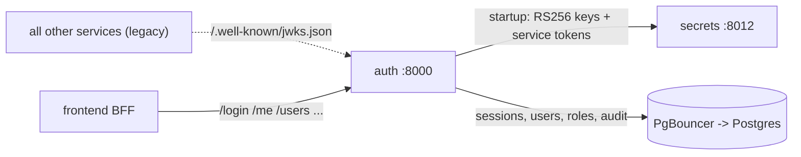

# auth — Dependency Graph

## Build-time dependencies

From `services/auth/pyproject.toml` (shared `tip_*` libs + auth-specific):

Notably auth does **not** depend on `tip_ai`, `tip_http`,
`tip_source_health`, or `tip_cache` — it is not an ingester, makes no AI
calls, and stores sessions in Postgres (not Redis).

## Runtime dependencies

- **Hard runtime dependency:** secrets (at startup) and Postgres
  (continuously).
- **No runtime dependency on any data service** — auth never calls
  outward except to the vault at boot.
- **Inbound:** the BFF (user auth) and, in the legacy model, other
  services fetching the public key. Post-simplification the data services
  no longer validate JWTs, so this inbound path is dormant.

## Why this dependency shape matters

auth is intentionally a **leaf** in the service call graph (it calls only
secrets + DB). This means:

- auth can start as soon as secrets + DB are up — early in the bring-up
  order.
- A failure in any data service cannot affect auth.
- The blast radius of an auth change is bounded: it affects who can log
  in, not what any data service does internally (those trust the network).

## Failure modes

| Dependency down | Effect |
|---|---|
| secrets (at boot) | auth cannot fetch RS256 keys → fails to start (correct — no point serving without keys) |
| Postgres | login/me/refresh fail; existing tokens still validate signature but session check fails |
| secrets (after boot) | no effect — keys are already in module state |
