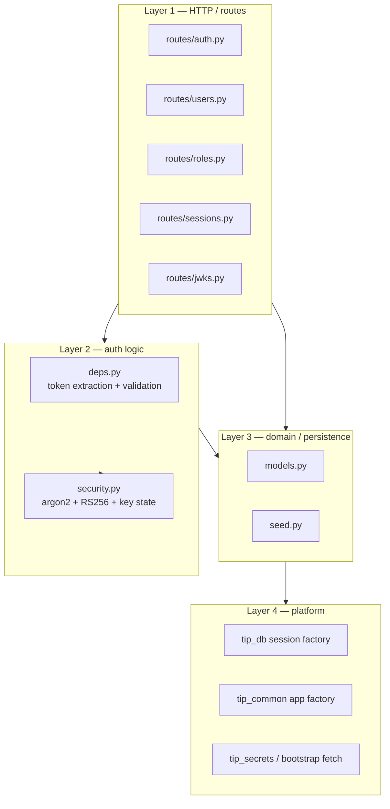
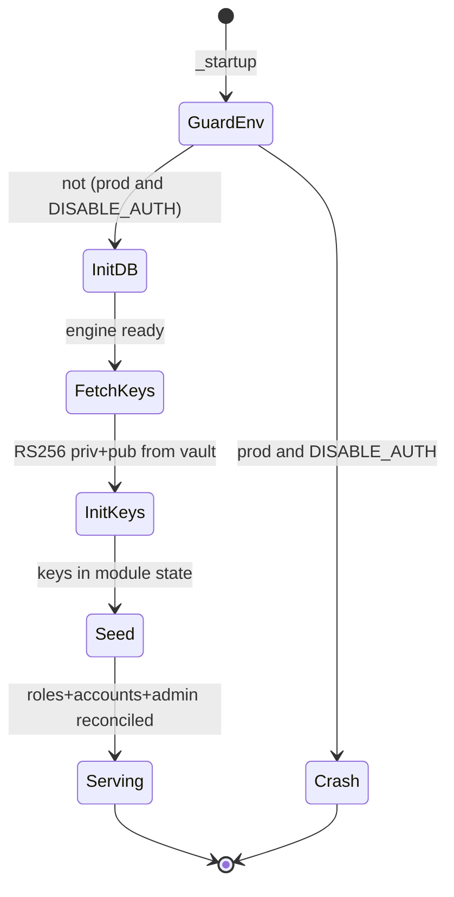

# auth — Internal Architecture

## Layering

## Module responsibilities

| Module | Responsibility | Notably does NOT |
|---|---|---|
| `routes/auth.py` | login, refresh, logout, `/me` | hold key material |
| `routes/users.py` | user CRUD + permission grants; revokes sessions on role/perm change | validate tokens (delegates to `deps.py`) |
| `routes/roles.py` | role CRUD | |
| `routes/sessions.py` | list/revoke sessions (admin) | |
| `routes/jwks.py` | publish RS256 public keys | sign anything |
| `deps.py` | `require_admin`, `get_current_user_payload`; local JWT decode | use `tip_auth` middleware |
| `security.py` | argon2 hash/verify, RS256 sign/verify, `init_keys`, `hash_token` | persist anything |
| `seed.py` | reconcile roles + service accounts + admin user | issue tokens |
| `models.py` | SQLAlchemy models for the `auth` schema | |

## Key state management

RS256 keys are loaded once at startup from the vault into module-level
state via `security.init_keys(private_pem, public_pem)`. All signing and
verification reads this state. This is why auth must complete its
bootstrap fetch before serving the first request — enforced by the
`_startup` hook running before the app accepts traffic.

## Session revocation model

A JWT is stateless, so "log this user out everywhere" cannot be done by
the token alone. The auth service solves this with a DB-truth check:

- `/me` (and any session-sensitive path) re-reads `auth.sessions` and
  checks the calling session is not `revoked`.
- `PATCH /users/{id}` revokes all of that user's sessions when role or
  permissions change.

This is why a demoted user is logged out: the frontend polls `/me` every
15 seconds (`frontend/src/app/(app)/layout.tsx`); the next poll after
revocation returns 401, triggering the single-flight redirect.

## Permission model

- A user's effective permissions = role permissions ∪ supplementary
  permissions.
- `admin` carries the wildcard `*`.
- Permission strings are resource-scoped (`intelligence:read`,
  `iocs:write`, …). The canonical set is whatever the `require_permission`
  call sites across all services actually check — audited to avoid the
  singular/plural drift fixed in commit `14d0489`.

## Startup sequence (detailed)

