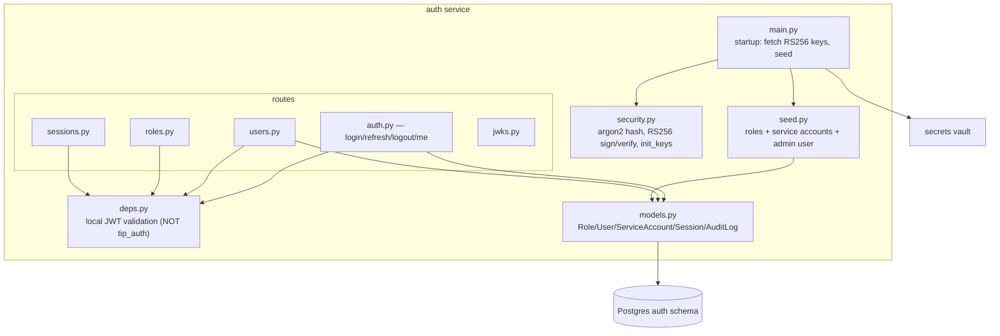

# auth — Overview

## Purpose

The authentication and authorisation authority for the platform. It is the
RS256 JWT issuer, the RBAC source of truth, the session manager, and the
service-identity bootstrapper. It is the **only** service that retains full
JWT validation after the auth simplification (commit `5d216c1`); all other
services trust the docker network.

| Property | Value |
|---|---|
| Port | 8000 |
| Schema | `auth` |
| Source | `services/auth/` |
| `DISABLE_AUTH` | hardcoded `false` in compose (others may be `true`) |
| External deps | none (talks only to secrets + Postgres) |

## Database tables

From `services/auth/app/models.py`:

| Table | Purpose |
|---|---|
| `roles` | role name + permission array (`admin`, `analyst`, `viewer`, `service`) |
| `users` | username, argon2 password hash, role FK, supplementary permissions, active flag |
| `service_accounts` | per-service identity + `bootstrap_token_hash` + supplementary permissions |
| `sessions` | refresh-token hash, issued/expires, revoked flag, UA/IP — enables revocation |
| `audit_log` | actor, action, target, timestamp, details — compliance trail |

## Endpoints

| Method | Path | Permission | Purpose |
|---|---|---|---|
| POST | `/login` | open | username/password → access (1h) + refresh (30d) |
| POST | `/refresh` | open | refresh token → new access token |
| POST | `/logout` | bearer | revoke calling session |
| GET | `/me` | bearer | profile + effective permissions (DB-truth session check) |
| GET/POST/PATCH/DELETE | `/users` | admin | user CRUD |
| GET/POST/PATCH/DELETE | `/roles` | admin | role CRUD |
| GET/DELETE | `/sessions` | admin | list / revoke sessions |
| GET | `/.well-known/jwks.json` | open | RS256 public keys |
| POST | `/service-login` | open (bootstrap token) | (legacy) service JWT issuance |

## Architecture (component view)

## Why auth does NOT use tip_auth middleware

Every other service uses `tip_auth.JWTAuthMiddleware`. The auth service
validates its own JWTs locally via `app/deps.py`. The reason: auth is the
*issuer* — it must validate tokens it just signed, and it must do so even
during the bootstrap window when the public key is freshly loaded from the
vault into `init_keys`. Using the shared middleware would create a
circular bootstrap dependency.

## The bootstrap dance

At startup (`services/auth/app/main.py` `_startup`):

1. Refuse to start if `TIP_ENV=production` and `DISABLE_AUTH=true`.
2. `init_engine` — DB.
3. POST `secrets /internal/bootstrap-fetch` with the shared bootstrap
   token to get the RS256 private + public keys → `init_keys`.
4. Build a token resolver that fetches each
   `SVC_<NAME>_BOOTSTRAP_TOKEN` from the vault.
5. `seed(session, resolver)` — create roles, service accounts (hashing
   each service's bootstrap token into `bootstrap_token_hash`), and the
   admin user.

This is the canonical example of the secrets bootstrap pattern (TP8).

## Seeding behaviour (idempotent reconcile)

`services/auth/app/seed.py` reconciles on **every** boot:

- Roles' permission arrays are overwritten from `_ROLES` (fixing a typo in
  code propagates on restart, no manual SQL).
- Service-account `supplementary_permissions` are reconciled from
  `_SERVICE_ACCOUNTS` (adding a perm to a service is a code change +
  restart).
- The admin user is created only if absent.

This reconcile-on-boot pattern is *why* the scheduler permission fix
(commit `14d0489`) and the threat-intel/threat-actors `iocs:write` grants
took effect with just a redeploy.

## Detailed documents

- `internal_architecture.md` — layering and module responsibilities.
- `request_flow.md` — login, refresh, /me-with-revocation sequences.
- `dependency_graph.md` — import + runtime dependencies.
- `security_model.md` — argon2, RS256, session revocation, RBAC.
- `implementation.md` — concrete implementation notes.
- `diagrams/` and `uml/` — full diagram set.
