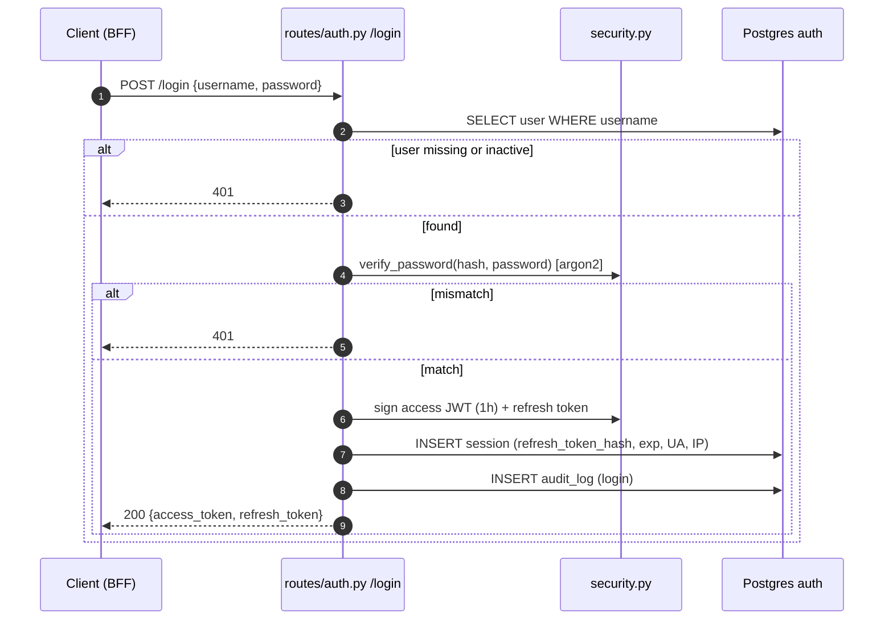
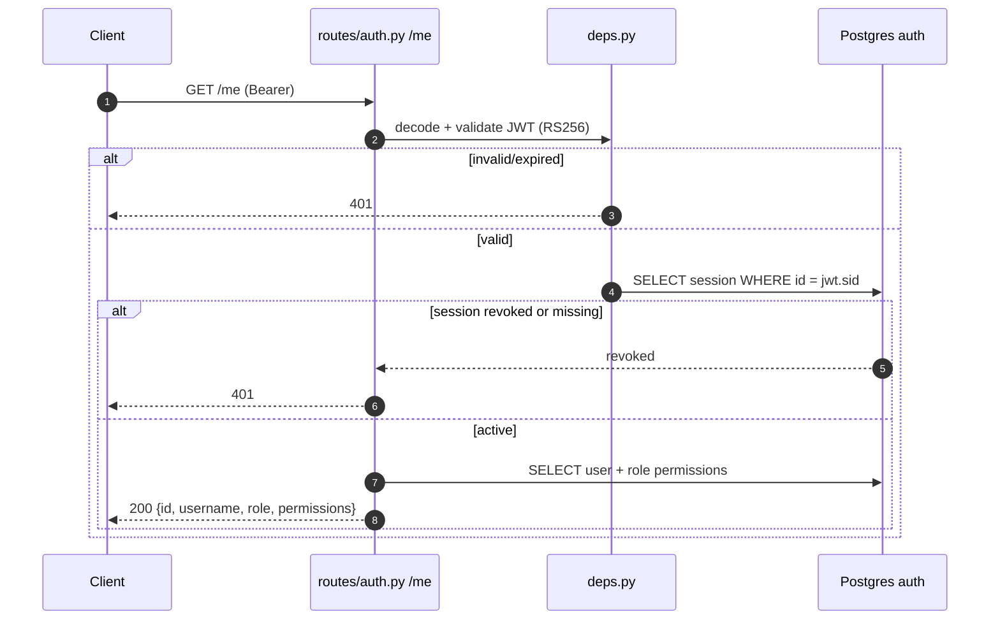
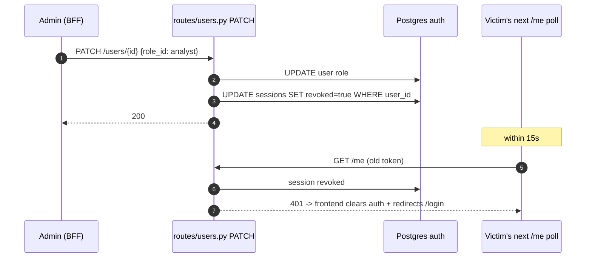
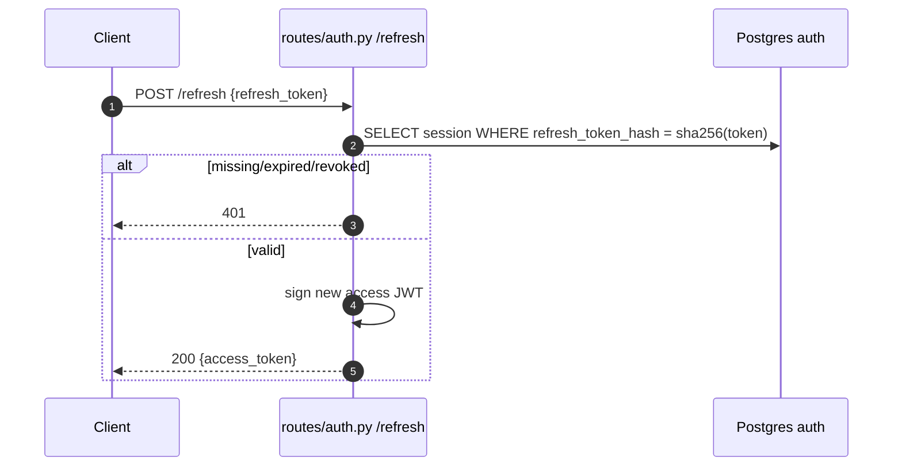

# auth — Request Flows

## Login

## /me with revocation check

## Admin demotes a user (cascade revoke)

This sequence is the concrete answer to the requirement "a revoked user
must be logged out without a manual refresh" — the 15-second `/me` poll in
`frontend/src/app/(app)/layout.tsx` closes the loop.

## Refresh

