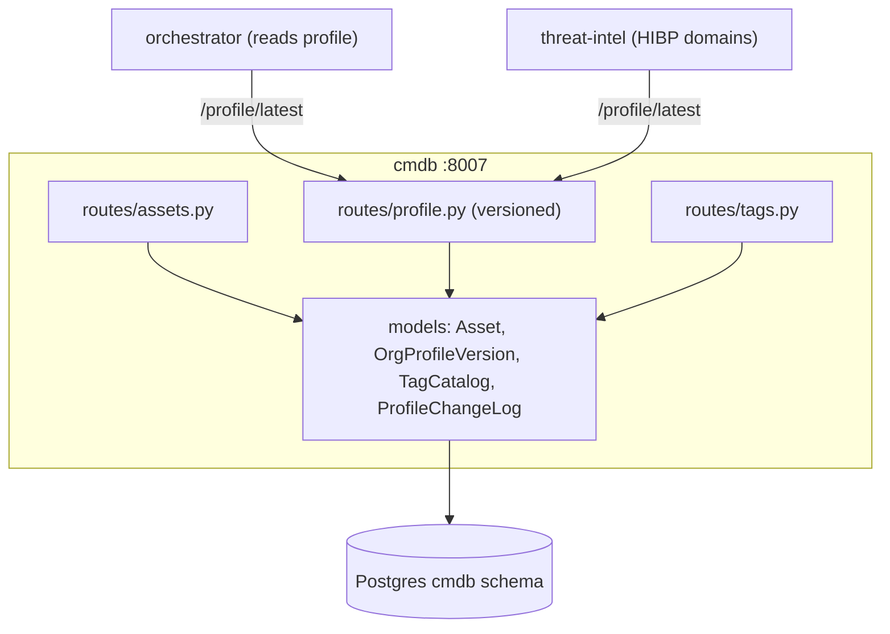

# cmdb — Overview

## Purpose

The configuration-management database: asset inventory CRUD and the
**versioned company profile** that the AI layer uses as relevance context.
"Is this CVE relevant to us?" is answerable only because cmdb holds the
bank's technology stack.

| Property | Value |
|---|---|
| Port | 8007 |
| Schema | `cmdb` |
| Source | `services/cmdb/` |
| Consumers | orchestrator (relevance context), threat-intel (HIBP domains) |

## Tables

| Table | Purpose |
|---|---|
| `assets` | hostname (unique), ip, os, software, device_type, criticality, owner, tags |
| `org_profile_versions` | one row per `PATCH /profile` — full version history |
| `tag_catalog` | platform-wide tag definitions (name, colour, scopes) |
| `profile_change_log` | provenance of auto-added profile entries (what, from where) |

## Endpoints

| Method | Path | Purpose |
|---|---|---|
| GET/POST/PATCH/DELETE | `/assets` | asset CRUD |
| POST | `/assets/bulk` | CSV/JSON bulk import |
| GET | `/profile/latest` | current company profile |
| PATCH | `/profile` | write a new profile version |
| GET | `/profile/versions`, `/profile/versions/{v}` | version history |
| POST | `/profile/auto-add` | idempotent product auto-add (from relevance flips) |
| GET/POST/PATCH/DELETE | `/tags` | tag catalogue |

## Why versioned profile

```mermaid
sequenceDiagram
    autonumber
    participant K as Karim
    participant P as /profile
    participant V as org_profile_versions
    K->>P: PATCH /profile {identity, technology, ...}
    P->>V: INSERT new version row (full payload)
    P-->>K: 200 latest
    Note over V: every edit is a new immutable row;<br/>history is reconstructable
```

Every profile edit writes a **new row** rather than mutating the previous
one. This gives a complete audit history (who changed the stack and when)
and lets the AI relevance scoring be re-run against any historical profile
version.

## The company profile as AI context

The orchestrator's CVE-relevance step reads `profile.technology.software`
to score CVEs against the bank's actual stack. The actor-likelihood step
reads `profile.identity` (sector, region) to weigh actor targeting. cmdb is
therefore the linchpin of the platform's "relevant to *us*" differentiator.

## Auto-add on relevance flip

When an analyst marks a CVE/threat `relevant`, the originating service can
call cmdb `POST /profile/auto-add` with the affected product. cmdb
idempotently adds it to `technology.software` (skips if present) and
records provenance in `profile_change_log`. A Redis dedup key coalesces
simultaneous flips. This keeps the profile current as analysts triage,
without manual data entry.

## Architecture



## Tests

cmdb is the one service with a `tests/` directory in the repository
(`services/cmdb/tests/`). The broader testing posture (light automated
coverage, smoke + Playwright as the primary safety nets) is discussed in
`11_testing/`.
