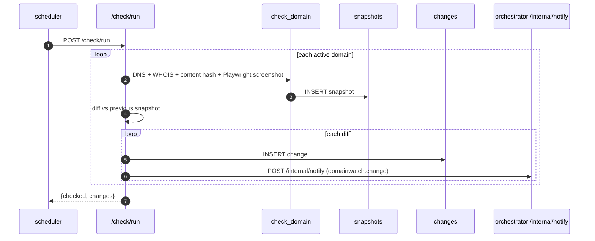
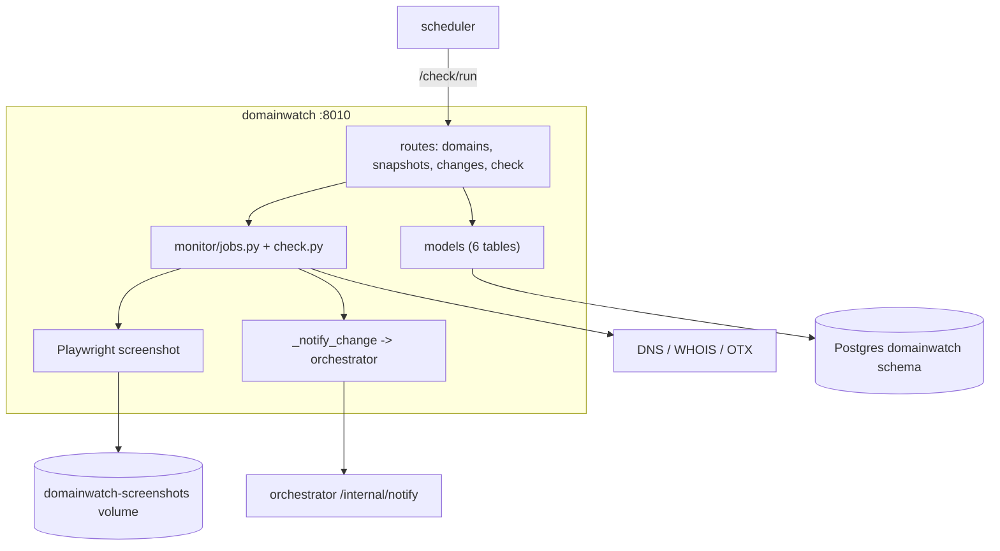

# domainwatch — Overview

## Purpose

Periodic per-domain monitoring: DNS/WHOIS, content hash, screenshot, IOC
lookup, and subdomain delta detection. Emits a notification on every
detected change. Refactored from a legacy Flask + SQLite app to async
FastAPI + Postgres.

| Property | Value |
|---|---|
| Port | 8010 |
| Schema | `domainwatch` |
| Source | `services/domainwatch/` |
| Base image | `mcr.microsoft.com/playwright/python` (ships browser binaries) |
| Scheduler trigger | `POST /check/run` every 12h |
| Secrets | `OTX_API_KEY` (optional, for IOC lookup) |

## Tables

| Table | Purpose |
|---|---|
| `domains` | monitored domains (name unique, active, last_checked_at) |
| `snapshots` | per-check capture (details jsonb, content_hash, screenshot_path) |
| `changes` | detected diffs (change_type, before, after) |
| `domain_iocs` | IOCs found per domain |
| `domain_subdomains` | discovered subdomains per domain |
| `source_health` | per-source circuit state |

## Endpoints

| Method | Path | Purpose |
|---|---|---|
| GET/POST/DELETE | `/domains` | domain management |
| GET | `/domains/{id}` | full status (latest snapshot + recent changes) |
| GET | `/domains/{id}/snapshots`, `/snapshots/{sid}` | snapshot history |
| GET | `/domains/{id}/changes` | change history |
| GET | `/domains/{id}/screenshot` | latest PNG (FileResponse) |
| POST | `/check/run` | scheduler trigger |
| POST | `/domains/{id}/check` | manual check (background, 202) |

## The monitoring pipeline

## Change notifications

Every detected change (DNS / content / cert) emits a
`domainwatch.change` event to the orchestrator's `/internal/notify`,
carrying the change type and before/after. This is the first event source
wired into the notification subsystem. The emit is fire-and-forget — a
failed notification never rolls back the committed snapshot.

## Playwright in a container

domainwatch needs a real browser to capture screenshots. Rather than a
fragile runtime `playwright install`, it uses the official
`mcr.microsoft.com/playwright/python` base image which ships the browser
binaries. DNS calls run in a `ThreadPoolExecutor` to avoid blocking the
async event loop. Screenshots are stored on disk at a volume-mounted path;
the DB stores only the path.

## Architecture

## Refactor provenance

Ported from the legacy "Domain Watcher" app: kept `monitor_domain` core
pipeline, `takescreenshot.py` (Playwright), `checkdomain.py`,
`getIOCS.py`, `subdomains.py`. Removed: all Jinja2 templates, HTML-serving
routes, `EncryptedSessionMiddleware` (replaced by JWT/edge-auth), internal
APScheduler (replaced by central scheduler), and the legacy `users` table
(auth centralised).
