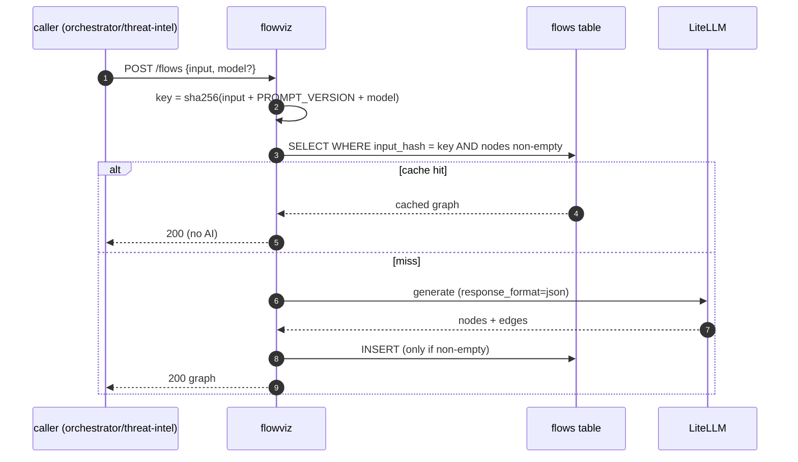
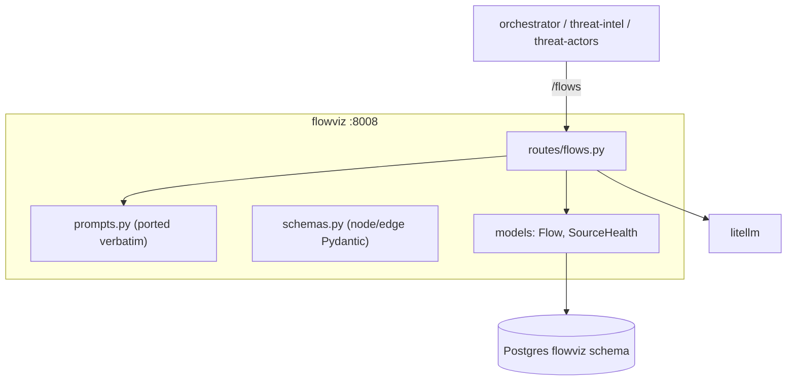

# flowviz — Overview

## Purpose

Converts a threat description into an ATT&CK attack-flow graph (typed
nodes + edges). It is stateless given its input (apart from a cache) and
is called one-way by the orchestrator, threat-intel, and threat-actors. It
was refactored from a legacy Node.js/React app — only the prompt and
schema were ported; all frontend code was discarded.

| Property | Value |
|---|---|
| Port | 8008 |
| Schema | `flowviz` |
| Source | `services/flowviz/` |
| Secrets | AI provider keys (via LiteLLM) |
| Default model | `github/gpt-4.1` (fallback `gpt-5-chat`, `gpt-4o`) |

## Tables

| Table | Purpose |
|---|---|
| `flows` | cache: `input_hash`, `input_text`, `output jsonb`, `model_name`, `generated_at` |
| `source_health` | LLM provider tracked as a "source" |

## Endpoints

| Method | Path | Purpose |
|---|---|---|
| POST | `/flows` | description → `{nodes, edges}` (cached) |
| POST | `/flows/stream` | SSE progressive output |
| GET | `/flows/{id}` | retrieve a cached flow |

## Caching by prompt version

- Cache key includes `PROMPT_VERSION` so prompt changes don't serve stale
  flows, and the per-request `model` so different models don't shadow each
  other.
- **Empty results are not cached** — a transient provider failure (0
  nodes) must not poison the cache; the next call retries (commit fix).

## The model-override path

`POST /flows` accepts an optional `model` in the body. threat-intel and
threat-actors pass their smart-picked model so the whole insight uses one
model. flowviz builds a one-off client for that model when supplied,
otherwise uses its configured default.

## Refactor provenance

The original Flowviz was a Node/React app. The refactor (documented in the
implementation plan) **deleted** all `src/` React code, converters, flow
storage, and providers, and **ported** only:
- `directFlowPrompts.ts` → `app/prompts.py` (string constants, verbatim).
- `attack-flow.ts` types → `app/schemas.py` (Pydantic node/edge models).
- the streaming endpoint logic → FastAPI `StreamingResponse`.

This is a clean example of the platform's "port the semantics, discard the
framework" refactor strategy.

## Architecture

## Frontend rendering

The frontend renders flowviz output as a real graph (ReactFlow + dagre
auto-layout) in `frontend/src/components/shared/AttackFlowGraph.tsx`,
used by both the standalone `/flowviz` page and the threat/actor insight
panels. Node types are colour-coded by the MITRE Attack Flow Builder
convention (action, malware, tool, asset, infrastructure, …).
