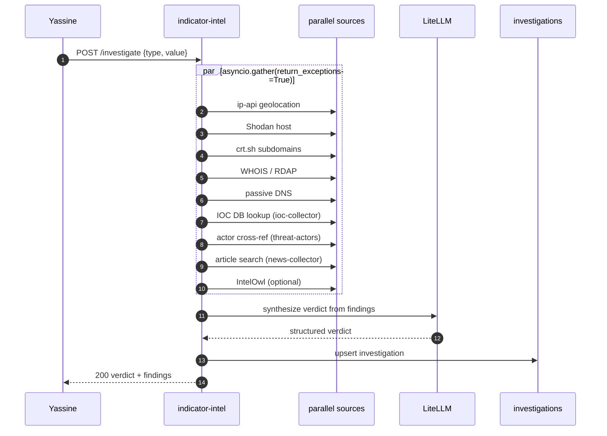
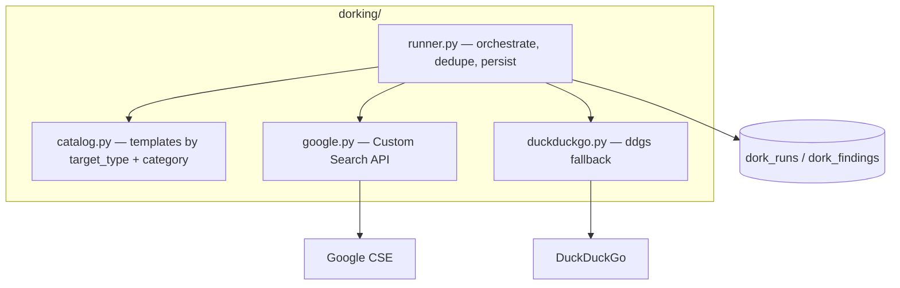

# indicator-intel — Overview

## Purpose

AI-driven passive investigation of a single IP or domain, plus a
Google-dorking sub-service. Aggregates many passive sources in parallel,
then asks the AI for a verdict. Passive only — it never sends a probe to
the target.

| Property | Value |
|---|---|
| Port | 8013 |
| Schema | `indicator` |
| Source | `services/indicator-intel/` |
| Secrets | `SHODAN_API_KEY`, `INTELOWL_URL/API_KEY`, AI keys, optional `GOOGLE_API_KEY`/`GOOGLE_CSE_ID` |

## Tables

| Table | Purpose |
|---|---|
| `investigations` | one row per investigation (verdict, risk_score, summary, payload, model) |
| `dork_runs` | one row per dork run (target, categories, backend, status, totals) |
| `dork_findings` | per-result rows (dork, category, title, url, snippet, source) |
| `source_health` | per passive-source circuit state |

## Investigation flow (parallel passive sources)

- Sync path caps at ~30s; deep investigations use `/investigate/async`
  which calls back the scheduler on completion.
- Partial failure is normal — `gather(return_exceptions=True)` means a
  dead source degrades one section, not the investigation.
- WHOIS runs in a `ThreadPoolExecutor` (the library is sync).

## Google dorking sub-service

`services/indicator-intel/app/dorking/` — added in commit `1cead2e`.

- **Catalog** — curated dork templates grouped by category (exposed_files,
  admin_panels, directory_listing, sensitive_data, github_leaks,
  paste_sites, cloud_storage for domains; breach/exec sets for email/ip/
  company). Adding a category is one dict entry; the UI renders it
  automatically.
- **Backend selection** — Google CSE first when `GOOGLE_API_KEY` +
  `GOOGLE_CSE_ID` are present; on per-query 429 / quota → DuckDuckGo for
  that query; on auth error → DDG for the whole run. Status =
  success / degraded / failed; backend = google / duckduckgo / mixed.
- **Persistence** — one `dork_runs` row + N `dork_findings`, deduped by
  `(category, url)`.

Verified live: `example.com` (no Google key configured) →
`backend=duckduckgo, 6 findings`.

## Endpoints

| Method | Path | Purpose |
|---|---|---|
| POST | `/investigate` | sync passive investigation |
| POST | `/investigate/async` | background investigation + scheduler callback |
| GET | `/investigations`, `/investigations/{id}` | history + detail |
| GET | `/dorks/catalog` | the dork catalogue (UI source) |
| POST | `/dorks/run` | execute dorks against a target |
| GET | `/dorks/runs`, `/dorks/runs/{id}` | dork history + detail |

## Frontend integration

The dorking panel is a collapsible card on `/iocs/investigate`
(`frontend/src/app/(app)/iocs/investigate/page.tsx`). It lazy-loads the
catalog, presents category checkboxes, runs the selected categories, and
groups results by category — each finding showing the link, snippet, the
exact dork that surfaced it, and a google/duckduckgo source tag.

## SSRF safety

Both the investigation and dorking paths pass the target as a **query
parameter** to fixed external services (ip-api, Shodan, crt.sh, Google
CSE, DuckDuckGo) — the service never fetches the user-supplied URL
directly, closing the obvious SSRF vector.
