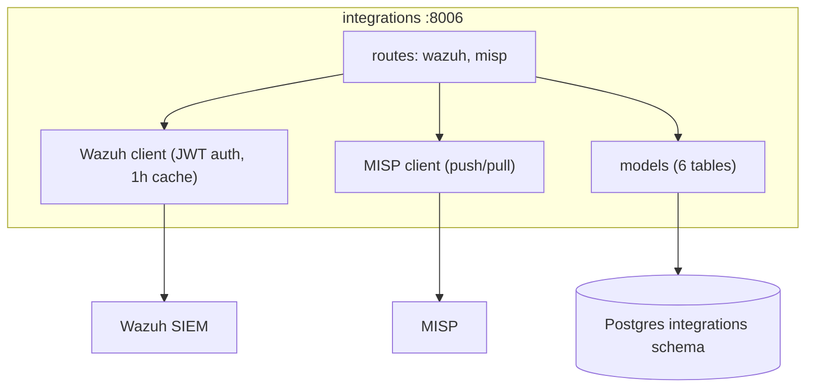
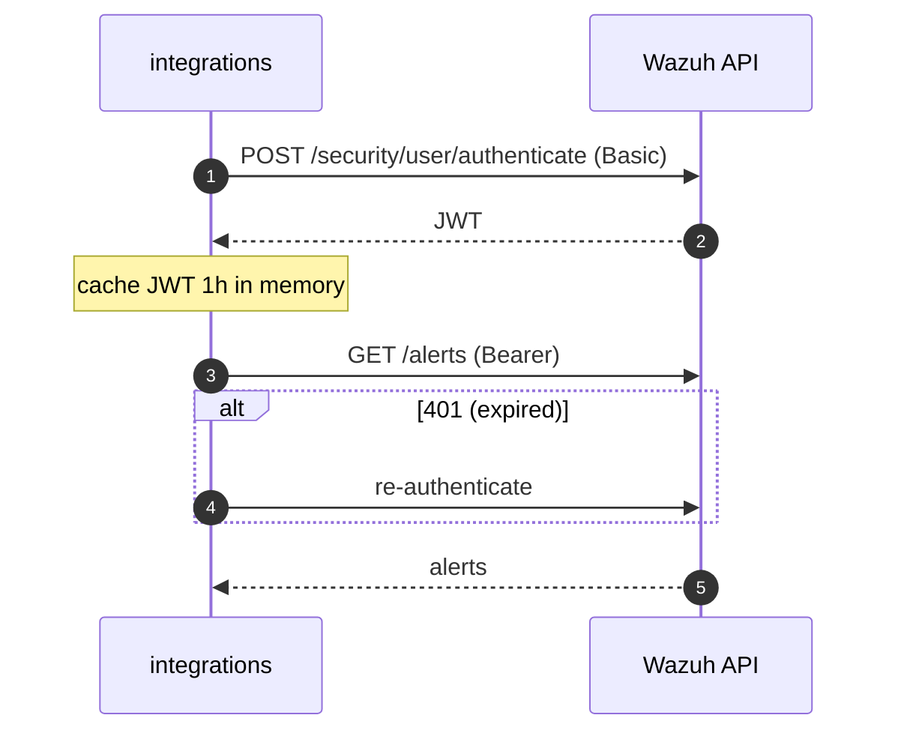

# integrations — Overview

## Purpose

The bridge to the bank's existing security substrate: pulls alerts and
agents from **Wazuh** (SIEM) and events/attributes from **MISP** (sharing
platform), and pushes high-confidence IOCs back to a configured MISP
event.

| Property | Value |
|---|---|
| Port | 8006 |
| Schema | `integrations` |
| Source | `services/integrations/` |
| Scheduler trigger | `POST /wazuh/sync` every 30 min (MISP sync included) |
| Secrets | `WAZUH_URL/USERNAME/PASSWORD`, `MISP_URL/API_KEY`, `MISP_PUSH_EVENT_ID` (all optional — degrades gracefully) |

## Tables

| Table | Purpose |
|---|---|
| `wazuh_alerts` | alert_id, agent, rule, severity, timestamp, raw |
| `wazuh_agents` | agent inventory |
| `misp_events` | pulled MISP events |
| `misp_iocs` | event attributes, normalised |
| `misp_pushes` | record of which local IOCs were pushed to which MISP event/attribute |
| `source_health` | per-integration circuit state |

## Endpoints

| Method | Path | Purpose |
|---|---|---|
| GET | `/wazuh/alerts` | filter by severity/agent/since |
| GET | `/wazuh/agents` | agent list |
| POST | `/wazuh/sync` | scheduler trigger (pull alerts + agents; MISP sync) |
| GET | `/misp/events`, `/misp/events/{id}`, `/misp/iocs` | MISP data |
| POST | `/misp/sync` | pull events + attributes |
| POST | `/misp/push` | push selected high-confidence IOCs |

## Architecture

## Wazuh auth flow

## MISP push policy

`POST /misp/push` targets a single org-owned event (`MISP_PUSH_EVENT_ID`
from the vault). Only IOCs with `confidence >= 0.85` that are **not
already pushed** (checked against `misp_pushes`) are sent. This makes the
bank a contributor to its sharing community without flooding it with
low-confidence noise or duplicates.

## Graceful degradation

Every external dependency is optional. If Wazuh or MISP creds are absent
from the vault, the relevant sync is skipped and `source_health` records
the absence — the service stays up and serves whatever it has. This honours
the "partial success is success" goal (G2) at the integration boundary.

## Role in the orchestrator's correlation step

The orchestrator's step-3 detection correlation reads
`integrations`' Wazuh alerts and joins them against the IOC DB and actor
TTPs. integrations is therefore both an ingest boundary (pulls from Wazuh)
and a data source for the synthesis layer.
