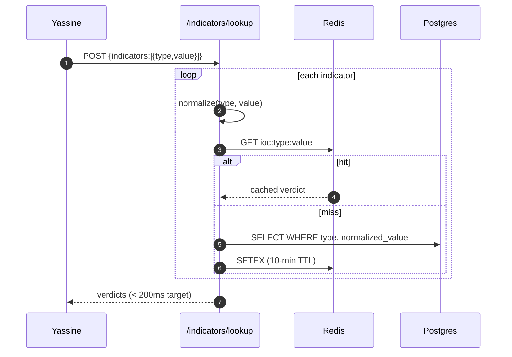
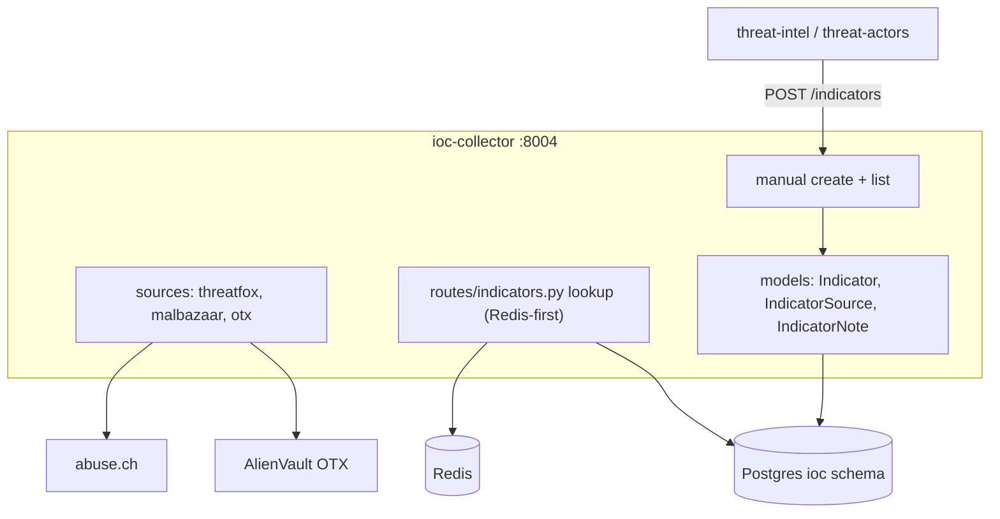

# ioc-collector — Overview

## Purpose

Ingests IOCs from ThreatFox, MalwareBazaar, and OTX; counts corroboration
across sources; serves the platform's latency-critical lookup hot path
through Redis; and receives auto-promoted IOCs from the threat/actor AI
insights.

| Property | Value |
|---|---|
| Port | 8004 |
| Schema | `ioc` |
| Source | `services/ioc-collector/` |
| Scheduler trigger | `POST /ingest/run` every 3h |
| Secrets | `ABUSECH_API_KEY` (ThreatFox + MalBazaar), `OTX_API_KEY` (optional) |
| Cache | Redis hot path (`ioc:<type>:<value>`, 10-min TTL) |

## Tables

| Table | Purpose |
|---|---|
| `indicators` | `type, normalized_value, raw_value, first/last_seen, tags, confidence, analyst_status`; `unique(type, normalized_value)` |
| `indicator_sources` | per-source report rows; corroboration is counted from these; `pk(indicator_id, source_name)` |
| `indicator_notes` | analyst notes |

## The hot path

This is the path that backs Yassine's sub-10-second triage (G9). On a
cache hit it is single-digit milliseconds and never touches Postgres.

## Corroboration scoring

When a new source reports an existing indicator: insert an
`indicator_sources` row, recompute the confidence score (corroboration =
count of distinct `source_name` rows, capped contribution), update
`last_seen`. The `confidence.py` IOC weight vector puts 0.30 on
corroboration — three independent sources materially raises confidence.

## Manual creation + auto-promotion

- `POST /indicators` — analyst-created IOC at reliability 0.95, source
  `analyst:<subject>`, status `reviewed`. Verified working end-to-end
  (admin → BFF → backend → DB returns 201).
- **Auto-promotion target** — threat-intel and threat-actors POST
  extracted IOCs here (tagged `from-threat-insight` /
  `from-actor-insight`), deduped on `(type, normalized_value)`; an
  existing indicator just gains a new source row.

## Architecture

## Why Redis only for the hot path

Every other read in the platform goes straight to Postgres. The IOC
lookup is the single endpoint with a hard latency budget, so it is the
single endpoint with a cache. The cache is loss-tolerant (10-min TTL,
reconstructed from Postgres on miss) — wiping Redis costs a cold-cache
penalty, not data.
