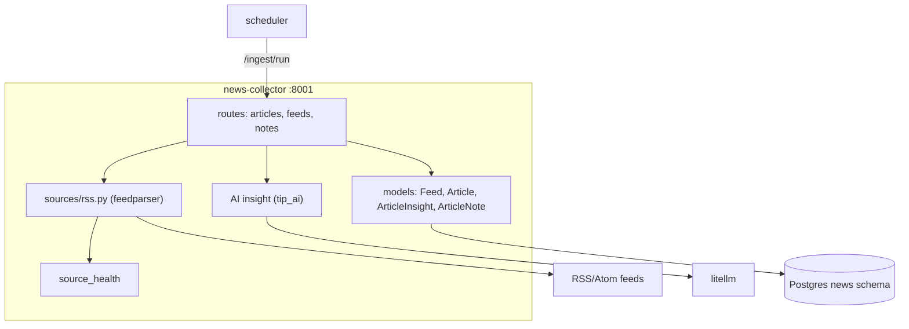

# news-collector — Overview

## Purpose

Ingests RSS / Atom security feeds, normalises and deduplicates articles,
and produces per-article AI insights on demand.

| Property | Value |
|---|---|
| Port | 8001 |
| Schema | `news` |
| Source | `services/news-collector/` |
| Scheduler trigger | `POST /ingest/run` every 2h |
| Secrets | provider keys (for AI insight) |

## Tables

| Table | Purpose |
|---|---|
| `feeds` | feed list editable at runtime (name, url, kind, active, reliability, tags) |
| `articles` | normalised articles, `url_hash` unique, content hash, confidence, analyst_status |
| `article_insights` | per-article AI payload (`prompt_version`, `analyst_override`) |
| `article_notes` | analyst notes (built via `tip_common.build_notes_router`) |

## Endpoints

| Method | Path | Purpose |
|---|---|---|
| GET | `/articles` | filter by source/tag/since/until/q, paginated, sortable |
| GET | `/articles/{id}` | one article |
| GET/POST | `/articles/{id}/insight`, `/analyze` | AI insight (cache-first) |
| PATCH | `/articles/{id}/status` | analyst_status |
| GET/POST/PATCH/DELETE | `/feeds` | runtime feed management |
| POST | `/ingest/run` | scheduler trigger — pull all active feeds in parallel |
| `*` | `/articles/{id}/notes` | notes CRUD |

## Architecture



## Ingestion flow

```mermaid
sequenceDiagram
    autonumber
    participant SCH as scheduler
    participant R as /ingest/run
    participant F as active feeds
    participant H as source_health
    SCH->>R: POST /ingest/run
    R->>F: SELECT feeds WHERE active
    par per feed (gather, return_exceptions)
        R->>R: fetch_with_resilience(feed.url)
        R->>R: parse, canonicalise URL, sha256 dedup
        R->>R: detect type + severity; compute confidence
        R->>H: mark_success / mark_failure
    end
    R-->>SCH: {feeds_attempted, feeds_succeeded, articles_added}
```

## Non-obvious decisions

- **Dedup** by SHA-256 of the canonicalised URL (strip UTM, trailing
  slash, fragment) — `url_hash` unique.
- **HTML → text** via readability + bs4; extraction_quality 0.7 unless the
  feed gave full content (then 1.0) — feeds into the confidence score.
- **Runtime feeds** — feeds live in the DB, editable from
  Settings → RSS Feeds, not hard-coded. (The watchTowr feed was added at
  runtime; its ingest was verified live.)
- **Notes router factory** — `article_notes` CRUD is generated by
  `tip_common.build_notes_router`, the same factory used by 4 other
  services (DRY across the analyst-notes feature).

## The watchTowr-feed incident

A feed added at runtime had `last_pulled_at = NULL` because the scheduled
cycle had not yet run since it was added. A manual `POST /ingest/run`
pulled 15 articles, confirming the runtime-feed path works end to end.
The ingester correctly iterates all `active=true` DB feeds.
