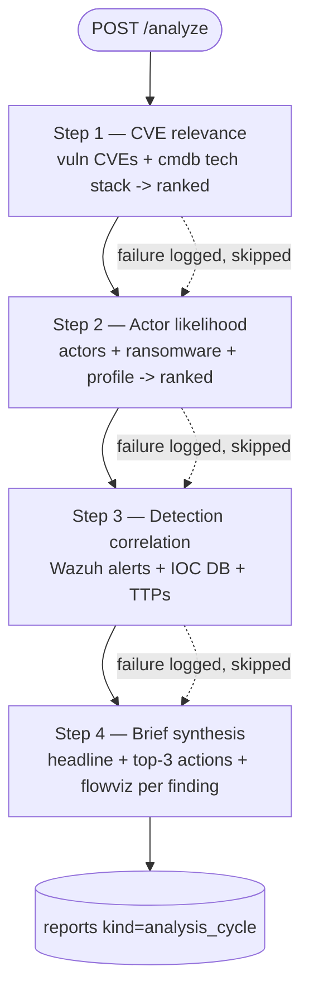
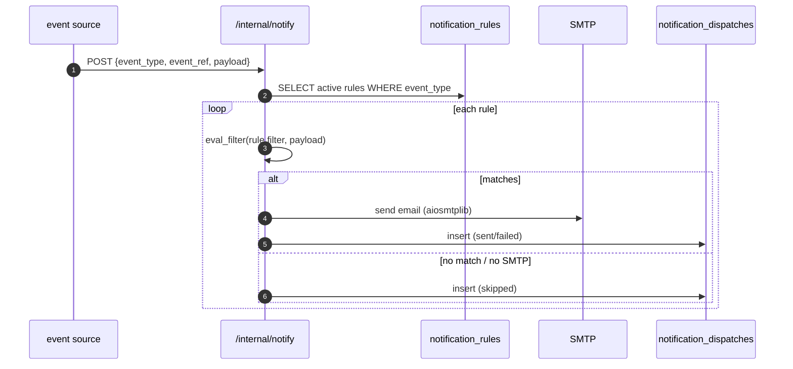
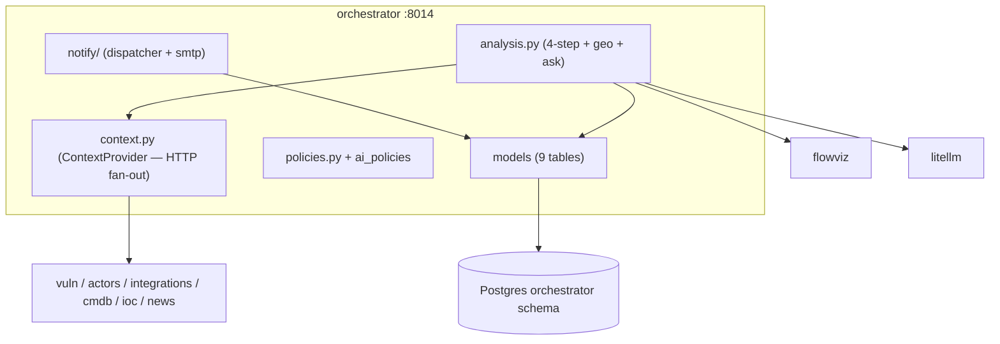

# orchestrator — Overview

## Purpose

The AI brain. It is the only service that reads from multiple other
services (HTTP fan-out implementing the `tip_ai.ContextProvider`
protocol). It runs the 4-step analysis cycle, the daily geopolitical
prediction, the ad-hoc `/ask`, the AI-policy engine, and the notification
dispatcher.

| Property | Value |
|---|---|
| Port | 8014 |
| Schema | `orchestrator` |
| Source | `services/orchestrator/` |
| Scheduler triggers | `POST /analyze` 6h, `POST /analyze/geo` daily 05:00 |
| Secrets | AI provider keys, SMTP creds (notifications) |

## Tables

| Table | Purpose |
|---|---|
| `reports` | `kind` (analysis_cycle / geo_prediction / adhoc), payload, prompt_version |
| `cve_relevance` | per-CVE relevance score + rationale |
| `actor_likelihood` | per-actor likelihood + TTP overlap + rationale |
| `correlations` | Wazuh-alert ↔ IOC/actor correlations |
| `ai_policies` | 3-mode × N-category policy engine (full_auto/category_auto/on_demand) |
| `action_runs` | per-action execution audit |
| `notification_rules` | event_type → channel/target/filter |
| `notification_dispatches` | per-send audit (sent/failed/skipped) |
| `source_health` | downstream services tracked as "sources" |

## The 4-step analysis cycle

Each step is an LLM call with structured output. Per-step failure is
logged and the step skipped — the cycle continues (G2). Each step's output
is persisted as soon as it lands, so a step-4 failure does not lose
steps 1–3.

## Geopolitical prediction

`POST /analyze/geo` (daily 05:00) uses the company's geopolitical profile
fields to produce `{outlook, summary, emerging_threats[], affected_sectors,
recommended_monitoring}`, stored as `reports kind=geo_prediction`. Surfaced
on the dashboard's Geopolitical Insights card.

## Ad-hoc /ask

`POST /ask` answers analyst questions. The prompt (`ASK_PROMPT`) is
investigation-grade: it instructs the model to engage substantively, use
public-reporting knowledge when the local DB is sparse (rather than
replying "no data"), tie findings to the company profile, and return
8–15 sentences with named campaigns, MITRE IDs, and concrete hunt
commands. Verified live on "tell me about Lazarus" (not in the local DB):
1355-char substantive answer with Bangladesh Bank heist, SWIFT, MITRE
techniques, and recommended actions.

## Notification subsystem

- Channel v1: SMTP (`app/notify/smtp.py`). Webhook/telegram scaffolded in
  the schema.
- Event types: `domainwatch.change`, `cve.exploited`,
  `threat.supply_chain`.
- Filters: `severity_min`, `change_types`, `product_match`.
- Rules + history are managed from Settings → Notifications.

## Architecture

## Why the orchestrator is the only fan-out service

Principle P1 says no service reads another's tables. The orchestrator
respects this — it reads other services via their HTTP APIs, not their
schemas. It is the single place where cross-service synthesis happens,
keeping every other service a clean vertical slice. It implements
`tip_ai.ContextProvider` by HTTP fan-out, so the AI library never needs to
know about service topology.
