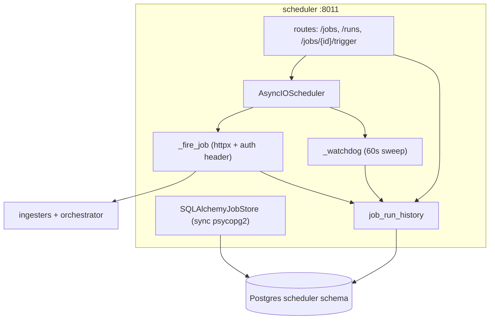

# scheduler — Overview

## Purpose

The single owner of all recurring jobs. It fires HTTP triggers to every
ingester and to the orchestrator on a schedule, records run history, and
runs a watchdog that times out stuck jobs.

| Property | Value |
|---|---|
| Port | 8011 |
| Schema | `scheduler` |
| Source | `services/scheduler/` |
| Engine | APScheduler 3.x with a **sync** `SQLAlchemyJobStore` (psycopg2) |

## Tables

| Table | Purpose |
|---|---|
| `apscheduler_jobs` | managed by APScheduler's job store |
| `job_run_history` | `run_id, job_id, triggered_at, completed_at, duration_ms, status, http_status, error_detail` |

## Built-in jobs

From `services/scheduler/app/jobs.py` `JOB_CONFIGS` (intervals shown are
the live-test cadence; production cadences are longer):

| Job | Target | Method |
|---|---|---|
| news_pull | news-collector | POST /ingest/run |
| threat_intel_pull | threat-intel | POST /ingest/run |
| vuln_cve_refresh | vuln-intel | POST /refresh/nvd |
| vuln_kev_refresh | vuln-intel | POST /refresh/kev |
| vuln_epss_refresh | vuln-intel | POST /refresh/epss |
| ioc_pull | ioc-collector | POST /ingest/run |
| actors_refresh | threat-actors | POST /refresh |
| asm_discovery | asm | POST /scan/run |
| domainwatch_check | domainwatch | POST /check/run |
| wazuh_sync | integrations | POST /wazuh/sync |
| orchestrator_analysis | orchestrator | POST /analyze |
| geo_prediction | orchestrator | POST /analyze/geo |
| _watchdog | (internal) | every 60s, marks stale `running` as `timeout` |

## Architecture



## The fire-job lifecycle

```mermaid
sequenceDiagram
    autonumber
    participant APS as APScheduler
    participant F as _fire_job
    participant T as target service
    participant H as job_run_history
    APS->>F: trigger (job_id, url_attr, path)
    F->>H: INSERT run (status=running, run_id)
    F->>T: POST {path} {run_id} (Authorization: service JWT)
    alt 401 (JWT expired)
        T-->>F: 401
        F->>F: refresh JWT, retry once
    end
    alt 2xx non-202
        T-->>F: 200
        F->>H: UPDATE run (success, http_status)
    else 202
        T-->>F: 202
        Note over F: row stays "running"; callback completes it later
    else error
        F->>H: UPDATE run (failed, error_detail)
    end
```

## The sync-engine wart (honest deviation from "async everywhere")

APScheduler 3.x's `SQLAlchemyJobStore` is synchronous and requires a
psycopg2 URL. The service therefore runs a small sync engine alongside the
async one. `Settings.sync_db_url` derives the psycopg2 URL automatically.
This is the one documented deviation from the platform's async-everywhere
principle (EC3); APScheduler 4 (async-native) is in beta and not yet
adopted.

## Two real incidents this service was central to

1. **24-hour silent 401 cascade (commit `5bd8b73`).** Outbound fires
   carried no `Authorization` header, so every target 401'd. Fixed by
   attaching the service JWT + a refresh-on-401 self-heal; later made moot
   by the auth simplification.
2. **Singular/plural permission bug (commit `14d0489`).** The scheduler's
   service account held `threat:write` but threat-intel checks
   `threats:write`. Fixed by auditing the real `require_permission` names.

Both are documented in `02_problem_statement/operational_challenges.md`.

## Why one central scheduler

Centralising cron in one service means "what runs when?" has a single
answer (`JOB_CONFIGS`), run history has a single table, and the watchdog
has a single place to detect stuck jobs — versus scattering cron across 15
containers (the rejected alternative A5).
