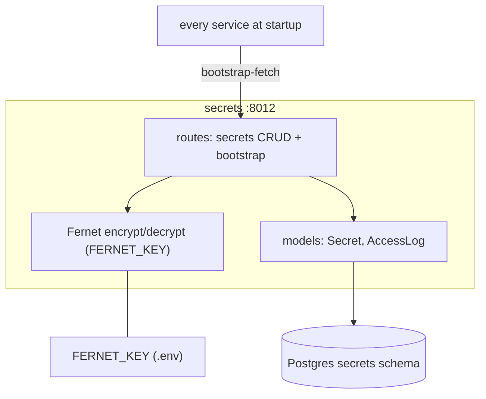

# secrets — Overview

## Purpose

A Fernet-encrypted credential vault. It is the single store for every
credential the platform uses (provider API keys, source keys, Wazuh/MISP
creds, SMTP creds, RS256 keypair, per-service bootstrap tokens). Only
`FERNET_KEY` and `SECRETS_BOOTSTRAP_TOKEN` live outside it (in `.env`).

| Property | Value |
|---|---|
| Port | 8012 |
| Schema | `secrets` |
| Source | `services/secrets/` |
| Hard requirement | `FERNET_KEY` (refuses to start without it) |

## Tables

| Table | Purpose |
|---|---|
| `secrets` | `name pk, value_encrypted bytea, version, metadata, created_at, updated_at` |
| `access_log` | `secret_name, actor, action (read/write/rotate/delete), at, source_ip` |

## Endpoints

| Method | Path | Auth | Purpose |
|---|---|---|---|
| GET | `/secrets` | admin | list names + metadata (never values) |
| GET | `/secrets/{name}` | admin | return value (logged) |
| POST | `/secrets` | admin | create/update |
| DELETE | `/secrets/{name}` | admin | delete |
| POST | `/secrets/{name}/rotate` | admin | update + bump version |
| POST | `/internal/bootstrap-fetch` | bootstrap token | pre-auth single/bulk fetch |

## The bootstrap endpoint — the chicken-and-egg solver

`POST /internal/bootstrap-fetch` is the **only** unauthenticated vault
path. It is authorised by the shared `SECRETS_BOOTSTRAP_TOKEN`. Two modes:

- `{service_name, bootstrap_token, secret_name}` → `{"value": "..."}`
  (single-secret mode, used by `tip_secrets.SecretsClient`).
- `{service_name, bootstrap_token}` (no `secret_name`) →
  `{"secrets": {RS256_PRIVATE_KEY, RS256_PUBLIC_KEY}}` (bulk mode, used
  only by the auth service for its keypair).

This is how every service reads its own credentials at startup before it
has any other identity (TP8).

## Architecture

## Security properties

- **At rest:** every value is Fernet-encrypted (`value_encrypted bytea`).
- **Access logged:** every read/write/rotate/delete → `access_log` with
  actor + source IP. The compliance officer can audit "who read
  `OPENROUTER_API_KEY`".
- **Never logs values:** `GET /secrets` returns names + metadata only.
- **Single point of trust:** `FERNET_KEY` is the one secret outside the
  vault; its compromise yields everything. It is intentionally kept in
  `.env` (operator-protected) and never in the database.

## Seeding

`infra/bootstrap/seed_secrets.py` (run via `make seed`) connects directly
to Postgres with the Fernet key and inserts: the RS256 keypair, per-service
bootstrap tokens (`SVC_<NAME>_BOOTSTRAP_TOKEN`), `LITELLM_MASTER_KEY`, and
everything from `prompt/credentials.env`. `set_secrets.py` is a helper for
adding individual secrets post-bootstrap (e.g. SMTP creds, Google CSE
keys).

## Why a dedicated service rather than env vars

- **Rotation** is a single vault write, not a 15-file change.
- **Audit** — every access is recorded.
- **Encryption at rest** — a Postgres dump does not leak credentials.
- **Centralisation** — one inventory of "what credentials exist".
