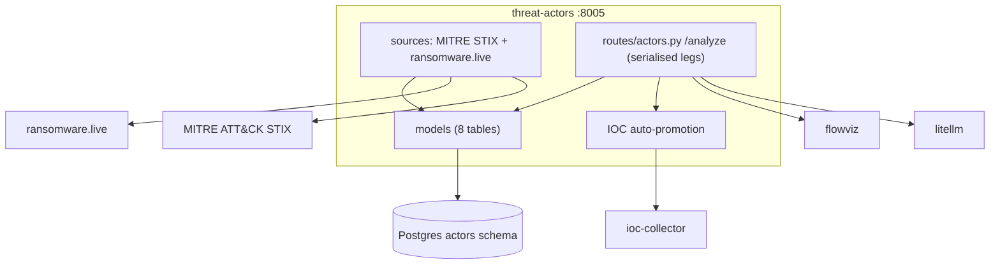

# threat-actors — Overview

## Purpose

Maintains the library of threat actors (MITRE ATT&CK groups), their
techniques and tools, ransomware groups and victims, and generates the
same hunting-hypothesis / IOC / attack-flow AI insight as threat-intel —
but sourced from an actor profile rather than a threat report.

| Property | Value |
|---|---|
| Port | 8005 |
| Schema | `actors` |
| Source | `services/threat-actors/` |
| Scheduler trigger | `POST /refresh` daily 03:00 |
| Sources | MITRE ATT&CK STIX bundle, ransomware.live, (optional Malpedia) |
| Inline calls | flowviz `/flows`, ioc-collector `/indicators` (auto-promote) |

## Tables

| Table | Purpose |
|---|---|
| `actors` | mitre_id (nullable for manual), name, aliases, origin, motivation, target sectors/countries, status, analyst_status |
| `actor_ttps` | technique mappings (`actor_id`, `technique_id`, confidence) |
| `tools` / `actor_tools` | malware/tools and the actor↔tool join |
| `ransomware_groups` / `ransomware_victims` | groups + disclosed victims (deduped) |
| `actor_insights` | AI payload (`prompt_version`, `analyst_override`) |
| `actor_notes` | analyst notes |
| `source_health` | per-source circuit state |

## Endpoints

| Method | Path | Purpose |
|---|---|---|
| GET | `/actors` | filter by sector/country/motivation/q, sortable |
| GET | `/actors/{id}` | full profile (TTPs, tools, campaigns) |
| GET/POST | `/actors/{id}/insight`, `/analyze` | AI insight (cache-first, force) |
| POST | `/actors` | manual actor (nullable mitre_id) |
| GET | `/ransomware/groups`, `/ransomware/victims` | ransomware library |
| GET | `/tools`, `/ttps/{technique_id}` | tools, actors-using-technique |
| POST | `/refresh` | scheduler trigger (STIX + ransomware.live) |

## Actor AI insight

Identical pipeline to threat-intel (`06_services/threat_intel_service`),
but the source blob is built from the actor's name, aliases, origin,
motivation, target sectors, known TTPs (from `actor_ttps`), and tools.
The prompt (`services/threat-actors/app/prompts.py`, `PROMPT_VERSION=v2`)
instructs the model to use its public knowledge of named actors when the
local profile is thin.

Verified live on ALLANITE (an ICS APT): produced a 407-char hypothesis,
292-char Wazuh rule, 4 ICS-specific MITRE techniques (T08xx), and a 6-node
attack flow.

## STIX processing order

The refresh processes the STIX bundle in dependency order: tools/malware →
actors → relationships. Tool and actor maps are built first so
relationship resolution (actor↔tool, actor↔technique) has its FK targets.

## Manual actors

`POST /actors` supports analyst-created actors with a **nullable**
`mitre_id`. The migration replaced the legacy `NOT NULL + UNIQUE` on
`mitre_id` with a partial unique index `WHERE mitre_id IS NOT NULL`, so
manual actors can omit it while STIX-sourced actors stay unique.

## Confidence display

`actor_ttps` rows carry a `confidence` value used for AI ranking, but the
UI no longer renders numeric confidence (the TTP matrix uses a flat accent
colour) — per the platform-wide "remove confidence metrics" decision.
