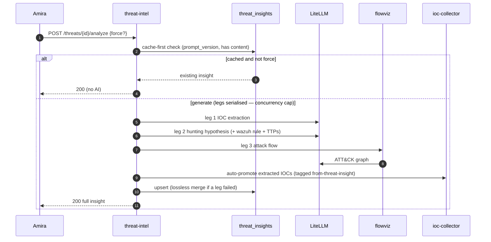
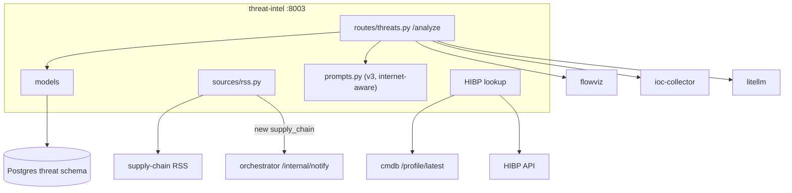

# threat-intel — Overview

## Purpose

Ingests supply-chain advisories and public disclosures (RSS), performs
HIBP domain-breach lookups, and generates the platform's richest AI
insight: a hunting hypothesis + Wazuh rule + extracted IOCs + ATT&CK
attack flow per threat. It also auto-promotes extracted IOCs into the
central IOC library.

| Property | Value |
|---|---|
| Port | 8003 |
| Schema | `threat` |
| Source | `services/threat-intel/` |
| Scheduler trigger | `POST /ingest/run` every 4h |
| Secrets | `HIBP_API_KEY` (optional), AI provider keys |
| Inline calls | flowviz `/flows`, ioc-collector `/indicators`, cmdb `/profile/latest` |

## Tables

| Table | Purpose |
|---|---|
| `threats` | type (supply_chain/data_breach/leak/disclosure/report), title, severity, details, analyst_status |
| `hibp_breaches` | HIBP breach records keyed by name |
| `threat_insights` | AI payload (hypothesis, wazuh_rule, IOCs, attack_flow), `prompt_version` |
| `threat_notes` | analyst notes |
| `source_health` | per-source circuit state |

## The multi-leg AI insight (the flagship feature)

`POST /threats/{id}/analyze` generates three artefacts. This is the most
intricate request in the platform.

### Why serialised, not parallel (EC11)
GitHub Models caps concurrent requests per key (1 for gpt-5-chat, 2 for
gpt-4o). Running the legs in parallel tripped `Rate limit of N per 0s for
UserConcurrentRequests`. Serial legs never trip it regardless of the
smart-picked model.

### Cache-first + lossless merge
- Cache-first: a saved insight at the current `prompt_version` is returned
  without an AI call unless `force=true`.
- Lossless merge: if a fresh run's leg fails (quota) but the previous row
  had content, the old content is carried over (marked
  `*_carried_over`), so a partial failure never destroys good data.

### Smart model picker
`_SMART_MODEL_DEFAULTS = [github/gpt-4.1, github/gpt-5-chat, github/gpt-4o,
anthropic/claude-3-5-sonnet]` — prefers the largest-quota model first
(commit `61ba20a`).

## Architecture

## HIBP integration

At each cycle, reads company `public_domains` from cmdb `/profile/latest`,
then queries HIBP per domain. Skipped gracefully when no `HIBP_API_KEY`.

## Supply-chain notification

When ingest adds a new `supply_chain` threat, it emits
`threat.supply_chain` to the orchestrator's `/internal/notify`, feeding the
notification subsystem.

## Prompt evolution

`prompts.py` `PROMPT_VERSION` is at `v3`: long-form, internet-aware
("don't say 'no info' — use public reporting"), Splunk SPL output dropped
(Wazuh-only deploy), 5–8 sentences with named campaigns + Sysmon/MITRE
specifics. Bumping the version invalidates cached insights platform-wide.
