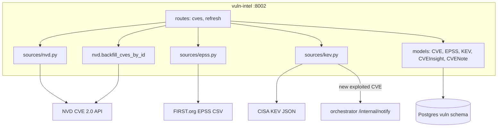
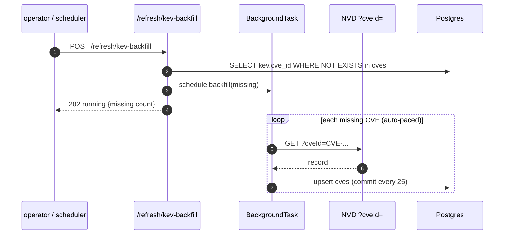

# vuln-intel — Overview

## Purpose

Ingests vulnerability intelligence: NVD CVE 2.0, EPSS scores, and CISA KEV
(Known Exploited Vulnerabilities). Produces per-CVE AI insights. Owns the
KEV-backfill logic that keeps the "exploited in the wild" filter accurate.

| Property | Value |
|---|---|
| Port | 8002 |
| Schema | `vuln` |
| Source | `services/vuln-intel/` |
| Scheduler triggers | `/refresh/nvd` 6h, `/refresh/kev` daily, `/refresh/epss` daily |
| Secrets | `NVD_API_KEY` (optional, raises rate limit) |

## Tables

| Table | Purpose |
|---|---|
| `cves` | NVD records (description, CVSS, CWE, affected_products, references) |
| `epss` | exploitation-probability score + percentile (full daily snapshot) |
| `kev` | CISA Known Exploited Vulnerabilities (vendor, product, ransomware_use, dates) |
| `cve_insights` | per-CVE AI payload |
| `cve_notes` | analyst notes |

## Endpoints

| Method | Path | Purpose |
|---|---|---|
| GET | `/cves` | filter by severity/product/since/kev/epss_gte/q, sortable |
| GET | `/cves/{cve_id}` | merged CVE + EPSS + KEV record |
| GET | `/kev` | full KEV list |
| POST | `/refresh/nvd` | incremental NVD pull (lastModified window) |
| POST | `/refresh/kev` | KEV refresh **+ auto-backfill of missing CVEs** |
| POST | `/refresh/epss` | full EPSS snapshot replace |
| POST | `/refresh/kev-backfill` | fetch missing CVEs from NVD by id (sync or background) |

## Architecture

## The KEV backfill — fixing the "exploited only" filter

The "exploited only" CVE filter is an inner join `CVE ⋈ KEV ON cve_id`.
The incremental NVD pull only fetches a recent `lastModified` window, so
KEV entries referencing older CVEs (Heartbleed 2014, Log4Shell 2021) had
no matching CVE row and were dropped — the filter returned ~12 instead of
~1500 (real incident, commit `e2443dd`).

- Uses FastAPI `BackgroundTasks` (not bare `asyncio.create_task`, which
  was GC'd mid-run — OC8).
- Auto-paced: 0.6s/req with an API key, 6s/req without (NVD rate limits).
- `POST /refresh/kev` now also fires this backfill for newly-discovered
  KEV entries, so the drift cannot reopen.

## New-exploit notification

When `/refresh/kev` discovers a genuinely new KEV entry (not a
re-confirmation), it emits a `cve.exploited` event to the orchestrator's
`/internal/notify`. Severity = critical when CISA flags ransomware use,
else high. This feeds the notification subsystem.

## Non-obvious decisions

- **Incremental NVD pull** by `lastModified` window since the max in DB;
  full backfill on first boot.
- **EPSS is a full daily snapshot** — all rows replaced (it is a fresh
  global ranking each day).
- **KEV upsert** by `cve_id` (idempotent).
