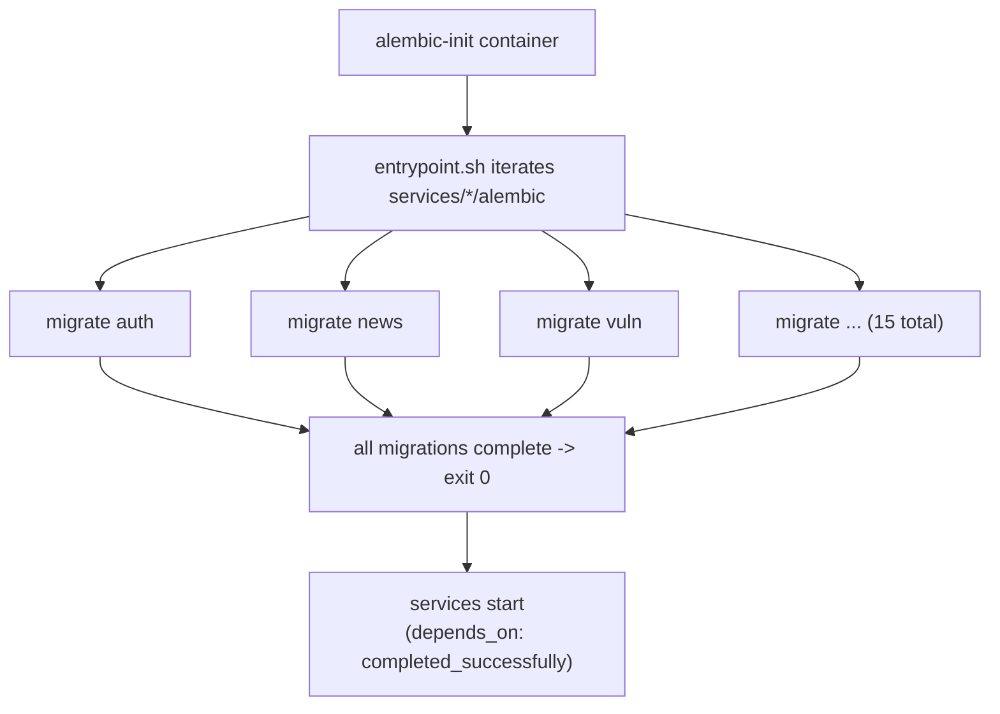

# Migrations

## Per-service Alembic, one-shot runner

Each service owns its Alembic directory (`services/<name>/alembic/`) with
its own migration history. All migrations run from a single one-shot
`alembic-init` container before any service starts.



## Why per-service histories

A single shared Alembic history would couple all services into one
migration timeline — changing one service's schema would touch the shared
history and risk conflicts between independently-developed services.
Per-service histories mean:

- Each service versions its schema independently.
- Order between services does not matter (no cross-schema FKs — P2).
- `version_table_schema` is set per service so version tables don't
  collide in the shared database.

## Migration inventory (from the repository)

| Service | Migrations |
|---|---|
| auth | 0001 |
| news-collector | 0001, 0002 (content hash), 0003 (analyst layer), 0004 (feed tags) |
| vuln-intel | 0001, 0002 (analyst layer) |
| threat-intel | 0001, 0002 (analyst layer) |
| ioc-collector | 0001, 0002 (analyst layer) |
| threat-actors | 0001, 0002 (victim dedup), 0003 (analyst layer), 0004 (richer fields) |
| integrations | 0001 |
| cmdb | 0001, 0002 (profile change log), 0003 (tag catalog) |
| flowviz | 0001 |
| asm | 0001, 0002 (target active + cascade) |
| domainwatch | 0001 |
| scheduler | 0001 |
| secrets | 0001 |
| indicator-intel | 0001, 0002 (dorking) |
| orchestrator | 0001, 0002 (ai_policies), 0003 (notifications) |

The migration history is a readable changelog of the platform's evolution:
the analyst layer (notes, status, overrides) rolled out across five
services as `000x_analyst_layer`; the notification subsystem is
`orchestrator/0003_notifications`; dorking is `indicator-intel/0002`.

## The alembic-init image

`infra/alembic-init/Dockerfile` installs every `packages/tip_*` and every
`services/*` package so each service's `env.py` can `import app.models` to
get its metadata. This makes the image fatter than a bare alembic image,
paid once at build time — the alternative (each service running its own
migration at startup) would re-introduce ordering races.

## Running migrations

```bash
make migrate      # docker compose run --rm alembic-init
```

The container runs all migrations and exits 0. Services
`depends_on: alembic-init: service_completed_successfully`, so no service
ever starts against an un-migrated schema (P8).

## Adding a migration

1. Change the service's `app/models.py`.
2. Author a migration in `services/<name>/alembic/versions/000N_*.py`
   (the project authors migrations by hand for control, not autogenerate).
3. Rebuild the alembic-init image (so it has the new file) and re-run
   `make migrate`.
4. Rebuild + recreate the affected service.

The notifications and dorking features in this project both followed this
sequence; the deploy scripts explicitly rebuilt `alembic-init` and ran
`docker compose run --rm alembic-init` before recreating the service.

## Data-step migrations

Some migrations include data steps, e.g. the orchestrator's `0002` seeds a
default global AI policy with `INSERT ... ON CONFLICT DO NOTHING` so the
policy resolver always has a fallback. These are idempotent so re-running
the migration container is safe.
