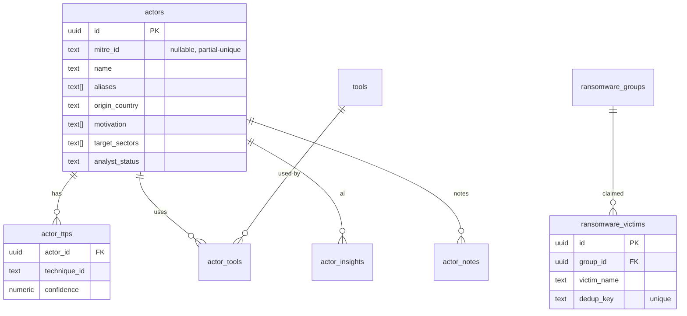

# Database Schema Design

## One database, fifteen schemas

The platform uses a **single Postgres database** named `tip`, partitioned
into **one schema per service**. Each service declares its schema in
`app/models.py` (`SCHEMA = "<name>"`) and builds its metadata with
`tip_db.build_metadata(SCHEMA)`.

```mermaid
erDiagram
    DATABASE_tip ||--|{ schema_auth : contains
    DATABASE_tip ||--|{ schema_news : contains
    DATABASE_tip ||--|{ schema_vuln : contains
    DATABASE_tip ||--|{ schema_threat : contains
    DATABASE_tip ||--|{ schema_ioc : contains
    DATABASE_tip ||--|{ schema_actors : contains
    DATABASE_tip ||--|{ schema_integrations : contains
    DATABASE_tip ||--|{ schema_cmdb : contains
    DATABASE_tip ||--|{ schema_flowviz : contains
    DATABASE_tip ||--|{ schema_asm : contains
    DATABASE_tip ||--|{ schema_domainwatch : contains
    DATABASE_tip ||--|{ schema_scheduler : contains
    DATABASE_tip ||--|{ schema_secrets : contains
    DATABASE_tip ||--|{ schema_indicator : contains
    DATABASE_tip ||--|{ schema_orchestrator : contains
```



## The two hard rules

1. **No service reads another service's tables** (P1). Cross-service data
   is HTTP-only.
2. **No foreign keys across schemas** (P2). Cross-schema relations use
   stable external identifiers.

These rules make each schema independently migratable and let a service be
split out to its own database with only a `DATABASE_URL` change.

## Cross-schema relationship keys (the join vocabulary)

Because there are no cross-schema FKs, services relate to each other
through these stable keys:

| Relationship | Key | Joined by |
|---|---|---|
| CVE ↔ KEV ↔ EPSS | `cve_id` | within vuln schema (these are same-schema FKs) |
| CVE ↔ threat ↔ article | CVE-ID string | orchestrator at the app layer |
| IOC ↔ actor infrastructure | normalised indicator value | indicator-intel, orchestrator |
| actor ↔ technique | `technique_id` (MITRE) | within actors schema |
| Wazuh alert ↔ IOC/actor | normalised value + technique_id | orchestrator step 3 |
| threat-insight IOC → IOC library | normalised value | auto-promotion |

## Representative schema — the actors schema (richest)



## Insight + notes pattern (repeated across services)

Five services share a uniform analyst-layer pattern:

- `<resource>_insights` — one AI payload per resource, JSONB +
  `prompt_version` + `analyst_override`.
- `<resource>_notes` — analyst notes, generated by the
  `tip_common.build_notes_router` factory (one implementation, five
  services).

This uniformity means the frontend's `InsightView` and notes panel work
identically across articles, CVEs, threats, actors, and IOCs.

## Audit / history tables

| Table | Schema | Records |
|---|---|---|
| `audit_log` | auth | logins, user/role changes |
| `access_log` | secrets | every secret read/write |
| `job_run_history` | scheduler | every scheduled job run |
| `notification_dispatches` | orchestrator | every notification attempt |
| `org_profile_versions` | cmdb | every profile edit (full version) |
| `profile_change_log` | cmdb | auto-add provenance |
| `action_runs` | orchestrator | every AI action execution |
| `dork_runs` / `dork_findings` | indicator | every dork run |
| `source_health` | per ingester | per-source circuit state |

The platform is heavily audit-oriented — a deliberate design for a bank.

## Confidence storage convention

Every confidence-scored row stores both the score and the inputs:

```
confidence_score   numeric(3,2)   -- 0.00–1.00
confidence_inputs  jsonb          -- {source_reliability, corroboration_count,
                                  --  freshness_factor, extraction_quality,
                                  --  weights_version}
```

This lets the scoring formula evolve and historical rows be re-scored
(P6) without re-fetching from the source.
