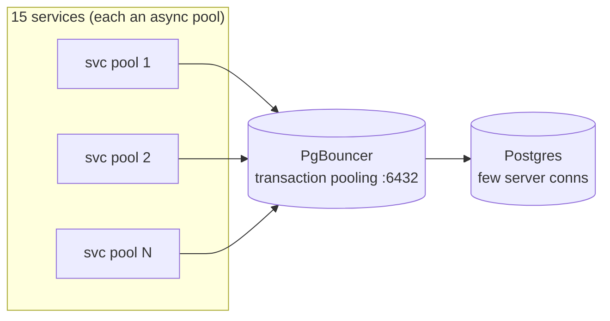
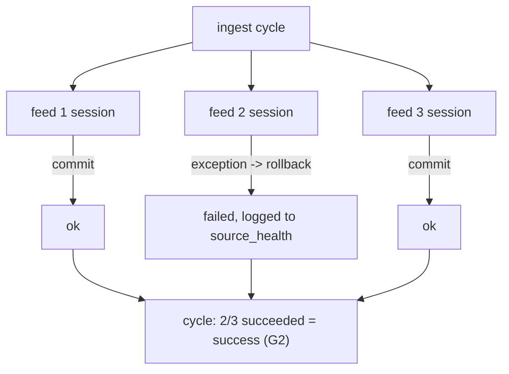

# Transactions and Connection Pooling

## Transaction pooling via PgBouncer

All services connect to **PgBouncer** (port 6432) in **transaction**
pooling mode, never to Postgres directly. The connection math forces this:
15 services × an async pool each would exhaust Postgres's connection
limit. PgBouncer multiplexes many client connections onto a small set of
server connections.

## The prepared-statement consequence

Transaction pooling forbids server-side prepared statements (a statement
prepared on one server connection may be executed on another). asyncpg is
therefore configured in `tip_db` with `statement_cache_size=0`. This is a
small performance tradeoff (no plan caching) accepted for the connection
multiplexing benefit.

## Transaction boundaries

Each service uses async SQLAlchemy sessions from `tip_db`'s session
factory. Transaction boundaries follow FastAPI request scope:

- **Read endpoints** — a session per request, committed (or rolled back)
  at request end.
- **Ingest cycles** — per-feed sessions so one feed's failure rolls back
  only that feed's writes, not the whole cycle (see news-collector
  `_run_one`).
- **Background tasks** (KEV backfill) — their own session, committing
  periodically (every 25 rows) so a long run is recoverable mid-flight.

## Idempotent writes (upsert)

Ingest is inherently re-run-heavy (the same feed item appears across
cycles). Writes are idempotent via `ON CONFLICT DO UPDATE`:

- `vuln.cves`, `vuln.kev` — upsert by `cve_id`.
- `ioc.indicators` — upsert by `(type, normalized_value)`; new sources
  append `indicator_sources` rows.
- `news.articles` — dedup by `url_hash`; existing rows enriched in place.

This means a re-fired ingest job never creates duplicates and is safe to
retry — important because the scheduler may re-trigger on a watchdog
timeout.

## Cross-service "transactions"

There are none — and that is deliberate. Because there are no cross-schema
FKs and no distributed transaction coordinator, a multi-service operation
(e.g. threat analyze → auto-promote IOC) is **not** atomic across
services. The design accepts eventual consistency here:

- The threat insight is committed in the `threat` schema.
- The IOC promotion is a best-effort HTTP call to ioc-collector.
- If the promotion fails, the insight still persists; the IOC is simply
  not promoted that run (re-analyze re-promotes).

This is the standard microservice tradeoff: no two-phase commit, eventual
consistency through idempotent retries, observability through audit rows.

## Failure isolation

Per-feed session scoping is what makes "partial success is success"
concrete at the database layer — feed 2's rollback does not touch feeds 1
and 3.
