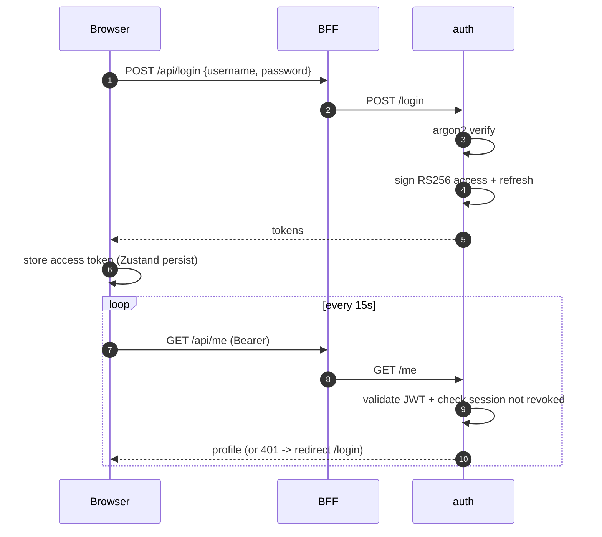

# Authentication

## Model summary

Authentication is centralised in the `auth` service (RS256 JWT issuer) and
enforced at the **browser ↔ BFF edge**. After the auth simplification
(commit `5d216c1`) the 14 data services trust the private docker network
(`DISABLE_AUTH=true`); auth itself keeps full validation
(`DISABLE_AUTH=false`, hardcoded in compose).

## Token scheme — RS256 JWT

- **Algorithm:** RS256 (asymmetric). Only auth holds the private key;
  verifiers need only the public key and cannot forge.
- **Access token:** 1-hour TTL, carried by the browser (Zustand persisted
  store), sent as `Authorization: Bearer` on every request.
- **Refresh token:** 30-day TTL, stored **hashed** (SHA-256) in
  `auth.sessions`.
- **Claims:** `sub=user:<id>`, `kind`, `role`, `perms[]`, `iat`, `exp`,
  session id.

## Authentication flow

## Why edge-only enforcement

The platform deliberately enforces auth at one boundary rather than on
every service. The justification and the incident that drove it (a
24-hour silent inter-service 401 cascade) are in
`02_problem_statement/operational_challenges.md` (OC5) and
`04_solution_design/engineering_choices.md` (EC9). The security tradeoff
is documented in `02_problem_statement/security_challenges.md` (SC3): the
docker network becomes a trust boundary, which is acceptable because no
data-service port except the frontend is externally exposed.

## Pre-auth paths

Two paths are intentionally reachable without a token:

- `auth /login`, `auth /refresh` — you need these to *get* a token. The
  frontend's `api.ts` whitelists them so the no-token guard doesn't block
  login (the regression fixed in commit `035ccfc`).
- `secrets /internal/bootstrap-fetch` — authorised by the shared bootstrap
  token, used by services at startup before they have any other identity.

## The frontend's role

`frontend/src/lib/api.ts`:
- Attaches the bearer token from the Zustand store to every request.
- On 401, performs a **single-flight** `clearAuth()` + redirect to
  `/login` (so a burst of concurrent 401s redirects once, not N times).
- Short-circuits requests when no token is present (except pre-auth
  paths), preventing a parade of "missing bearer token" errors before the
  redirect lands.

## Production guard

`auth` refuses to start if `TIP_ENV=production` and `DISABLE_AUTH=true` —
a fail-fast against accidentally serving an open API in production.

## Service identity (legacy + current)

Originally, inter-service calls used service JWTs minted by
`auth /service-login` (validated against `service_accounts.
bootstrap_token_hash`). Post-simplification, data services no longer
validate, so this path is dormant but intact — re-enabling per-service
auth is a configuration change (`DISABLE_AUTH=false` on a service), not a
re-architecture.
