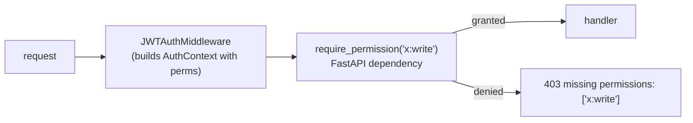

# Authorization (RBAC)

## Role model

Three primary roles plus a service role, seeded by
`services/auth/app/seed.py` and reconciled on every boot.

| Role | Permissions | Mapped user |
|---|---|---|
| `admin` | `*` (wildcard) | platform admin |
| `analyst` | all `:read` + analyst-layer `:write` | Yassine, Amira |
| `viewer` | all `:read` + `profile:write` | Karim |
| `service` | per-account supplementary perms | service accounts |

Effective permissions = role permissions ∪ user supplementary permissions.

## Permission string convention

Permissions are `resource:verb`:

```
intelligence:read   intelligence:write
threats:read        threats:write
iocs:read           iocs:write
actors:read         actors:write
assets:read         assets:write   assets:delete
profile:read        profile:write
integrations:read   integrations:write
asm:read            asm:write
domainwatch:read    domainwatch:write
flowviz:read
indicator:read      indicator:write
reports:read        reports:write
scheduling:read     scheduling:write
secrets:read        secrets:write
```

> The canonical set is whatever the `require_permission()` call sites
> across all services actually check. Singular aliases (`threat:write`,
> `ioc:write`) are **not** checked anywhere and were a source of a real
> bug (the scheduler held `threat:write` but threat-intel checks
> `threats:write`) fixed in commit `14d0489` by auditing the call sites:
> `grep -rh require_permission services/*/app/routes/ | grep -oE
> '"[a-z_]+:(read|write|delete)"' | sort -u`.

## Enforcement



- **Server-side (authoritative):** `tip_auth.require_permission(perm)` is
  a FastAPI dependency on every protected route. It reads the request's
  `AuthContext` (perms set) and 403s if the required perm isn't present
  (or `*`).
- When `DISABLE_AUTH=true`, the middleware injects a synthetic dev-admin
  context with `perms={"*"}`, so all checks pass — this is how data
  services serve on the trusted network.

## Client-side mirroring (cosmetic only)

`frontend/src/lib/store.ts` mirrors the permission logic
(`hasPermission`, `isAdmin`, `permissionMatches`) purely to hide UI a user
can't use (e.g. don't show "Users & Roles" to a viewer). The client is
**never** the authority — the server re-checks every request. The
wildcard and `resource:*` semantics match the server.

## Wildcard semantics

`permissionMatches(granted, required)`:
- `granted == "*"` → matches anything (admin).
- `granted == required` → exact match.
- `granted` ends `:*` → matches `resource:<any-verb>`.

## Service-account authorization

Service accounts carry supplementary permissions for the endpoints they
call. The scheduler, for example, needs write perms on every endpoint it
triggers (`intelligence:write`, `threats:write`, `iocs:write`,
`actors:write`, `asm:write`, `domainwatch:write`, `integrations:write`,
`reports:write`). These are seeded and reconciled on boot, which is why
the scheduler permission fix took effect with just a redeploy.

## Authorization audit

Role and permission changes are recorded in `auth.audit_log`. Permission
changes also revoke the affected user's sessions, so a demotion is
enforced within one `/me` poll (15s).
