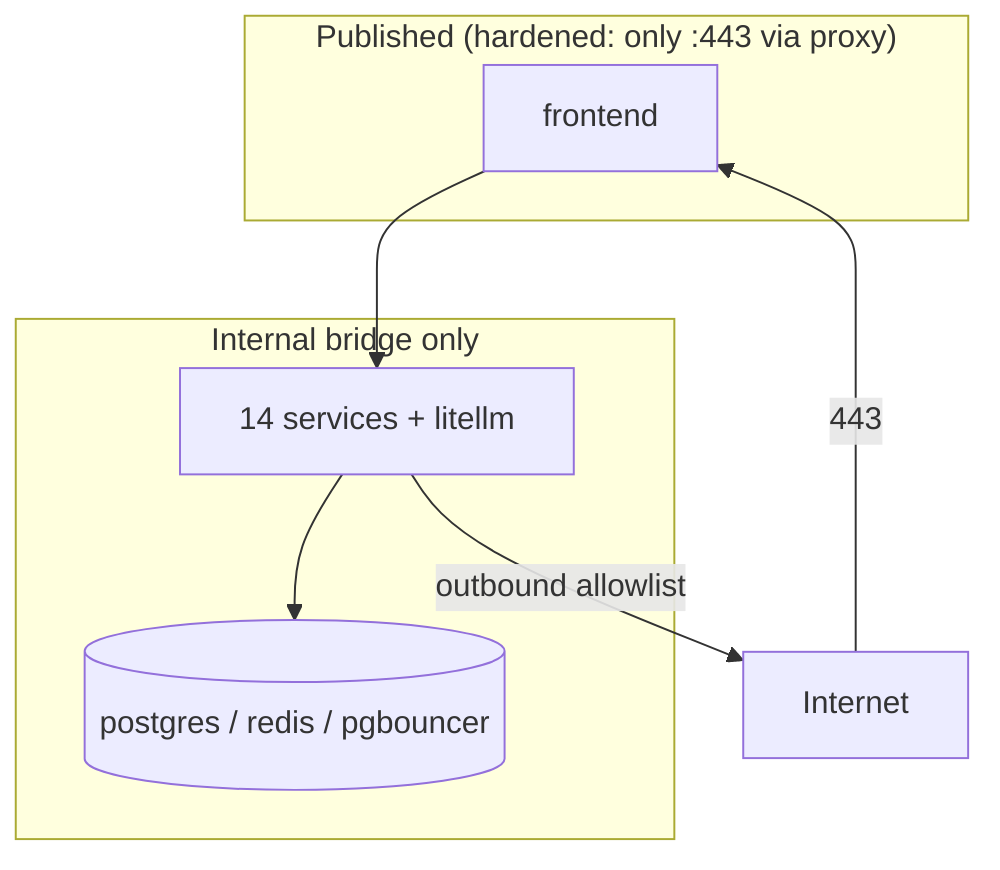

# Container Security

## Per-service image isolation

Each of the 15 services builds into its own image from its own Dockerfile.
A vulnerability in one service's dependency tree is contained to that
image; there is no shared monolithic image whose compromise affects
everything.

## Build hygiene

- **Slim official bases** minimise the attack surface.
- **No build secrets baked in** — secrets are fetched at runtime from the
  vault, never `COPY`'d or `ARG`'d into an image.
- **`.dockerignore`** keeps `.env`, `.git`, and local artefacts out of the
  build context.

## Runtime isolation

- Services run on a **private bridge network**; only the frontend port is
  published in a hardened deployment.
- Services hold the **minimum secret set** — each fetches only the
  credentials it needs. A compromised ingester cannot read another
  service's keys.
- **No provider keys in data services** — only `LITELLM_MASTER_KEY`, so a
  data-service compromise cannot exfil AI provider credentials.

## Network segmentation

## Volume security

- `postgres-data` — the system of record; the operator's primary backup
  target. Should be on encrypted storage in production.
- `domainwatch-screenshots` — PNGs of monitored domains; lower
  sensitivity, reproducible.

## Healthchecks

`postgres`, `pgbouncer`, `redis`, `litellm`, and `auth` declare Docker
healthchecks. `depends_on: condition: service_healthy` gates the bring-up
order on them, preventing services from starting against an unready
dependency (which previously caused transient DNS/connect failures —
OC1).

## The production-mode guard

The auth service refuses to start with `DISABLE_AUTH=true` when
`TIP_ENV=production`. This is a container-level fail-fast: a misconfigured
production container exits rather than serving an open API.

## One-shot sidecars

`alembic-init` and `bootstrap-seed` are one-shot containers that run, do
their job, and exit. They are not long-running attack surface — they exist
only during bring-up.

## Hardening checklist (production)

| Item | Status | Action for production |
|---|---|---|
| Only :443 exposed | dev: all ports | firewall service + litellm ports |
| TLS termination | not in compose | add reverse proxy (nginx/caddy/traefik) |
| `/docs` exposure | open | disable or auth-gate FastAPI docs |
| Non-root container user | base default | add `USER` to Dockerfiles |
| Read-only root FS | not set | add `read_only: true` where possible |
| Resource limits | not set | add `mem_limit` / `cpus` |
| Encrypted volumes | host-dependent | encrypt `postgres-data` |

These are documented hardening steps for a production deployment; the
development/PoC compose prioritises operability (all ports published for
diagnostics). The path from dev to hardened is a compose overlay, not a
re-architecture.

## Image provenance

- Python services: official `python:slim` derivatives.
- domainwatch: Microsoft's official Playwright image.
- litellm: BerriAI's official image.
- Postgres / Redis / PgBouncer: official images.

All from well-known publishers, reducing supply-chain risk versus
community/unofficial images.
