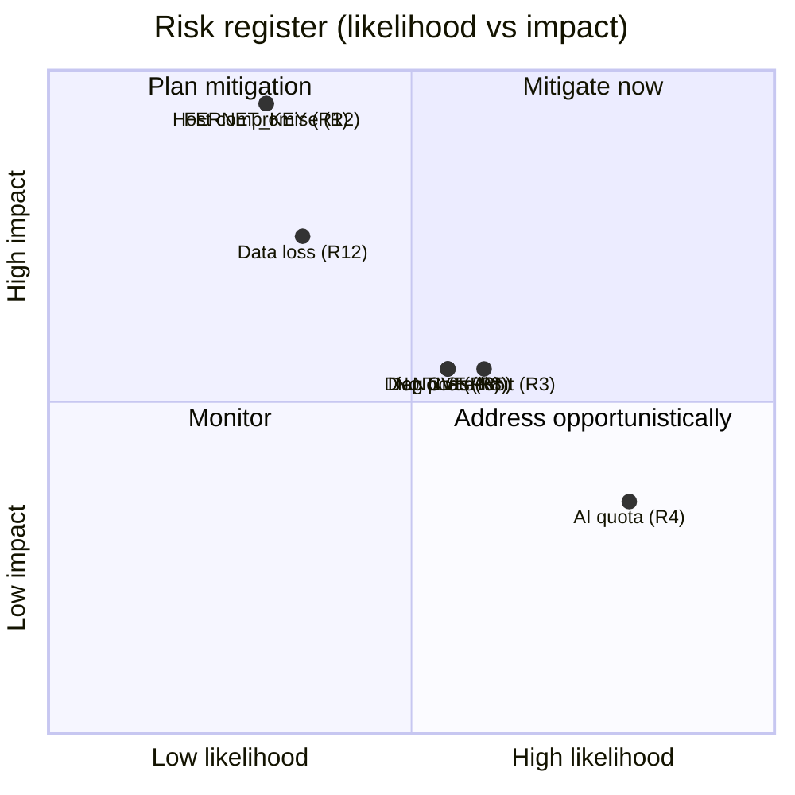

# Risk Analysis

## Scoring

Likelihood and impact on a 1–5 scale; risk = L × I. Items sorted by risk.

| # | Risk | L | I | Score | Mitigation | Residual |
|---|---|---|---|---|---|---|
| R1 | `FERNET_KEY` compromise → full vault | 2 | 5 | 10 | `.env` host-only, never in DB/vault; operator protects host | accept; host hardening |
| R2 | Host compromise → trusted-network lateral movement | 2 | 5 | 10 | edge auth; minimal exposed ports; per-service min secrets | accept (single-host model) |
| R3 | No edge rate-limiting → brute-force / DoS | 3 | 3 | 9 | argon2 cost slows brute-force; Redis absorbs lookups | add rate-limit (future) |
| R4 | AI provider quota exhaustion → degraded insights | 4 | 2 | 8 | smart picker, fallback cascade, cache-first | add paid provider key |
| R5 | Diagnostic ports exposed in production | 3 | 3 | 9 | firewall in hardened deploy | document + checklist |
| R6 | TLS not terminated by platform | 3 | 3 | 9 | operator reverse proxy | document |
| R7 | Prompt injection via ingested content | 2 | 2 | 4 | processed-data-only; Pydantic validation; analyst gate | accept |
| R8 | Dependency CVE in a pinned lib | 3 | 3 | 9 | pinned floors, slim bases, LiteLLM isolation | add auto-scan (future) |
| R9 | Stolen access token (1h window) | 2 | 3 | 6 | 1h TTL; session revocation; 15s poll | accept |
| R10 | New source added with SSRF | 2 | 3 | 6 | query-param convention; code review | review gate |
| R11 | No MFA on admin login | 2 | 3 | 6 | argon2; audit log | add MFA (future) |
| R12 | Postgres data loss (no HA) | 2 | 4 | 8 | operator backups of `postgres-data` | add replica (future) |

## Risk heat map

## Top three risks and the verdict on each

### R1 — `FERNET_KEY` compromise (accepted with operational mitigation)
There is no way to encrypt a vault without a key that lives outside it.
The risk is reduced to "protect one file on one host". This is a
deliberate, irreducible single point of cryptographic trust. The mitigation
is operational, not architectural.

### R2 — Host compromise (accepted, single-host model)
The edge-auth + trusted-network model means a host compromise reaches the
data services. This is the documented cost of operational simplicity
(SC3). For a single-organisation, single-host deployment behind the bank's
perimeter, it is an accepted tradeoff. The HA / network-policy evolution
is future work.

### R3/R5/R6 — Production-hardening gaps (planned)
Rate-limiting, firewalling diagnostic ports, and TLS termination are
production-deployment steps documented in `container_security.md` and
`09_devops/deployment_strategies.md`. They are compose-overlay /
reverse-proxy additions, not re-architecture.

## Residual risk acceptance

The platform is a **single-organisation, single-host, behind-perimeter**
deployment. Within that envelope:
- The catastrophic risks (R1, R2) are accepted with operational
  mitigations.
- The production-hardening risks (R3, R5, R6, R8, R12) have documented,
  low-effort remediation paths.
- The AI-specific risk (R4) is external (provider quota) and operationally
  mitigated.

No risk in the register is both high-likelihood and high-impact
(top-right quadrant is empty), which is the intended posture.
