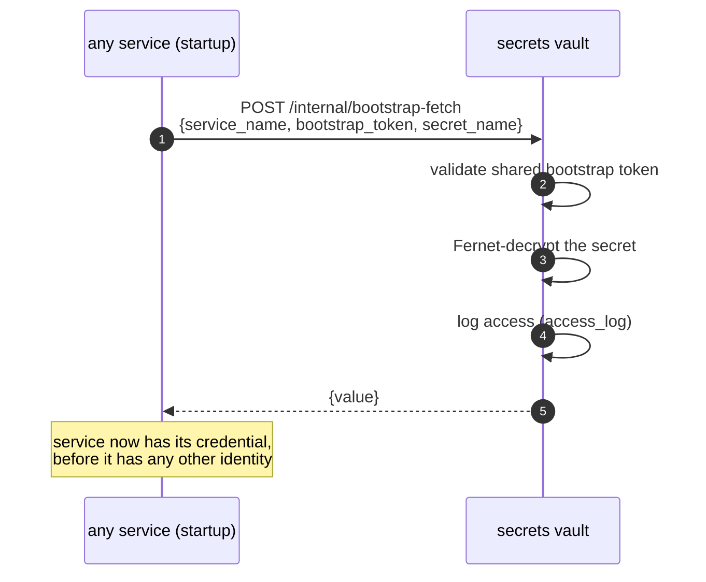

# Secrets Management

## The vault model

Every credential lives in the `secrets` service, Fernet-encrypted at rest.
Only two values exist outside it, in `.env`:

| Outside the vault | Why |
|---|---|
| `FERNET_KEY` | the vault's own encryption key — cannot be inside what it encrypts |
| `SECRETS_BOOTSTRAP_TOKEN` | authorises the pre-auth bootstrap fetch — needed before any service can read the vault |

Everything else — provider keys, NVD/abuse.ch/OTX/HIBP/Shodan keys,
Wazuh/MISP creds, SMTP creds, optional Google CSE keys, the RS256 keypair,
per-service bootstrap tokens, `LITELLM_MASTER_KEY` — is in the vault.

## The bootstrap dance (chicken-and-egg solved)

The bootstrap endpoint is the only unauthenticated vault path. It returns
single secrets by name (every service) or the RS256 keypair in bulk (auth
only).

## Encryption at rest

- Each secret's value is stored as `value_encrypted bytea` — Fernet
  (AES-128-CBC + HMAC) keyed by `FERNET_KEY`.
- A Postgres dump yields ciphertext only.
- `GET /secrets` returns names + metadata, never values.

## Access auditing

Every vault operation writes `secrets.access_log` (secret name, actor,
action, timestamp, source IP). The compliance officer can answer "who read
`OPENROUTER_API_KEY` and when". This is a deliberate feature for a bank.

## Rotation

Rotation is a single vault write:
- `POST /secrets/{name}/rotate {new_value}` bumps the version.
- The consuming service picks up the new value on its next startup (or
  immediately if it fetches per-request — most fetch at startup, so a
  restart applies the rotation).

For the LiteLLM master key and provider keys, rotation is: write to vault →
restart litellm. For the RS256 keypair, rotation is a re-seed + restart of
auth (and a brief token-invalidation window).

## Seeding

`infra/bootstrap/seed_secrets.py` (run via `make seed`) connects directly
to Postgres with the Fernet key and inserts: the RS256 keypair, per-service
bootstrap tokens, `LITELLM_MASTER_KEY`, and all of `prompt/credentials.env`.
`set_secrets.py` adds individual secrets afterward (SMTP, Google CSE).

## The single catastrophic secret

`FERNET_KEY` is the one secret whose compromise yields the entire vault.
It is therefore:
- Never in the vault (it can't be — it decrypts the vault).
- Never in the database.
- Only in `.env` on the host, which is the operator's responsibility to
  protect (file permissions, host access control).

This is an explicit, documented single point of cryptographic trust. The
mitigation is operational (protect the host + `.env`), and the risk is
recorded in `risk_analysis.md` as the highest-impact item.

## What is NOT a secret

- Service URLs (`http://auth:8000`) — topology, in compose.
- The bootstrap admin *username* — in `.env` (the password is rotated
  after first login).
- Public keys (RS256 public, JWKS) — published by design.

## Provider key isolation

A critical property: **no data service holds an AI provider key.** They
hold only `LITELLM_MASTER_KEY`. The provider keys (GitHub PAT, OpenAI,
Anthropic, etc.) live only in the vault and are read only by the LiteLLM
proxy at its startup. This means a compromised data service cannot exfil
the provider keys — it can only make proxied AI calls (which are
quota-limited and logged).
