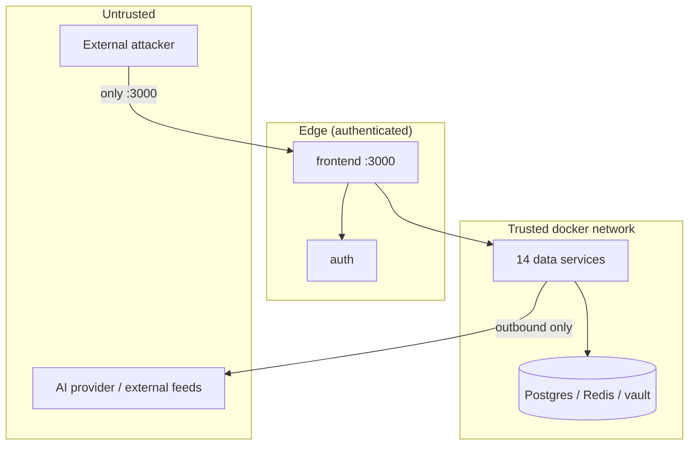

# Threat Model

## Methodology

A STRIDE-oriented threat model scoped to the platform's actual deployment
(single host, edge auth, trusted internal network).

## Assets to protect

| Asset | Where | Impact if compromised |
|---|---|---|
| `FERNET_KEY` | `.env` | full vault decryption (catastrophic) |
| Vault contents | secrets schema | all provider/source/SMTP creds |
| RS256 private key | vault | token forgery |
| User credentials | auth schema (argon2) | account takeover |
| Threat intelligence | all schemas | competitive/operational loss, not customer PII |
| Company profile | cmdb | reveals the bank's stack to an attacker |

Note: the platform stores **no bank customer PII** — a deliberate scope
decision that bounds the breach impact.

## Trust boundaries

## STRIDE analysis

### Spoofing
- **Threat:** attacker forges a JWT.
- **Mitigation:** RS256 — forging needs the private key (vault-only).
- **Threat:** attacker replays a stolen token.
- **Mitigation:** 1h access TTL; session revocation; 15s `/me` poll.

### Tampering
- **Threat:** attacker modifies data in transit.
- **Mitigation (edge):** TLS (operator reverse proxy). **Internal:**
  plaintext on the trusted bridge — residual risk if host is compromised.
- **Threat:** attacker tampers with stored intelligence.
- **Mitigation:** RBAC writes; audit tables; idempotent upserts.

### Repudiation
- **Threat:** a user denies an action.
- **Mitigation:** `audit_log`, `access_log`, `notification_dispatches`,
  `org_profile_versions`, `action_runs` — comprehensive audit.

### Information Disclosure
- **Threat:** vault dump reveals secrets.
- **Mitigation:** Fernet at rest; `GET /secrets` never returns values;
  access logged.
- **Threat:** DB dump reveals passwords/tokens.
- **Mitigation:** argon2id passwords; SHA-256 refresh/bootstrap tokens.

### Denial of Service
- **Threat:** flood the platform.
- **Mitigation:** Redis hot path absorbs lookup bursts; ingest is
  scheduler-paced; AI is provider-rate-limited (the bottleneck is upstream,
  not the platform). **Residual:** no per-IP rate limiting at the edge yet.

### Elevation of Privilege
- **Threat:** analyst performs admin action.
- **Mitigation:** server-side `require_permission`; client checks are
  cosmetic; admin endpoints use `require_admin`.
- **Threat:** stale token retains old privileges after demotion.
- **Mitigation:** session revocation on role change + 15s poll.

## Attack scenarios

### Scenario 1 — External attacker, no credentials
- Only `:3000` is reachable. Login requires valid credentials (argon2).
- No data-service port is exposed. The BFF requires a valid token to
  return anything useful.
- **Outcome:** blocked at the edge.

### Scenario 2 — Stolen analyst token
- Token works for 1h max; limited to analyst permissions.
- If the breach is detected, revoking the session logs them out within
  15s.
- **Outcome:** bounded blast radius, fast containment.

### Scenario 3 — Shell on one data service (host partially compromised)
- The compromised service can reach other data services (trusted network)
  and read its own secrets.
- It **cannot** decrypt the vault without `FERNET_KEY` (in `.env`, not in
  any service's secret set beyond what it fetched).
- **Outcome:** lateral movement possible (the documented cost of edge-auth
  + trusted network — SC3); vault stays encrypted.

### Scenario 4 — Compromised AI provider
- The provider sees only what the LiteLLM proxy sends (processed data,
  prompts) — never raw vault contents or customer PII.
- A malicious response is constrained by Pydantic validation; a poisoned
  insight is reviewed by an analyst before action.
- **Outcome:** bounded to insight content; single egress boundary makes
  the exposure auditable.

## Highest-priority residual risks

1. **`FERNET_KEY` protection** — the single catastrophic secret.
2. **Host compromise** — trusted-network model means host = blast radius.
3. **No edge rate-limiting** — DoS / brute-force not yet throttled.

These feed the scored risk register in `risk_analysis.md`.
