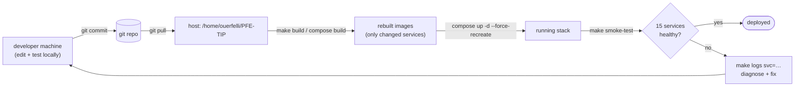
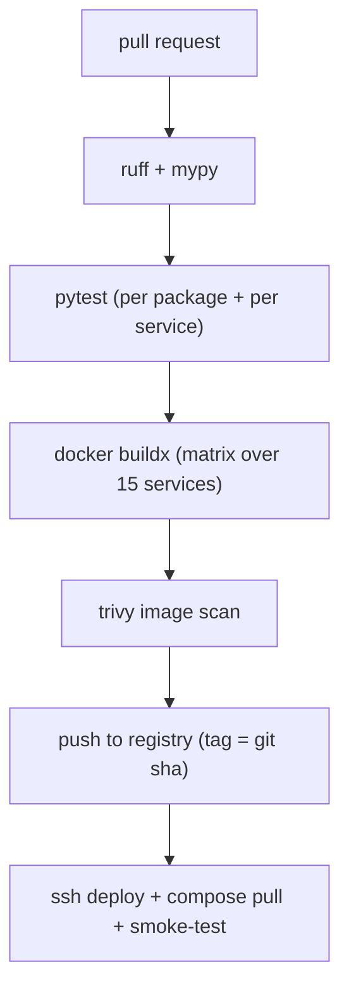

# CI / CD

## Honest statement of the current state

This project has **no automated CI/CD pipeline**. There is no
`.github/workflows/`, no GitLab CI file, no Jenkinsfile, no Drone, no
CircleCI configuration anywhere in the repository. The "pipeline" is a
**human-driven, scripted, single-host workflow**: build locally or on the
host, commit to git, pull on the server, rebuild the changed images,
recreate the containers, and run a smoke test.

This is documented honestly because the platform is a final-year
engineering project (PFE) deployed to a single internal host
(`lightserv1.local` / `192.168.150.135`), not a multi-tenant SaaS. A full
CI/CD pipeline is listed as future work (`16_future_work`). What follows
describes the **actual** flow and the **scripts that stand in** for a
pipeline's stages.

## The de-facto pipeline



The stages map to scripts and `make` targets rather than to pipeline YAML:

| Pipeline stage (conceptual) | What actually performs it | Automated? |
|---|---|---|
| Lint / format | `ruff` config in root `pyproject.toml` (run manually) | manual |
| Type check | `mypy` config in root `pyproject.toml` (run manually) | manual |
| Unit test | `pytest` on the one suite that exists (`services/cmdb/tests/`) | manual |
| Build | `make build` → `docker compose build` | scripted |
| Migrate | `make migrate` → one-shot `alembic-init` container | scripted |
| Deploy | `docker compose up -d --force-recreate <svc>` | scripted |
| Smoke test | `make smoke-test` → `infra/bootstrap/smoke_test.py` | scripted |
| AI-chain check | `make check-llm` → `infra/bootstrap/check_litellm.py` | scripted |

## The actual deploy procedure (as performed)

```bash
# on the developer machine
git add -A && git commit -m "…"
git push                                  # or scp / rsync to the host

# on the host (ssh ouerfelli@lightserv1.local)
cd /home/ouerfelli/PFE-TIP
git pull
# rebuild only the services whose code changed:
docker compose -f infra/docker-compose.yml --env-file .env build <service>
docker compose -f infra/docker-compose.yml --env-file .env up -d --force-recreate <service>
# verify
python infra/bootstrap/smoke_test.py
```

The per-service image isolation (`09_devops/dockerization.md`) is what
makes this fast — a one-service change rebuilds one image, not the whole
stack.

## What stands in for CI gates

Because there is no automated gate, three scripts are run by hand and
serve as the **acceptance checks** before a change is considered shipped:

- **`infra/bootstrap/smoke_test.py`** — probes `/health` on all 15
  services. This is the liveness gate.
- **`infra/bootstrap/check_litellm.py`** — exercises the AI chain through
  the LiteLLM proxy (the most failure-prone dependency).
- **`screenshots/walkthrough.py`** — a Playwright script that drives the
  frontend from login through every page; the captured screenshots are the
  visual-regression / end-to-end gate (see `11_testing`).

## What a real pipeline would add (future work)

A GitHub Actions workflow is the natural next step. The recommended shape:



The blocking gaps that must be closed first are documented in
`11_testing` (test coverage is light) and `09_devops/rollback_strategy.md`
(no image registry means rollback is a rebuild, not a re-pull).

## Why no pipeline yet — the honest rationale

| Reason | Detail |
|---|---|
| Single host | One target; `compose up` on the host is the whole deploy. |
| Single operator | The author is the only deployer; no merge-queue contention. |
| No registry | Images are built on the host, never pushed; nothing to pull. |
| Project scope | Backend + frontend correctness was prioritised over delivery automation. |

The cost of this choice is real and named in `15_limitations`: no
automated regression safety net, manual rebuild on rollback, and
deploy-time human error is possible. The mitigations in place are the
three verification scripts above and the fast per-service rebuild.
