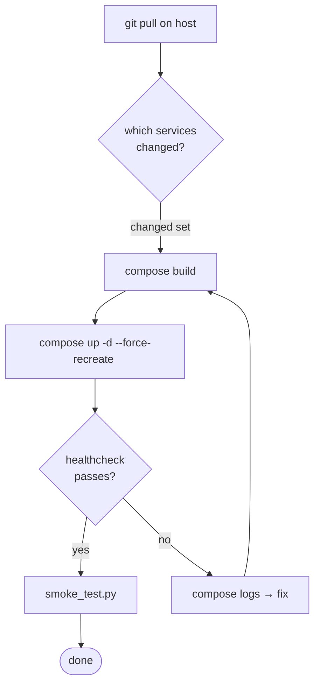

# Deployment Strategies

## The deployment target

A single Linux host: `lightserv1.local` (`192.168.150.135`), project at
`/home/ouerfelli/PFE-TIP`, reached over SSH. The entire platform — ~20
containers — runs on this one host via Docker Compose. This single-host
reality shapes every strategy decision below.

## Strategy: recreate-in-place, per service

Because there is one host and no image registry, the deployment strategy is
**rolling recreate of changed services**, not blue-green and not canary.



Only the changed services are rebuilt and recreated. The per-service image
isolation (`09_devops/dockerization.md`) is what makes this viable: a
one-service change touches one image and one container; the other 14 keep
running.

## Why not blue-green or canary

| Strategy | Requires | Why not here |
|---|---|---|
| Blue-green | two full environments + a switch | one host; no second environment |
| Canary | traffic splitting + a load balancer | one replica per service; nothing to split |
| Rolling (multi-replica) | N replicas per service | each service runs as a single container |

The accepted consequence is a **brief per-service downtime** during
`--force-recreate` (seconds, while the container restarts). For an internal
analyst tool with stale-over-blocking reads (`G2`), a few seconds of
unavailability on one service during a deploy is acceptable and named in
`15_limitations`.

## First-deploy vs incremental deploy

The first deploy and every subsequent deploy differ:

### First deploy (cold)

```bash
cp .env.example .env                      # fill FERNET_KEY, POSTGRES_PASSWORD,
                                          # SECRETS_BOOTSTRAP_TOKEN, admin creds
docker compose -f infra/docker-compose.yml up -d postgres pgbouncer redis
python infra/bootstrap/seed_secrets.py    # seed the vault (one-shot)
make migrate                              # alembic-init runs all migrations
make up                                   # bring up the full stack
python infra/bootstrap/smoke_test.py
```

### Incremental deploy (warm)

```bash
git pull
docker compose ... build <changed-services>
docker compose ... up -d --force-recreate <changed-services>
python infra/bootstrap/smoke_test.py
```

The bootstrap dance (seed → migrate → secrets → auth → rest) runs only on
the cold path; warm deploys reuse the already-seeded vault and the
already-migrated schema.

## Dev vs production deployment shape

| Aspect | Dev overlay | Production-shape |
|---|---|---|
| Compose files | base + `docker-compose.dev.yml` | base only |
| Auth | `DISABLE_AUTH=true` on data services | auth enforced at the edge |
| Code | `packages/` bind-mounted (live edit) | baked into images |
| Logging | debug | structured JSON at info |
| Command | `make up` | `compose -f base up -d` |

The dev overlay exists so the author can edit `packages/tip_*` and see
changes without rebuilding. Production uses the base file only, where code
is copied into images at build time.

## Migration handling during deploy

Schema changes ship as Alembic migrations under each service's
`alembic/` directory and are applied by the one-shot `alembic-init`
container (`make migrate`) **before** the services that need them start.
A deploy that includes a migration runs `make migrate` between `git pull`
and `compose up`. Because migrations run in their own container, a
service never races to migrate its own schema at startup.

## Deploy verification gate

A deploy is "done" only after `smoke_test.py` reports `[OK]` for all 15
services and, for AI-affecting changes, `check_litellm.py` confirms the AI
chain. For frontend changes, the Playwright walkthrough
(`screenshots/walkthrough.py`) is the visual gate. These three scripts are
the manual stand-in for a CD pipeline's post-deploy verification stage
(`09_devops/ci_cd.md`).
