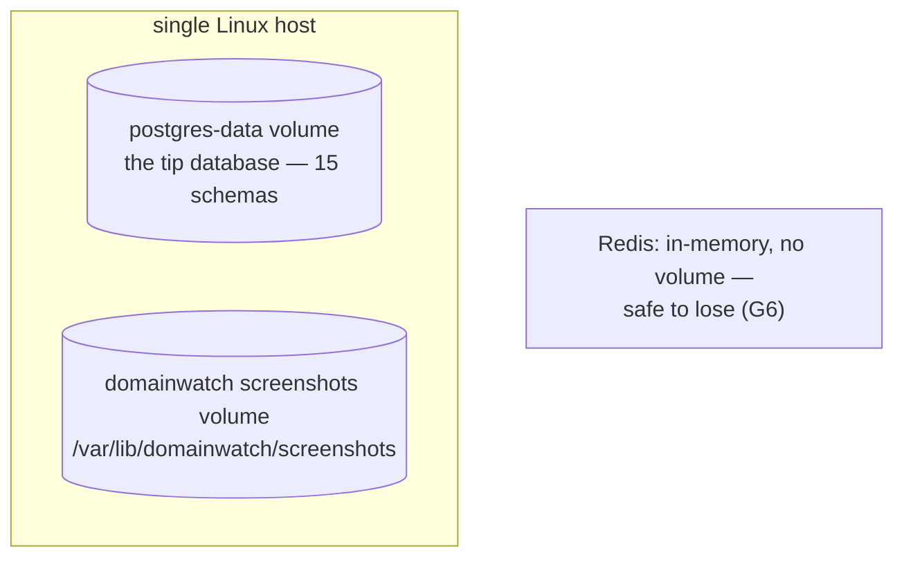
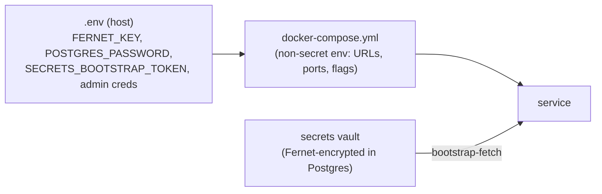

# Infrastructure Management

## Infrastructure as code — at the Compose level

The platform's infrastructure is **defined as code**, but at the Docker
Compose level rather than the Terraform/Ansible level. There is no
Terraform, no Ansible, no Pulumi, no cloud provisioning. The host itself is
provisioned manually; everything that runs **on** it is declared in version
control.

| Layer | Defined by | In version control? |
|---|---|---|
| The host (OS, Docker engine) | manual provisioning | no |
| The full container topology | `infra/docker-compose.yml` | yes |
| Dev overrides | `infra/docker-compose.dev.yml` | yes |
| Connection pooling | `infra/pgbouncer/pgbouncer.ini` | yes |
| AI gateway routing | `infra/litellm/` config | yes |
| Schema | per-service `alembic/` migrations | yes |
| Secrets bootstrap | `infra/bootstrap/seed_secrets.py` | yes (script; values are not) |
| Operational commands | `Makefile` | yes |

So while it is not "IaC" in the cloud-provisioning sense, the **entire
runtime topology is reproducible from the repository** plus a host with
Docker. That is the property that matters: `make seed && make migrate &&
make up` rebuilds the platform identically.

## The single source of truth: docker-compose.yml

`infra/docker-compose.yml` is the inventory of the entire system — every
service, every port, every dependency edge, every volume, every
environment variable. The bank's compliance officer treats it as the
**egress inventory** (`01_introduction/stakeholders.md`): the only
containers permitted outbound HTTPS are the named ingester sources and the
LiteLLM proxy, and the compose file is where that is auditable.

## Persistent state (volumes)

| Volume | Holds | Loss tolerance |
|---|---|---|
| `postgres-data` | all business data + secrets vault | none — backup required |
| domainwatch screenshots | historical page captures | low — regenerated on next check |
| (Redis) | cache only | total — repopulates from Postgres |

The deliberate design choice is that **only Postgres is irreplaceable**.
Redis is explicitly loss-tolerant (`06_caching` / `G6`), and screenshots
regenerate. This concentrates the backup burden on a single volume.

## Configuration management

Configuration flows through three tiers, by sensitivity:

| Tier | Contains | Example |
|---|---|---|
| `.env` (host only) | the two root secrets + bootstrap params | `FERNET_KEY`, `POSTGRES_PASSWORD` |
| compose env | non-secret config | service URLs, ports, `DISABLE_AUTH` |
| secrets vault | every other credential | provider API keys, RS256 keypair |

The invariant (`CLAUDE.md`): only `FERNET_KEY` and
`SECRETS_BOOTSTRAP_TOKEN` ever live in `.env`; everything else is in the
vault. This is the operator's single protection burden — guard the Fernet
key and the bootstrap token, and the rest is encrypted at rest.

## Operational interface: the Makefile

The Makefile is the operator's whole API to the infrastructure. It exists
so the IT operations team has memorable single commands rather than long
`docker compose` invocations.

| Command | Action |
|---|---|
| `make seed` | seed the secrets vault (first deploy) |
| `make migrate` | run the one-shot `alembic-init` container |
| `make up` / `make down` | start / stop the stack |
| `make logs svc=<name>` | tail one service's logs |
| `make psql` | psql shell into Postgres |
| `make smoke-test` | probe `/health` on all 15 services |
| `make check-llm` | exercise the AI chain through LiteLLM |
| `make build` | rebuild all images |
| `make clean` | remove containers **and volumes** (cold reset) |

## Host sizing

The full footprint — ~20 containers (15 Python services + Postgres +
PgBouncer + Redis + LiteLLM + frontend) plus two transient one-shots — is
sized for a **single mid-range Linux host**
(`05_architecture/infrastructure_topology.md`). The Python service images
are light; the heaviest is domainwatch (Playwright browser binaries). There
is no horizontal scaling and no second host; scaling out is `16_future_work`
(the schema-per-service design is the enabler — a service can be lifted to
its own host because it shares no tables).

## What infrastructure management does not include

Stated honestly:

- **No automated host provisioning** — the Docker host is set up by hand.
- **No automated backups** — `pg_dump` is operator-managed
  (`09_devops/rollback_strategy.md`).
- **No secrets rotation automation** beyond the bootstrap-token rotation
  the auth/secrets dance performs.
- **No multi-host / HA** — single point of failure is the host itself,
  accepted for this deployment and named in `15_limitations`.
