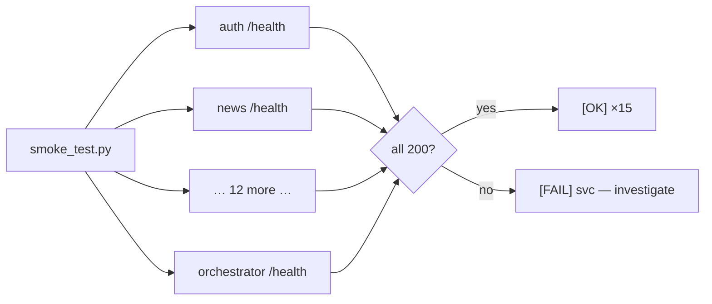

# Monitoring

## Honest statement of scope

There is **no Prometheus, no Grafana, no Alertmanager, no Datadog** in this
deployment. Monitoring is built from **first-class application surfaces**
that the platform exposes deliberately, plus two diagnostic scripts. This
is appropriate for a single-host deployment with one operator, and the
gaps (no metrics time-series, no alerting fan-out beyond the notification
subsystem) are named in `15_limitations`.

What the platform *does* provide is **structured health visibility at three
levels**: process liveness, per-source health, and job-run history. These
are richer than a bare `/health` ping because they were designed for the
fault-tolerance model (`G2` — degrade, never crash).

## Level 1 — Process liveness

Every service exposes `GET /health` returning `200` when the process is up.
This is what `make smoke-test` probes.

```bash
make smoke-test            # infra/bootstrap/smoke_test.py — probes all 15
```



## Level 2 — Per-source health

This is the monitoring surface that matters operationally. Every ingesting
service tracks each **external source** (NVD, CISA, abuse.ch, OTX, RSS
feeds, HIBP, Shodan, Wazuh, MISP, …) in its own `source_health` table and
exposes it at `GET /health/sources`.

```
source_name             text primary key
last_success_at         timestamptz
last_failure_at         timestamptz
consecutive_failures    int
status                  text          -- active | degraded | dead
last_error              text
last_http_status        int
updated_at              timestamptz
```

The status is driven by the circuit breaker in `tip_http`
(5 consecutive failures → `degraded`). An operator answering "why is IOC
data stale?" reads `GET /health/sources` on ioc-collector and sees exactly
which feed is degraded and the last error string — no log spelunking.

| Question | Surface |
|---|---|
| Is the service up? | `GET /health` |
| Which external feeds are failing? | `GET /health/sources` |
| When did NVD last succeed? | `source_health.last_success_at` |
| Why is it failing? | `source_health.last_error` + `last_http_status` |

## Level 3 — Job-run history

The scheduler records every triggered job in
`scheduler.job_run_history` (run_id, job_id, triggered_at, completed_at,
duration_ms, status, http_status, error_detail). This is the monitoring
surface for the *ingestion pipeline*, surfaced on the dashboard's "Recent
Feed" panel and queryable at `GET /runs?job_id=&status=&since=`.

The scheduler watchdog (every 60s) marks any `running` row older than the
job's `max_runtime` as `timeout` — so a hung ingest is visible as a
`timeout` row rather than a silently-stuck job.

## AI-chain monitoring

The AI path (services → LiteLLM → upstream provider) is the most
failure-prone dependency (provider quotas, concurrency caps). It has a
dedicated diagnostic:

```bash
make check-llm             # infra/bootstrap/check_litellm.py
```

This exercises a real completion through the proxy and reports which model
answered (the smart-picker fallback cascade means the answering model is
itself a signal). LiteLLM's own `/health/liveliness` is the container
healthcheck.

## Notification-driven alerting

The closest thing to alerting is the **notification subsystem** in the
orchestrator (`notification_rules` → `notification_dispatches`). An operator
can configure rules to email/Telegram on `domainwatch.change`,
`cve.exploited`, or `threat.supply_chain` events. This is event alerting,
not metric alerting — it fires on business events, not on CPU or latency.

## What is deliberately missing

| Missing | Consequence | Mitigation in place |
|---|---|---|
| Metrics time-series (Prometheus) | no historical latency/throughput graphs | structured logs carry `duration_ms` per call |
| Dashboards (Grafana) | no single-pane ops view | the app dashboard aggregates source health + job runs |
| Infra alerting (Alertmanager) | no page on host CPU/disk | host-level `systemd`/`docker` is the operator's responsibility |
| Centralised log store (ELK/Loki) | logs live in `docker compose logs` | JSON logs are grep-able per service |

These are the honest gaps. For a single-host PFE deployment the
application-level surfaces above are sufficient; for production at scale,
`16_future_work` proposes a Prometheus + Grafana + Loki stack reading the
already-structured logs and the already-exposed `/health/sources`.
