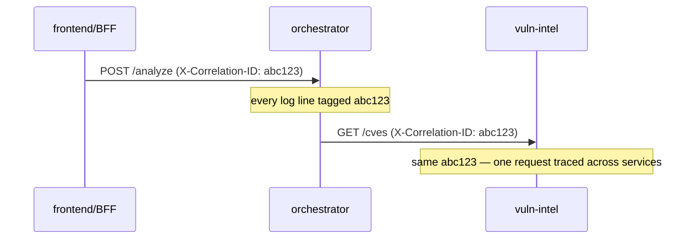

# Observability

Observability here means the three classic pillars — **logs, metrics,
traces** — assessed honestly against what the codebase actually emits.
The short version: **logs are first-class and structured; metrics are
embedded in log fields rather than a metrics system; distributed tracing
is approximated by correlation IDs, not a tracing backend**.

## Logs — structured JSON, correlation-tagged

`tip_common.logging_setup()` configures structured JSON logging for every
service. This is the strongest observability pillar in the platform.

Every request is assigned a **correlation ID** (UUID) at the edge. It is:

- generated if absent, or read from the incoming `X-Correlation-ID` header;
- attached to every log line for that request;
- propagated to downstream HTTP calls as `X-Correlation-ID`.



This means a single analysis cycle can be reconstructed across the
orchestrator and the six services it fans out to by grepping one ID:

```bash
make logs svc=orchestrator | grep abc123
make logs svc=vuln-intel   | grep abc123
```

## What every log line carries

| Field | Source | Why |
|---|---|---|
| `correlation_id` | edge middleware | cross-service request tracing |
| `service` | `logging_setup()` | which service emitted it |
| `level`, `timestamp`, `message` | standard | baseline |
| External-call fields | `tip_http` | `source_name`, `attempt`, `duration_ms`, `http_status`, `outcome` |
| AI-cost fields | `tip_ai` | `tokens_in`, `tokens_out`, `model`, `service`, `purpose` |

The last two rows are where **metrics live**: rather than exporting a
Prometheus histogram, the platform logs `duration_ms` on every external
call and `tokens_in/tokens_out` on every AI call. These are queryable
after the fact but not graphed in real time.

## Metrics — embedded, not exported

There is no `/metrics` endpoint and no metrics scraper. The measurements
that a metrics system would collect are instead **log fields**:

| Metric of interest | Where it is | How to read it |
|---|---|---|
| External source latency | `duration_ms` log field | grep `tip_http` lines |
| AI token cost per call | `tokens_in/out` log fields | grep `tip_ai` lines |
| Job duration | `job_run_history.duration_ms` | `GET /runs` |
| Source failure rate | `source_health.consecutive_failures` | `GET /health/sources` |

The honest tradeoff: this is excellent for *post-hoc* analysis ("why was
last night's cycle slow?") and poor for *real-time* alerting ("page me when
p99 latency exceeds 2s"). Closing that gap is `16_future_work`.

## Tracing — correlation IDs, not OpenTelemetry

There is no OpenTelemetry, no Jaeger, no Zipkin. The correlation-ID
propagation described above is a **lightweight trace**: it links log lines
across services for one logical request, but it does not produce span
trees, timing waterfalls, or a trace UI. For the platform's fan-out
topology (orchestrator → 6 services) the correlation ID is enough to answer
"what did this request touch and where did it fail"; it cannot answer "how
much of the 4s was spent in each leg" without manually diffing `duration_ms`
fields.

## AI cost observability

Because AI is the platform's metered resource (GitHub Models daily quotas,
concurrency caps), AI-call observability is deliberately richer than the
rest. Every LiteLLM call logs the model chosen, the purpose (which insight
or analysis step), and the token counts. Combined with the smart-model
fallback cascade, the *model that answered* is itself a health signal: if
logs show `gpt-4o` answering work normally handled by `gpt-5-chat`, the
operator knows the daily `gpt-5-chat` quota is exhausted.

## Summary scorecard

| Pillar | Status | Mechanism |
|---|---|---|
| Logs | strong | structured JSON, correlation IDs, per-call fields |
| Metrics | partial | embedded in log fields + DB tables, not exported |
| Traces | partial | correlation-ID propagation, no span backend |

This is an honest, single-host observability posture: the data is captured
and structured; the visualisation/alerting layer is future work.
