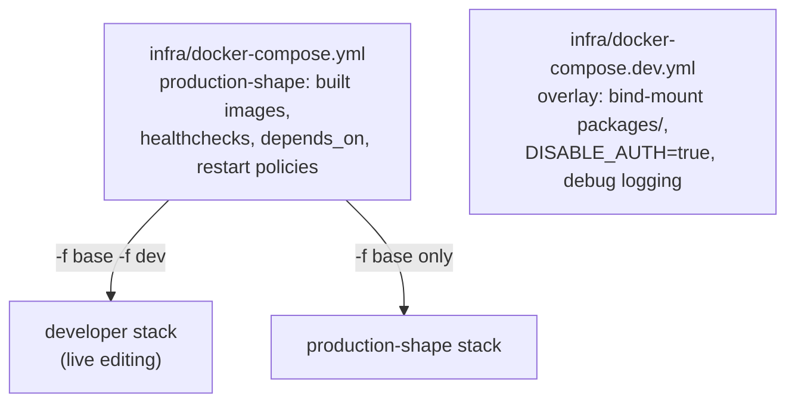
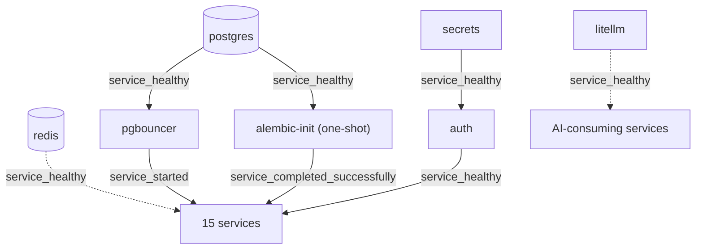

# Container Orchestration

## Orchestrator: Docker Compose, not Kubernetes

The platform is orchestrated by **Docker Compose** on a single host. This
is a deliberate choice, not a limitation overlooked. The reasoning:

| Factor | Compose (chosen) | Kubernetes (rejected for now) |
|---|---|---|
| Target | one mid-range Linux host | a cluster |
| Operator skill | one engineer, `make up` | a platform team |
| Bring-up ordering | `depends_on` conditions | init-containers + readiness probes |
| Operational surface | one YAML, one CLI | API server, etcd, kubelets, CNI |
| Failure domain | the host | matches the host anyway (single node) |

For a 15-service platform that a bank's existing ops team must run without
a dedicated Kubernetes operator, Compose is the right altitude. Kubernetes
is named in `16_future_work` as the migration path if multi-host HA becomes
a requirement.

## The two-file overlay model



Compose merges files left-to-right, so the dev overlay only states the
*differences*. `make up` passes `--env-file .env` automatically.

## Bring-up ordering

The hard part of orchestrating 15 services plus stateful infrastructure is
**ordering**. Compose `depends_on` with `condition` solves it declaratively.



The dependency conditions used:

| Condition | Meaning | Used for |
|---|---|---|
| `service_healthy` | wait for the healthcheck to pass | postgres, secrets, auth, litellm |
| `service_started` | wait for the container to start | pgbouncer, redis |
| `service_completed_successfully` | wait for a one-shot to exit 0 | alembic-init, bootstrap-seed |

This encodes the bootstrap order from `CLAUDE.md`: Postgres → migrations →
secrets → litellm → auth → everything else.

## One-shot (sidecar) containers

Two containers are **not long-running services** — they run once and exit:

| Container | Job | Exit behaviour |
|---|---|---|
| `alembic-init` | run every service's migrations, then stop | `restart: "no"`; gates services via `service_completed_successfully` |
| `bootstrap-seed` | seed the secrets vault (RS256 keypair, per-service tokens, credentials) | one-shot; runs after secrets is healthy |

Treating migration and seeding as one-shot containers — rather than
embedding them in each service's startup — means the schema is migrated
exactly once and no service races another to create a table.

## Healthchecks

Every long-running container declares a healthcheck so `depends_on:
condition: service_healthy` has something to wait on.

| Service class | Healthcheck |
|---|---|
| FastAPI services | HTTP `GET /health` (liveness) |
| postgres | `pg_isready` |
| litellm | HTTP `GET /health/liveliness` |
| redis | `redis-cli ping` |

The auth service's healthcheck is load-bearing: every other service depends
on `auth: service_healthy`, so auth must answer `/health` before the rest
of the stack proceeds (the fix that resolved the domainwatch "auth public
key not yet available" startup race).

## Restart policy

Long-running services use `restart: unless-stopped` so the stack survives a
host reboot — one of the IT operations team's explicit requirements
(`01_introduction/stakeholders.md`: "single command bring-up after a server
reboot"). One-shot containers use `restart: "no"`.

## The single command

```bash
make up      # docker compose -f infra/docker-compose.yml --env-file .env \
             #   -f infra/docker-compose.dev.yml up -d
```

This brings up ~20 containers in dependency order. The whole point of the
orchestration design is that this one command, plus `make seed` and
`make migrate` on first deploy, is the entire operational runbook.
