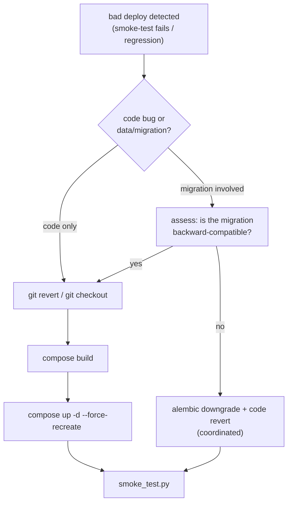

# Rollback Strategy

## The core constraint: no image registry

Images are **built on the host and never pushed to a registry**. This single
fact defines the rollback strategy: **rollback is git-revert-and-rebuild,
not image-retag-and-pull**. There is no `docker pull old-tag` to fall back
to, because old tags were never stored anywhere.



## Code rollback (the common case)

Most rollbacks are code-only — a bad handler, a broken frontend build, a
regression. The procedure:

```bash
# on the host
cd /home/ouerfelli/PFE-TIP
git log --oneline -10                       # find the last-good sha
git checkout <last-good-sha> -- <changed paths>   # or: git revert <bad-sha>
docker compose ... build <svc>
docker compose ... up -d --force-recreate <svc>
python infra/bootstrap/smoke_test.py
```

Because services are independent images, a bad change to one service rolls
back that one service; the other 14 are untouched. The git history is the
source of truth for "what was the last good state" — the commit log
(e.g. `035ccfc login regression fix`) shows rollback-style fixes already
done this way.

## Data and migration rollback (the hard case)

Schema rollback is the genuinely risky path and is treated with care:

| Migration type | Rollback approach |
|---|---|
| Additive (new column nullable, new table) | backward-compatible; just revert the code, leave the column |
| Destructive (drop/rename column) | requires `alembic downgrade` coordinated with code revert |
| Data migration (backfill) | reverting code does not un-backfill; assess case by case |

The design choices that make most migrations safely revertible:

- **Additive-by-default migrations** — new columns use `server_default` so
  existing rows are valid without a rewrite (the Phase 3 analyst-layer
  migrations follow this).
- **No cross-schema FKs** — a rollback in one service's schema cannot break
  another service's referential integrity (`P1`); there are no foreign keys
  to cascade across.
- **Per-service version tables** — each schema has its own Alembic version
  table, so `alembic downgrade` on one service does not touch another's
  migration state.

## State preservation

The stateful assets that a rollback must **not** destroy:

| Asset | Storage | Rollback handling |
|---|---|---|
| Business data | `postgres-data` volume | never `compose down -v` on rollback |
| Secrets vault | `secrets` schema (Fernet-encrypted) | preserved with the volume |
| Screenshots | `domainwatch` disk volume | preserved with the volume |
| Cache | Redis | safe to lose — repopulates (`G6`) |

The critical operator rule: a rollback uses `up -d --force-recreate`, **never**
`down -v`. The `-v` flag deletes volumes and would wipe Postgres. `make
clean` (which does remove volumes) is for a deliberate cold reset only.

## Backup posture

Backups of `postgres-data` are **operator-managed and outside the compose
file** (`09_devops/dockerization.md` lists them under "what is NOT
containerised"). The recommended minimum is a periodic `pg_dump` of the
`tip` database to off-host storage, which is the true recovery floor if a
migration corrupts data beyond what `alembic downgrade` can repair. This is
named as a gap in `15_limitations`: there is no automated backup job in the
repository today.

## Rollback verification

After any rollback, the same gates as a forward deploy apply:
`smoke_test.py` for liveness, `check_litellm.py` for the AI chain (if
AI code was reverted), and the Playwright walkthrough for frontend
reverts. A rollback is not "done" until the smoke test is green.

## Honest assessment

| Capability | Status |
|---|---|
| Code rollback | fast and reliable (git + per-service rebuild) |
| Additive-migration rollback | safe (revert code, leave schema) |
| Destructive-migration rollback | manual, requires coordinated downgrade |
| Instant rollback (image re-pull) | not available (no registry) |
| Automated DB backup | not present (operator-managed `pg_dump` recommended) |

The fast, safe path (code revert + rebuild) covers the overwhelming
majority of real rollbacks. The two gaps — no registry for instant
re-pull, no automated backup — are documented rather than hidden, and both
have named mitigations.
