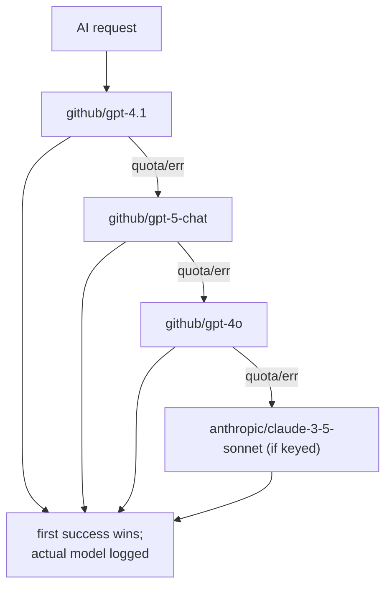

# AI Implementation

AI is implemented as a **single egress through a LiteLLM proxy**, consumed
by a **schema-validated synthesis helper**, with a **smart-model fallback
cascade** to survive provider quotas. No service calls an AI provider
directly; no AI runs on the ingest hot path (`AI reads processed data
only`).

## Topology — one proxy, many consumers


Why a proxy instead of an in-process SDK (from the client's own docstring):
centralised key storage (keys live on the proxy, not in 7 services),
centralised retry/fallback config, reliable routing for GitHub Models, and
key rotation requires restarting one container not five.

## The client — `LiteLLMClient`

`tip_ai.LiteLLMClient` is an OpenAI-format HTTP client pointed at the proxy.
Key implementation details:

- POSTs `/v1/chat/completions` with `response_format: {type: json_object}`
  when structured output is wanted.
- Sends a per-request `fallbacks` list (belt-and-braces on top of the
  proxy's own `router_settings.fallbacks`).
- Logs every call with `requested`, `actual`, `fellback`, `tokens_in`,
  `tokens_out` — so the *model that answered* is observable
  (`09_devops/observability.md`).
- Maps proxy errors to typed exceptions so callers can react differently:

| Status | Exception | Caller reaction |
|---|---|---|
| 429 | `LiteLLMRateLimitError(retry_after_seconds)` | surface 429 / skip step, don't abort cycle |
| 413 | `LiteLLMRequestTooLargeError` | trim payload and retry (our bug, not the user's) |
| other ≥400 | `LiteLLMError` | log verbatim envelope (auth/model-not-found/etc.) |
| network | `LiteLLMError("proxy unreachable")` | degrade |

The 429/413 split matters: the synthesis layer must **not** retry a
rate-limit or oversize error — retrying just burns more quota and fails
identically.

## Structured output — `generate_structured`

`tip_ai.synthesis.generate_structured` is how every structured AI result is
produced. It:

1. injects the Pydantic schema's JSON-schema into the user message;
2. calls the model in JSON mode;
3. validates the response with `schema.model_validate(...)`;
4. on invalid JSON / validation error, retries **once** with the error fed
   back: *"Your last output was invalid: {err}. Return only valid JSON…"*;
5. **does not** retry on rate-limit / too-large (re-raises the typed error).

This is the "structured output enforcement" rule: JSON mode + Pydantic
validation + one repair attempt, then fail (`04_solution_design`).

## Insight synthesis — `generate_insight`

`generate_insight` builds the AI payload by fan-out through the
`ContextProvider` protocol — the abstraction that keeps `tip_ai` free of any
DB import:

```python
profile  = await context.company_profile()
actors   = await context.related_actors(item)
iocs     = await context.related_iocs(item)
articles = await context.related_articles(item)
notes    = await context.analyst_notes(item)
```

Implementation specifics drawn from the code:

- Related data is **capped** before sending: actors[:10], iocs[:25],
  articles[:10] — bounding prompt size and cost.
- Analyst notes are sorted **pinned-first then newest, capped at 20**, and
  when present a directive is appended to the system prompt: *"Analyst notes
  are ground truth from a human reviewer; pinned notes carry the highest
  weight."* (Phase 3 — notes flow into AI).
- The result is stamped with `model_name`, `prompt_version`, `generated_at`
  before it is returned and stored.

The `ContextProvider` has two implementations: per-service in-process
providers (local-schema reads) and the orchestrator's HTTP fan-out provider
(`context.py`) — the only place that reads multiple services' APIs (`P1`).

## Smart-model fallback cascade

Provider quotas (GitHub Models: `gpt-5-chat` 12/day + 1 concurrent;
`gpt-4.1` ~50/day; `gpt-4o` 2 concurrent — operating characteristics
observed at runtime, not contractual) make a single model unreliable. The
implementation defends in depth:



`_SMART_MODEL_DEFAULTS` orders the cascade; the LiteLLM proxy also has a
server-side fallback config, so the platform retries across models both
client-side and proxy-side. Flowviz uses `github/gpt-4.1` as primary
specifically because Sonnet via GitHub Models has no key in the vault and
would 401.

## Concurrency: serialized, not gathered

As covered in `async_implementation.md`, AI legs are **serialized** because
of the provider concurrency cap. This is the one place the platform
deliberately does not parallelise independent I/O.

## What AI never does

| Rule | Enforcement |
|---|---|
| No AI on the ingest hot path | ingest jobs never import `tip_ai` |
| No service holds provider keys | keys live on the LiteLLM proxy only |
| `tip_ai` never imports a DB model | data arrives via `ContextProvider` protocol |
| No unbounded prompt | related data capped (10/25/10), notes capped (20) |
