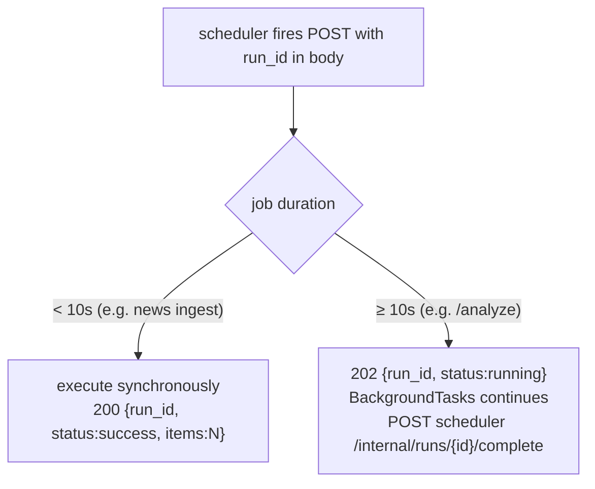

# API Implementation

The platform exposes ~150 REST endpoints across 15 services. Every service's
OpenAPI document is generated automatically by FastAPI from the route type
hints and Pydantic models, and a snapshot per service is checked into
`OpenAPI/`.

## REST conventions

The services follow one set of conventions so the BFF and the frontend
client can treat them uniformly:

| Concern | Convention |
|---|---|
| Resource lists | `GET /<resource>` with query filters, paginated |
| Single resource | `GET /<resource>/{id}` |
| Mutations | `POST` (create), `PATCH` (partial update), `DELETE` |
| AI insight | `GET /<resource>/{id}/insight` + `POST /<resource>/{id}/analyze` |
| Analyst notes | `GET/POST/PATCH/DELETE /<resource>/{id}/notes` |
| Status triage | `PATCH /<resource>/{id}/status` |
| Health | `GET /health` (liveness) + `GET /health/sources` (per-source) |
| Scheduler trigger | `POST /ingest/run`, `/refresh/*`, `/scan/run`, `/check/run`, `/analyze` |

## Pagination and sorting

List endpoints take offset/limit and a sort spec. Sort parsing is shared:
`tip_common.resolve_sort` turns a sort parameter into a validated column +
direction, so every service sorts the same way and an invalid sort key is a
clean 422 rather than a 500.

Some frontend list pages additionally sort **client-side** over the fetched
page (the Phase 6 sort helper) — an accepted tradeoff documented in
`11_testing`: the visible page is sorted, but it sorts the current page, not
the whole table. This is fine because most lists fetch ≤200 rows.

## Trigger endpoint contract (fast vs slow)

The scheduler ↔ service contract distinguishes fast and slow jobs by status
code:

The `run_id` is generated by the scheduler **before** firing, so the
callback can be correlated. The helpers `extract_run_id`,
`run_with_callback`, and `notify_scheduler_complete` (in `tip_common`)
implement the callback side once for all services.

## Status codes in use

| Code | When |
|---|---|
| 200 | successful read / fast mutation |
| 202 | slow job accepted, running in background |
| 400 / 422 | bad input / validation failure |
| 401 | missing or invalid JWT (at the edge) |
| 403 | authenticated but missing permission |
| 404 | resource (or insight) not found |
| 409 | conflict (e.g. duplicate unique key) |
| 429 | AI rate limit propagated from LiteLLM |
| 502 / 503 | upstream/source failure, or key-not-yet-available |

The 429 path is deliberate: when LiteLLM reports an upstream provider quota
hit, the service surfaces 429 (not 500) so the frontend can show "try again
later" rather than a generic error (`ai_implementation.md`).

## OpenAPI as the contract

Each service serves interactive docs at `/docs` (FastAPI default) and a
machine-readable spec at `/openapi.json`. The checked-in `OpenAPI/`
snapshots let the frontend types (`src/types/*.ts`) be kept in sync with the
backend by hand — there is no automated codegen step, which is named as a
minor gap in `15_limitations` (type drift is possible and guarded only by
the Playwright walkthrough catching runtime shape mismatches).

## Error responses

All error responses use the uniform envelope from
`backend_implementation.md` (`{"code", "message"}`). This is what the
frontend's Ask-AI page reads to show specific messages, and what the BFF
forwards verbatim so the browser sees the same `code` the service emitted.
