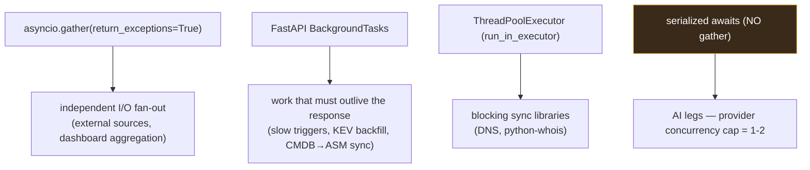

# Asynchronous Implementation

The platform is async end-to-end: ASGI (FastAPI/uvicorn) → asyncpg →
httpx. Three concurrency primitives are used deliberately, each for a
distinct problem. Choosing the wrong one was the root cause of two real
bugs (AI concurrency-cap trips and a GC'd background task), so this document
is precise about which primitive applies where.



## Primitive 1 — `asyncio.gather` for source fan-out

Ingestion and investigation run many independent external calls
concurrently and tolerate partial failure:

```python
results = await asyncio.gather(*tasks, return_exceptions=True)
```

`return_exceptions=True` is mandatory here — it converts a failing source
into a result entry instead of cancelling its siblings. This implements the
fault-tolerance rule "partial success is success" (`G2`,
`fault_tolerance.md`): if 3 of 5 IOC feeds answer, the cycle succeeds and the
2 failures are logged to `source_health`.

The indicator-intel investigation uses the same pattern across ip-api,
Shodan, crt.sh, WHOIS, the local IOC DB, actors, and articles — all in one
`gather`, so a slow Shodan never blocks the geolocation result.

## Primitive 2 — FastAPI `BackgroundTasks` for work that outlives the response

Slow triggers return `202` immediately and finish the work after the
response is sent. The critical implementation detail, learned from a real
bug: **use FastAPI `BackgroundTasks`, not a bare `asyncio.create_task`.**

A bare `asyncio.create_task(...)` returns a task that nothing holds a
reference to; the event loop can garbage-collect it mid-flight. The KEV
backfill failed exactly this way until it was moved to `BackgroundTasks`,
which keeps the task referenced until completion.

`BackgroundTasks` powers:

| Feature | Why background |
|---|---|
| `POST /analyze`, `/analyze/geo` | the 4-step AI cycle takes minutes |
| `POST /refresh/kev-backfill` | historical NVD backfill runs ~90 min |
| `POST /domains/{id}/check` | a manual domain check (DNS + screenshot) |
| CMDB → ASM profile sync | analyst's PATCH must not block on ASM |
| `/investigate/async` | deep investigation beyond the 30s sync cap |

All background work that the scheduler triggered ends by calling
`scheduler /internal/runs/{run_id}/complete` so the run history is accurate
(`api_implementation.md`).

## Primitive 3 — `ThreadPoolExecutor` for blocking libraries

Two dependencies are synchronous and would block the event loop if awaited
naively: DNS resolution (domainwatch) and `python-whois` (indicator-intel).
Both are run via `loop.run_in_executor(...)` so the blocking call happens on
a thread and the loop stays free. This is documented per service in
`06_services` ("DNS in ThreadPoolExecutor", "WHOIS calls run in
ThreadPoolExecutor").

## The anti-pattern: do NOT gather AI legs

AI is the one place concurrency is **wrong**. GitHub Models (through
LiteLLM) enforces a tight concurrency cap — `gpt-5-chat` allows 1 concurrent
request, others 2. Running insight legs (IOC extraction, hunting
hypothesis, attack flow) in a `gather` tripped
`Rate limit … UserConcurrentRequests`. The fix was to **serialize** them:

```python
iocs = await _run_iocs(...)
hunt = await _run_hunt(...)
flow = await _run_flow(...)
```

This is the explicit exception to "fan out independent I/O". The constraint
is the provider's, not the platform's, and serialization is the correct
adaptation (`ai_implementation.md`).

## Why async at all

The detailed rationale is in `12_technology_choices`. In implementation
terms: the workload is I/O-bound (external feeds, downstream services, the
LLM proxy, Postgres), so an async event loop serves far more concurrent
in-flight calls per process than a thread-per-request model would, and it
makes the fan-out patterns above natural to express.
