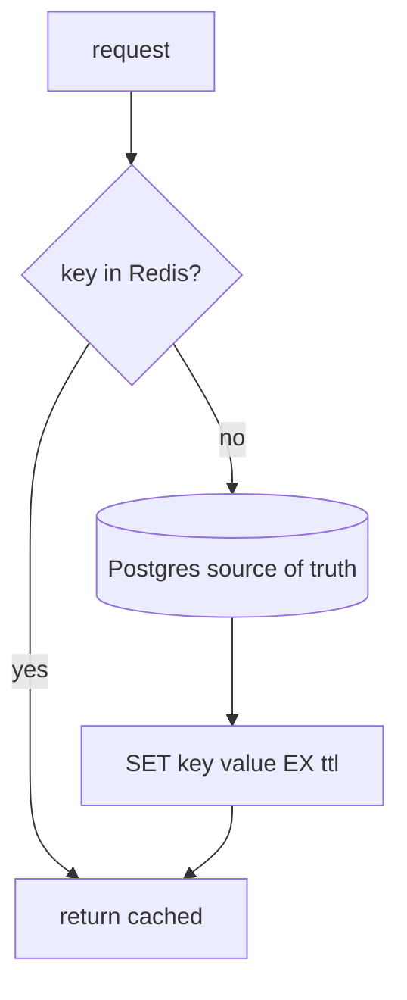
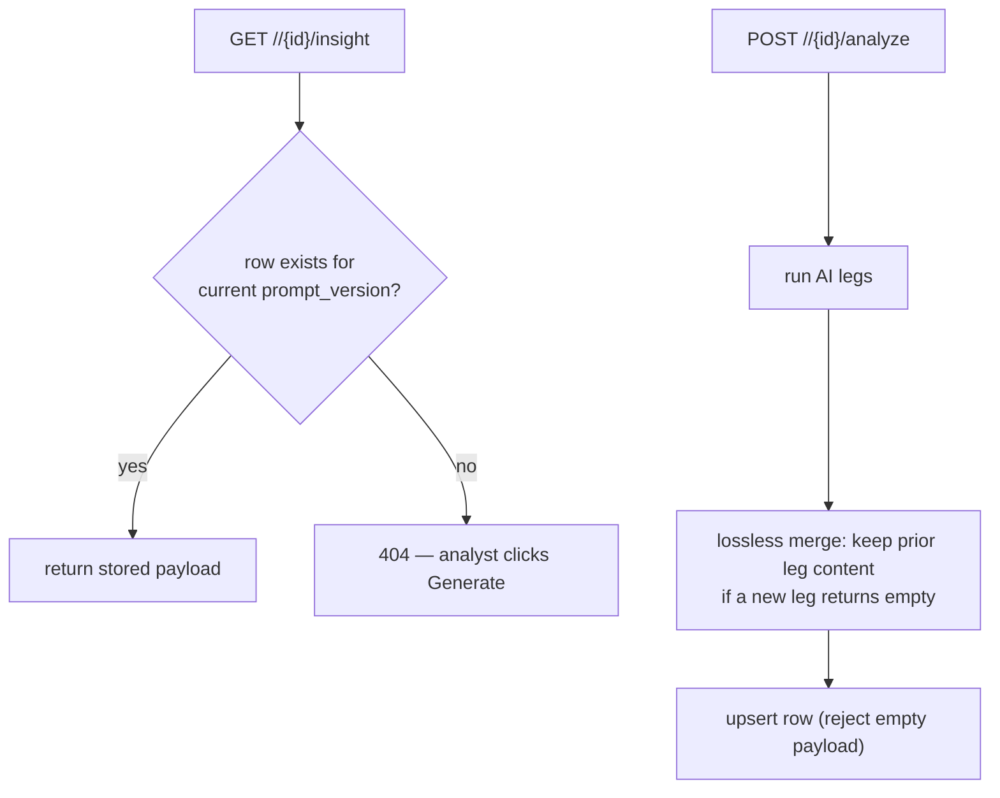

# Caching Implementation

Caching has two distinct layers in this platform, and conflating them is a
mistake the design avoids:

1. **Redis** — a loss-tolerant accelerator. Anything in Redis can vanish
   without data loss.
2. **`*_insights` tables (Postgres)** — durable, cache-first AI results.
   These are *not* a cache in the loss-tolerant sense; they are the
   permanent record of expensive AI work.

## Layer 1 — Redis (loss-tolerant)

`tip_cache` wraps `redis.asyncio` with JSON helpers and incr-with-TTL. The
governing rule (`G6`): **only loss-tolerant data goes in Redis; it can be
flushed at any time and the platform repopulates from Postgres.**

| Key pattern | TTL | Purpose |
|---|---|---|
| `ioc:<type>:<value>` | 10 min | the IOC hot-path lookup (Yassine's <10s triage) |
| `cve:<id>` | 1 h | CVE summary cache |
| `health:<svc>:<source>` | 60 s | circuit-breaker state (fast `is_open` check) |
| `ai:<sha256(prompt)>` | 24 h | AI response cache (avoid re-billing identical prompts) |
| `rl:<svc>:<key>` | per-window | rate-limit counters |

What is **never** in Redis: sessions (→ `auth.sessions`), job queues (→
APScheduler Postgres store), and any business state. This is what makes
"flush Redis" a safe operation.

### The IOC hot path

The lookup endpoint (`POST /indicators/lookup`) checks Redis first
(`ioc:<type>:<value>`), falls back to Postgres, and populates the cache. The
target is sub-200ms so an analyst pasting indicators during alert triage
gets an answer before they would otherwise switch to VirusTotal
(`01_introduction/stakeholders.md`).

### The circuit-breaker cache

The source-health repository pushes circuit state into Redis
(`health:<svc>:<source>`, 60s TTL) so `fetch_with_resilience`'s `is_open()`
check is a fast Redis read on the hot path rather than a Postgres query
(`fault_tolerance.md`).

## Layer 2 — cache-first AI insights (durable)

AI insights are far too expensive (latency + provider quota) to regenerate
on every view, so they are stored permanently and served cache-first. Each
`*_insights` table row holds `payload jsonb`, `model_name`, `prompt_version`,
`generated_at`.

Two implementation rules came directly from real bugs:

- **Keyed by `prompt_version`.** Bumping `PROMPT_VERSION` invalidates the
  cache so a prompt change yields fresh insights; an unchanged prompt always
  hits the stored row (`flowviz` caches by `sha256(input + PROMPT_VERSION)`).
- **Never overwrite good content with empty.** When a provider quota is hit
  mid-generation, the failing leg returns empty. The merge carries over the
  previous leg's content and the cache **rejects empty rows**, so a partial
  failure can never erase a previously-good insight (the "hunting hypothesis
  disappeared" bug).

## Flowviz attack-flow cache

Generated attack flows are cached in `flowviz.flows` keyed by
`sha256(input_text + PROMPT_VERSION)`. Re-requesting the same threat
description returns the stored `{nodes, edges}` without another AI call —
the user-visible payoff of "save all attack flows so we don't re-run them
and waste AI".

## Summary: two caches, two contracts

| | Redis | `*_insights` / `flows` tables |
|---|---|---|
| Durability | loss-tolerant | durable |
| On loss | repopulate from Postgres | would lose paid AI work — so it's in Postgres |
| Keyed by | semantic key + TTL | resource id + `prompt_version` |
| Invalidation | TTL expiry | `prompt_version` bump |
