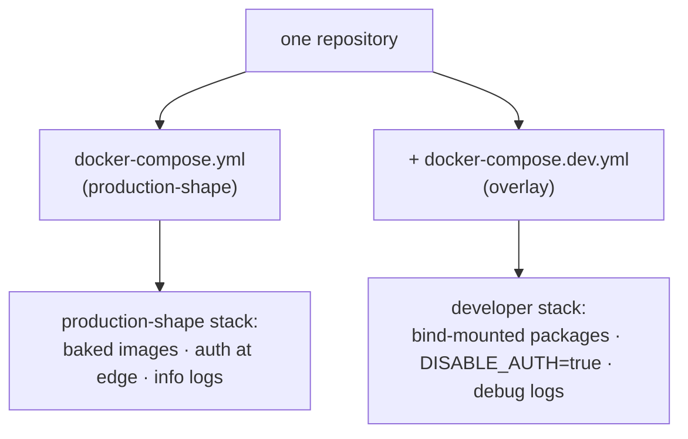
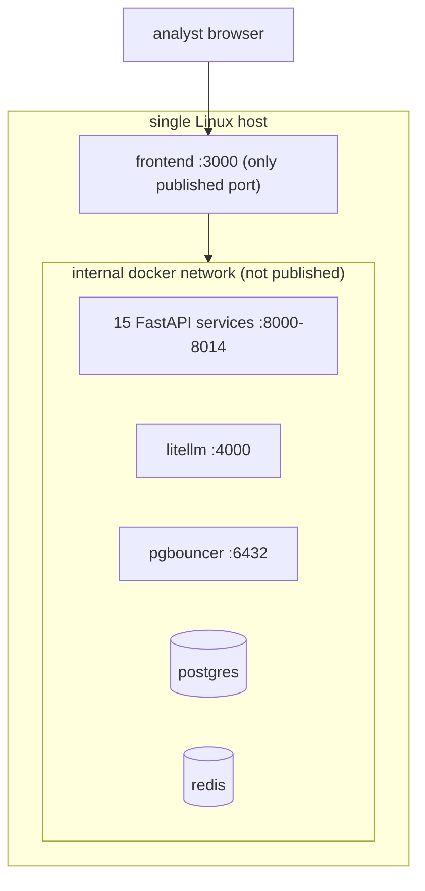

# Deployment Models

This document covers the two **shapes** the same codebase deploys as — the
developer overlay and the production-shape stack — at the implementation
level. The operational procedure is in `09_devops/deployment_strategies.md`;
this is about what differs in the running system.

## One codebase, two compose shapes

| Dimension | Dev overlay | Production-shape |
|---|---|---|
| Code source | `packages/` bind-mounted (live edit, no rebuild) | code baked into images |
| Auth | `DISABLE_AUTH=true` on data services | enforced at the edge |
| Logging | debug | structured JSON at info |
| Command | `make up` (base + dev) | `compose -f base up -d` |
| Use | iteration on the author's machine / host | the actual deployment |

The overlay only states differences; Compose merges left-to-right
(`09_devops/orchestration.md`).

## The deployed model: single host

The platform deploys as **one Docker Compose project on one Linux host**
(`lightserv1.local`). Roughly 20 containers:

The security consequence (`08_security`): only port 3000 (the frontend) is
exposed; every service, the AI proxy, and the databases are reachable only on
the internal Docker network. This is what made removing inter-service auth
acceptable — there is no external attack surface on the services.

## Why single-host is the right model here

| Factor | Implication |
|---|---|
| One finance-enterprise tenant | no multi-tenant isolation needed |
| Analyst-tool workload | bursty ingest + low-volume reads fit one host |
| Schema-per-service design | a service *can* be lifted to its own host later (no shared tables) — but isn't needed yet |
| One operator | `make up` is the whole deployment |

The schema-per-service boundary is the **enabler** for a future multi-host
model: because no service shares another's tables and all cross-service flow
is HTTP, a hot service could be moved to its own host and database with only
a connection-string and URL change. That migration is `16_future_work`; the
current model is deliberately single-host.

## State and persistence in the deployed model

| Container | State | Persistence |
|---|---|---|
| postgres | the `tip` DB (15 schemas) + Fernet vault | named volume (must be backed up) |
| domainwatch | screenshots | named volume (regenerable) |
| redis | cache only | none — loss-tolerant |
| everything else | stateless | rebuilt from images |

The deliberate property: only the Postgres volume is irreplaceable, which
concentrates the backup burden (`09_devops/rollback_strategy.md`).

## First-deploy vs warm-deploy at the implementation level

The cold path runs the bootstrap dance (`runtime_behavior.md`) — seed the
vault, run migrations, then the ordered service bring-up. The warm path skips
all of that: the vault is already seeded, the schema already migrated, so a
deploy is just rebuild-changed-images + `up -d --force-recreate`. The
per-service image isolation is what makes the warm path touch only the
services that changed.
