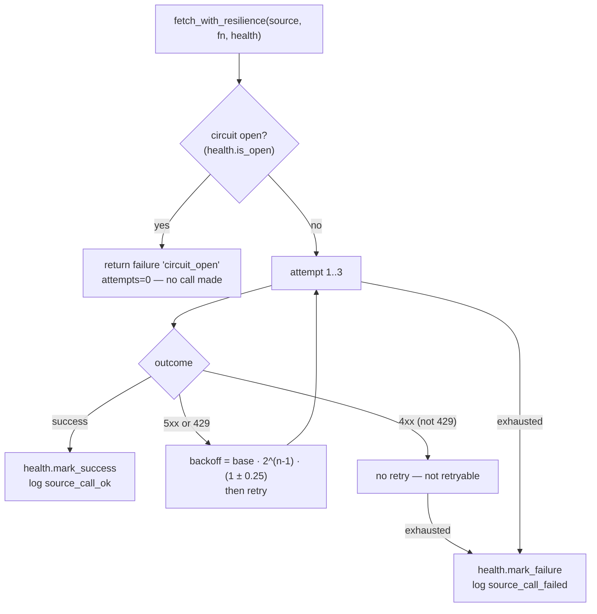
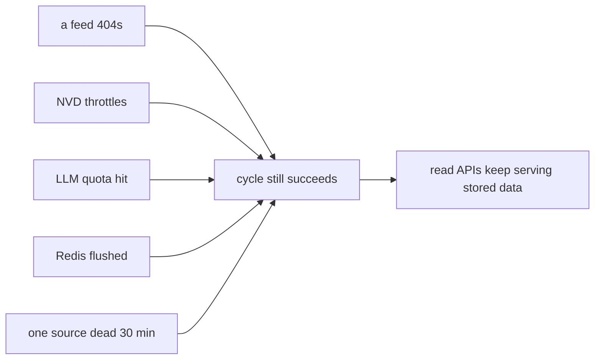

# Fault Tolerance Implementation

The platform's defining non-functional property is **degrade, never crash**
(`G2`). External sources fail constantly — feeds 404, NVD throttles,
providers hit quota — and none of it may take down a service. This is
implemented in one place, `tip_http.fetch_with_resilience`, plus the
source-health subsystem.

## `fetch_with_resilience` — the real policy

Every outbound call to an external source is wrapped by this function. The
policy values are from the code, not aspirational:

```python
@dataclass
class RetryPolicy:
    max_attempts: int = 3
    base_delay: float = 1.0
    backoff: float = 2.0
    jitter: float = 0.25
```



| Behaviour | Implementation |
|---|---|
| Retryable | HTTP `≥500` **or** `429`; plus timeouts / connect / read errors |
| Not retryable | any other `4xx` — fail immediately, don't waste attempts |
| Backoff | exponential `base·backoff^(n-1)` with ±25% jitter |
| Result | a `SourceCallResult` (success, value, error, attempts, duration_ms, http_status) — never an exception bubbling to the caller |

The function **returns a result object rather than raising** — the caller
inspects `.success`. This is what lets an ingestion cycle `gather` many
sources and treat each independently.

## Circuit breaker

The breaker is implemented via the `HealthStore` protocol that
`fetch_with_resilience` consults:

- before calling, `is_open(source)` — if open, return immediately with
  `error="circuit_open"` and **make no network call**;
- on success, `mark_success` resets the failure count;
- on failure, `mark_failure` increments it; at 5 consecutive failures the
  status flips to `degraded`.

The breaker state is cached in Redis (`health:<svc>:<source>`, 60s TTL —
`caching_implementation.md`) so `is_open` is a fast read on the hot path, and
also persisted to the service's `source_health` table for operator
visibility.

## Source health as the durable record

`tip_source_health.SourceHealthRepository` is the durable side. Each service
has its own `source_health` table:

```
source_name, last_success_at, last_failure_at, consecutive_failures,
status (active|degraded|dead), last_error, last_http_status, updated_at
```

Exposed at `GET /health/sources` on every ingesting service. This is the
operator's window into *why* data is stale — the exact failing source, its
last error string, and its last HTTP status (`09_devops/monitoring.md`).

## Cycle-level isolation

Above the per-call breaker, ingestion cycles isolate sources from each
other:

- sources run under `asyncio.gather(*tasks, return_exceptions=True)` — one
  failure cannot cancel siblings;
- **partial success is success** — if some sources return data, the cycle is
  marked successful and the failures are logged, not raised
  (`async_implementation.md`);
- **stale over blocking** — read endpoints always serve the latest stored
  data and never wait on a live fetch.

## AI fault tolerance

The AI path has its own degradation rules layered on the same philosophy:

| Failure | Handling |
|---|---|
| Provider quota (429) | typed `LiteLLMRateLimitError`; step skipped, cycle continues |
| Model unavailable | smart-model cascade tries the next model |
| Invalid JSON | one repair retry, then fail that step only |
| Partial insight | lossless merge keeps prior content; empty rows rejected |
| Per-step failure in the 4-step cycle | logged + skipped; prior steps already persisted |

The orchestrator's 4-step cycle persists each step's output as soon as it
lands, so a step-4 failure never loses steps 1–3
(`06_services/orchestrator_service`).

## The net effect



No single external failure produces a crashed service or an empty UI — only
a `degraded` row in `source_health` and a log line. That is the whole goal
of the fault-tolerance implementation.
