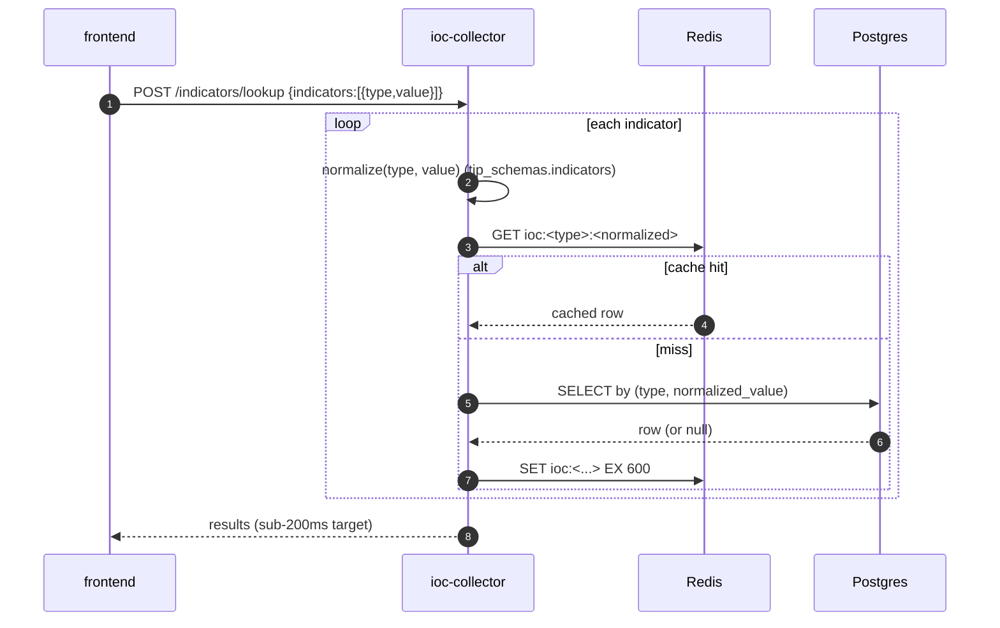
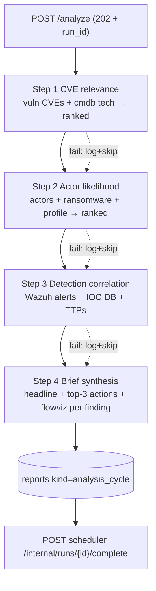
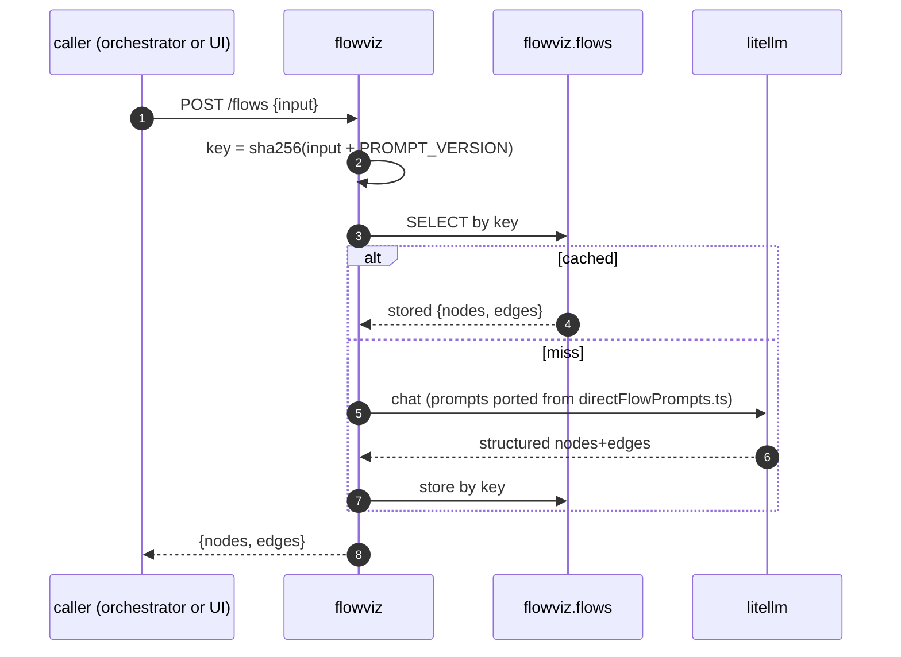
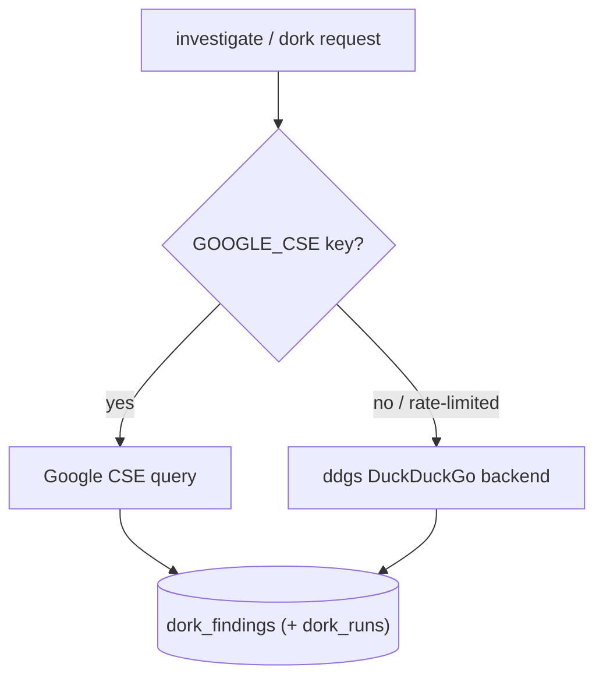
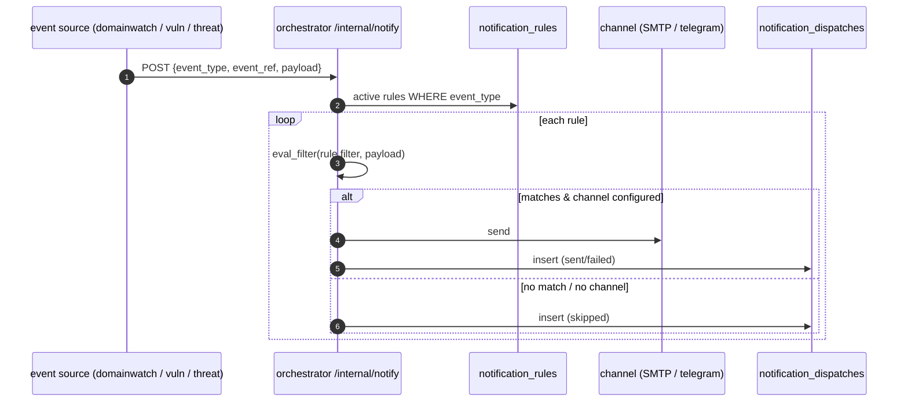

# Feature Implementation (end-to-end)

This document walks five real features from request to storage, naming the
actual modules. It is the "how it all fits" complement to the
component-level documents.

## 1. IOC lookup (the hot path)

The latency-critical feature — Yassine pasting indicators during triage.

Key modules: `tip_schemas.indicators.normalize` (the cross-service key),
`tip_cache` (the Redis wrapper), `services/ioc-collector/app/routes/
indicators.py`. Normalisation is what makes a defanged `example[.]com` and a
clean `example.com` resolve to the same cached entry.

## 2. The 4-step analysis cycle (the AI brain)

Triggered by the scheduler every 6h, or on demand. Returns 202, runs in
`BackgroundTasks`.

Each step is a `generate_structured` call (`ai_implementation.md`); each
step's output persists immediately (`cve_relevance`, `actor_likelihood`,
`correlations`, then `reports`). The orchestrator gathers cross-service input
via its HTTP `ContextProvider` (`context.py`) — the only fan-out service.
For each top-3 finding, it calls flowviz `POST /flows` and embeds the
returned attack flow in the report.

## 3. Flowviz attack-flow generation

Prompts are ported verbatim from the legacy `directFlowPrompts.ts`; output is
a Pydantic-validated ATT&CK node/edge graph; the cache key embeds
`PROMPT_VERSION` so a prompt change invalidates stale flows
(`caching_implementation.md`). The frontend renders the result with
ReactFlow + dagre.

## 4. Dorking (investigate enrichment)

The dorking feature added a search capability to indicator-intel's
investigation. Implementation: a Google Custom Search Engine primary with a
DuckDuckGo (`ddgs`) fallback when no Google key is configured.

Verified at runtime: `example.com` → `backend=duckduckgo, 6 findings` with no
Google key present. Results persist in the `indicator` schema's `dork_runs` /
`dork_findings` tables.

## 5. Configurable notifications

The notification subsystem (orchestrator) turns platform events into
email/Telegram dispatches, filtered by analyst-configured rules.

Event types: `domainwatch.change`, `cve.exploited`, `threat.supply_chain`.
Filters: `severity_min`, `change_types`, `product_match`. Verified
end-to-end: a rule was created, `/internal/notify` evaluated it, and a
dispatch row was written `skipped` with "SMTP not configured" when no channel
was set — the graceful-degradation path. Modules: `app/notify/dispatcher.py`,
`app/notify/smtp.py`, `app/routes/notifications.py`.

## Cross-feature threads

All five share the platform invariants: external calls through
`fetch_with_resilience`; AI through the LiteLLM proxy with structured output;
durable results in Postgres with Redis only as accelerator; correlation IDs
threaded through every hop.
