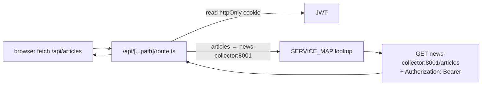

# Frontend Implementation

The frontend is a **Next.js 16 (App Router)** application that is the only
component exposed to users. It is also the **security boundary**: after the
inter-service auth simplification, JWT validation happens at the
frontend↔backend edge (the BFF), not between services.

## The BFF proxy — one catch-all route

All browser → backend traffic goes through a single catch-all route,
`frontend/src/app/api/[...path]/route.ts`. It:

1. reads the JWT from the **httpOnly cookie** (never exposed to JS);
2. maps the first path segment to the target service;
3. forwards the request with `Authorization: Bearer <jwt>` injected;
4. returns the upstream response.

The `SERVICE_MAP` maps path segments to service hostnames (`articles →
news-collector:8001`, `cves → vuln-intel:8002`, `policies →
orchestrator:8014`, …). Two consequences:

- **No CORS configuration** is needed on any backend service — the browser
  only ever talks to the same Next.js origin.
- **The token never reaches the browser's JS context** — it lives in an
  httpOnly cookie and is injected server-side by the BFF.

## Special (non-proxied) BFF routes

| Route | Action |
|---|---|
| `POST /api/login` | calls auth `/login`, sets the httpOnly cookie |
| `POST /api/logout` | clears cookies, calls auth `/logout` |
| `POST /api/refresh` | transparent token refresh |
| `GET /api/dashboard` | fans out to several services in parallel, returns combined metrics |

The dashboard aggregation route is the one place the BFF does fan-out rather
than 1:1 proxying — it parallelises the counts and rankings the dashboard
needs so the page makes one request, not nine.

## Client data layer — SWR + the typed client

Data fetching uses **SWR** (stale-while-revalidate). The typed client in
`frontend/src/lib/api.ts` wraps `fetch`, handles the error envelope, and
respects pre-auth paths:

- `PRE_AUTH_PATHS = {'/login', '/refresh'}` bypass the no-token guard — the
  fix for the login redirect loop (commit `035ccfc`). Without it, the guard
  blocked the very POST that obtains a token.
- the `Authorization` header is attached conditionally (only when a token
  exists), so pre-auth calls don't send an empty bearer.

SWR `refetchInterval` drives the live feel: ~15s for the `/me` poll, ~30s
for the dashboard, ~60s for lists.

## Global state — Zustand

A small **Zustand** store holds auth state, user preferences, and sidebar
state. It is intentionally minimal — server data lives in SWR's cache, not
in the store, so there is no Redux-style duplication of server state.

## Attack-flow rendering — ReactFlow + dagre

The flowviz and supply-chain attack flows are rendered with **ReactFlow**,
laid out with **dagre** for automatic hierarchical positioning. This
replaced the earlier "stacked cards" rendering: the backend returns
`{nodes, edges}` (ATT&CK chain) and ReactFlow draws a proper directed graph.
The component takes `RawFlowNode.data?: unknown` to satisfy ReactFlow's
index-signature typing (the TypeScript build fix).

## Theme and visual system

Ant Design 5.x dark theme via `ConfigProvider` (token overrides in
`src/lib/theme.ts`) layered with Tailwind utilities. The accent was migrated
from blue (`#1f6feb` / `#58a6ff`) to teal (`var(--accent)` = `#2dd4bf`)
across the component set, and border-radii mix sharp and rounded edges per
the design pass (commit `fe7053f`).

## Page surface

27 pages under `src/app/(app)/` cover the three personas: fast lookup and
triage (Yassine), the intelligence library with notes/overrides/manual
creation (Amira), and the executive dashboard with the daily briefing and
geopolitical card (Karim). The detailed page inventory is in
`05_architecture` and the Phase 5/6 plan; the verification screenshots are
in `screenshots/` (`11_testing/playwright_testing.md`).

## Why Next.js (implementation payoff)

The full rationale is in `12_technology_choices/frontend_stack.md`. In
implementation terms: the App Router gives SSR for first paint plus
client-side transitions; API routes give a server-side BFF in the same
deployable, which is what makes the httpOnly-cookie + token-injection
security model possible without a separate gateway process.
